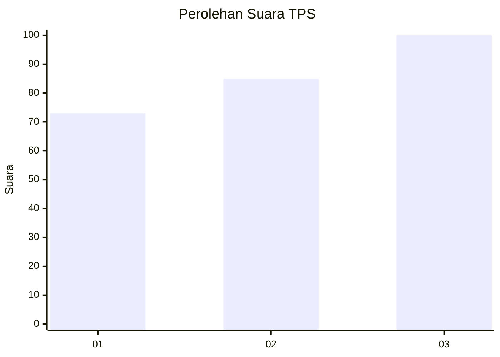
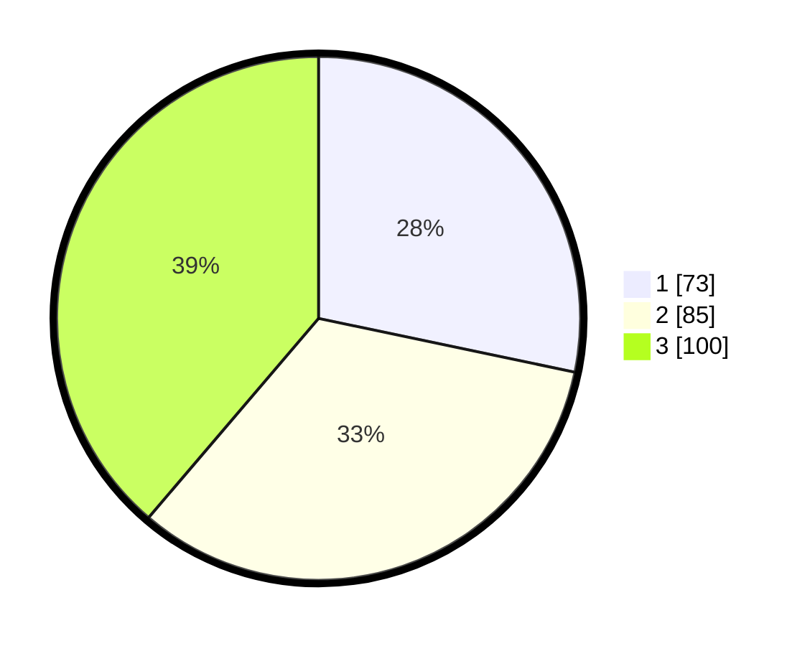

# Hasil

## Grafik

## Tabel

| No. | Nama Paslon    | Suara | Suara (raw) | Persentase |
|:--- |:-------------- | -----:| -----------:| ----------:|
| 1   | ANIES MUHAIMIN | 73    | [73][p-1]   | 28,29      |
| 2   | PRABOWO GIBRAN | 85    | [85][p-2]   | 32,95      |
| 3   | GANJAR MAHFUD  | 100   | [100][p-3]  | 38,76      |

[p-1]: https://github.com/gigit-pemilu/pemilu-2024-34-di-yogyakarta/blob/main/pilpres/hitung-suara/sub/34-di-yogyakarta/sub/04-sleman/sub/01-gamping/sub/2004-nogotirto/sub/006-tps/sub/paslon-1.txt
[p-2]: https://github.com/gigit-pemilu/pemilu-2024-34-di-yogyakarta/blob/main/pilpres/hitung-suara/sub/34-di-yogyakarta/sub/04-sleman/sub/01-gamping/sub/2004-nogotirto/sub/006-tps/sub/paslon-2.txt
[p-3]: https://github.com/gigit-pemilu/pemilu-2024-34-di-yogyakarta/blob/main/pilpres/hitung-suara/sub/34-di-yogyakarta/sub/04-sleman/sub/01-gamping/sub/2004-nogotirto/sub/006-tps/sub/paslon-3.txt

## Foto C Plano

https://sirekap-obj-formc.kpu.go.id/e065/pemilu/ppwp/34/04/01/20/04/3404012004006-20240214-141840--b8d15417-1520-4a24-a23a-f4817b216528.jpg

https://sirekap-obj-formc.kpu.go.id/e065/pemilu/ppwp/34/04/01/20/04/3404012004006-20240214-141929--6a1e7bd8-a6d1-403a-83b7-b815fef4ddf5.jpg

https://sirekap-obj-formc.kpu.go.id/e065/pemilu/ppwp/34/04/01/20/04/3404012004006-20240214-200022--4b5ecff0-6541-437c-b7fb-e7cf82ae4deb.jpg

## Metadata

| Key        | Value               |
| ---------- | ------------------- |
| Time Stamp | 2024-02-15 12:00:28 |

