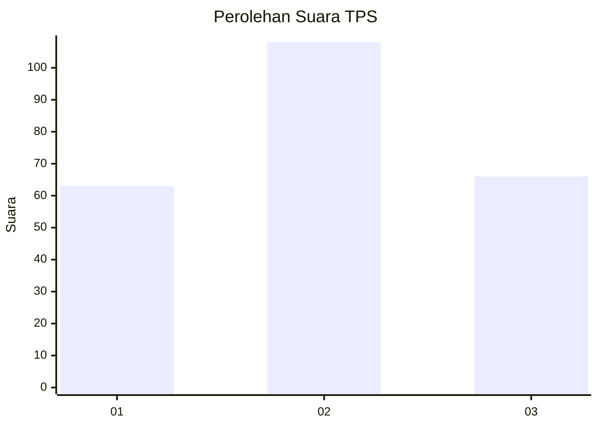
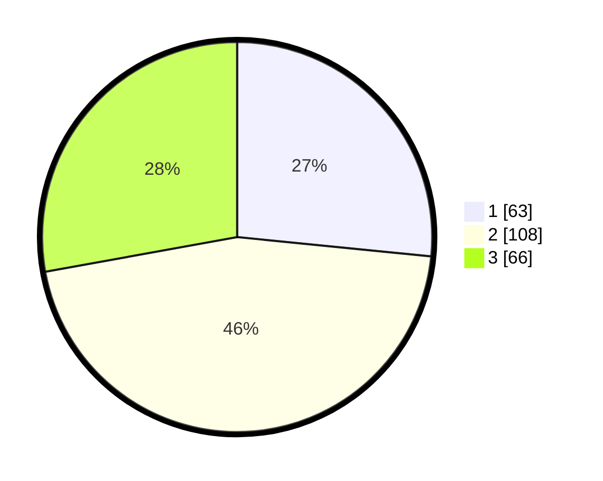

# Hasil

## Grafik

## Tabel

| No. | Nama Paslon    | Suara | Suara (raw) | Persentase |
|:--- |:-------------- | -----:| -----------:| ----------:|
| 1   | ANIES MUHAIMIN | 63    | [63][p-1]   | 26,58      |
| 2   | PRABOWO GIBRAN | 108   | [108][p-2]  | 45,57      |
| 3   | GANJAR MAHFUD  | 66    | [66][p-3]   | 27,85      |

[p-1]: https://github.com/gigit-pemilu/pemilu-2024-34-di-yogyakarta/blob/main/pilpres/hitung-suara/sub/34-di-yogyakarta/sub/04-sleman/sub/01-gamping/sub/2004-nogotirto/sub/007-tps/sub/paslon-1.txt
[p-2]: https://github.com/gigit-pemilu/pemilu-2024-34-di-yogyakarta/blob/main/pilpres/hitung-suara/sub/34-di-yogyakarta/sub/04-sleman/sub/01-gamping/sub/2004-nogotirto/sub/007-tps/sub/paslon-2.txt
[p-3]: https://github.com/gigit-pemilu/pemilu-2024-34-di-yogyakarta/blob/main/pilpres/hitung-suara/sub/34-di-yogyakarta/sub/04-sleman/sub/01-gamping/sub/2004-nogotirto/sub/007-tps/sub/paslon-3.txt

## Foto C Plano

https://sirekap-obj-formc.kpu.go.id/5f51/pemilu/ppwp/34/04/01/20/04/3404012004007-20240215-014632--89126cbf-eddc-4656-95ad-2e57ed1d14c5.jpg

https://sirekap-obj-formc.kpu.go.id/5f51/pemilu/ppwp/34/04/01/20/04/3404012004007-20240214-213221--4be93ed9-a975-441f-961e-918a89e37122.jpg

https://sirekap-obj-formc.kpu.go.id/5f51/pemilu/ppwp/34/04/01/20/04/3404012004007-20240214-213357--c85169d8-8d70-42af-881e-e972d6d92466.jpg

## Metadata

| Key        | Value               |
| ---------- | ------------------- |
| Time Stamp | 2024-02-15 22:00:27 |

