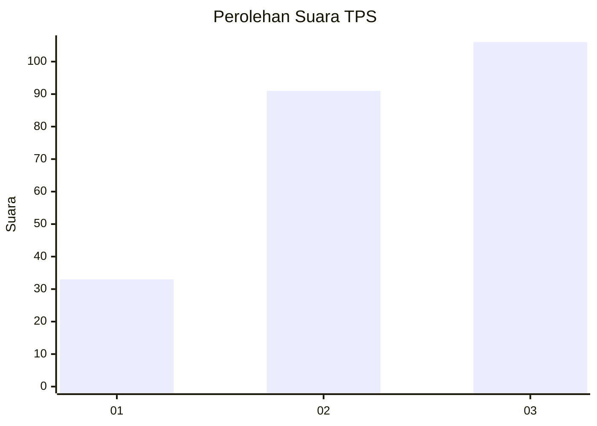
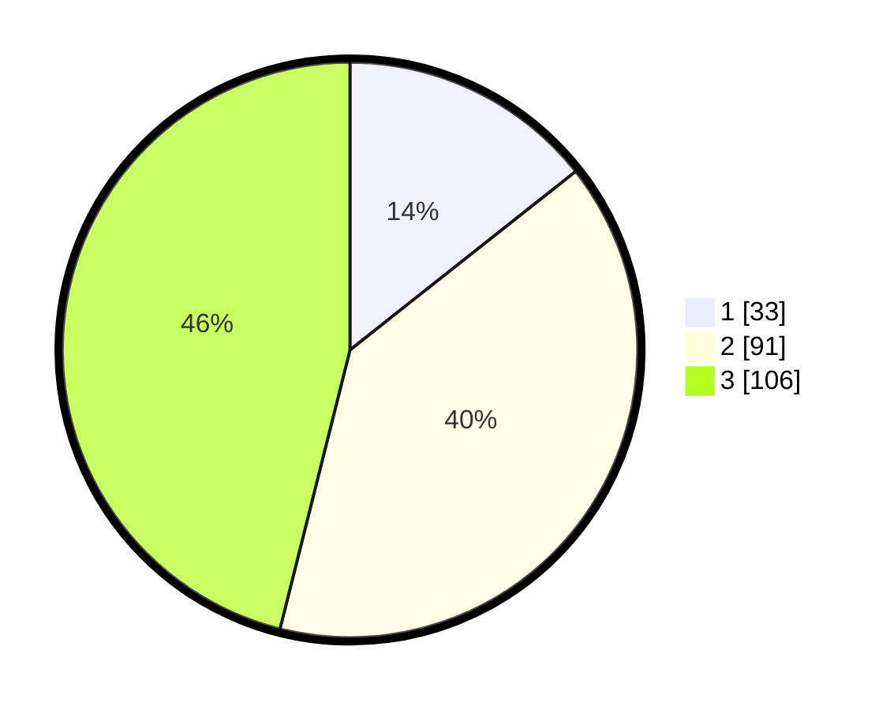

# Hasil

## Grafik

## Tabel

| No. | Nama Paslon    | Suara | Suara (raw) | Persentase |
|:--- |:-------------- | -----:| -----------:| ----------:|
| 1   | ANIES MUHAIMIN | 33    | [33][p-1]   | 14,35      |
| 2   | PRABOWO GIBRAN | 91    | [91][p-2]   | 39,57      |
| 3   | GANJAR MAHFUD  | 106   | [106][p-3]  | 46,09      |

[p-1]: https://github.com/gigit-pemilu/pemilu-2024-34-di-yogyakarta/blob/main/pilpres/hitung-suara/sub/34-di-yogyakarta/sub/04-sleman/sub/01-gamping/sub/2004-nogotirto/sub/009-tps/sub/paslon-1.txt
[p-2]: https://github.com/gigit-pemilu/pemilu-2024-34-di-yogyakarta/blob/main/pilpres/hitung-suara/sub/34-di-yogyakarta/sub/04-sleman/sub/01-gamping/sub/2004-nogotirto/sub/009-tps/sub/paslon-2.txt
[p-3]: https://github.com/gigit-pemilu/pemilu-2024-34-di-yogyakarta/blob/main/pilpres/hitung-suara/sub/34-di-yogyakarta/sub/04-sleman/sub/01-gamping/sub/2004-nogotirto/sub/009-tps/sub/paslon-3.txt

## Foto C Plano

https://sirekap-obj-formc.kpu.go.id/ee5a/pemilu/ppwp/34/04/01/20/04/3404012004009-20240214-204602--db0e9d7f-5915-4022-a2c8-2467e0d5fb0a.jpg

https://sirekap-obj-formc.kpu.go.id/ee5a/pemilu/ppwp/34/04/01/20/04/3404012004009-20240214-204808--a350ac3d-9cc3-4792-812c-b446605e4a88.jpg

https://sirekap-obj-formc.kpu.go.id/ee5a/pemilu/ppwp/34/04/01/20/04/3404012004009-20240214-204927--38868ea6-41eb-4283-b80c-ef7fd3cdcf36.jpg

## Metadata

| Key        | Value               |
| ---------- | ------------------- |
| Time Stamp | 2024-02-15 06:00:23 |

