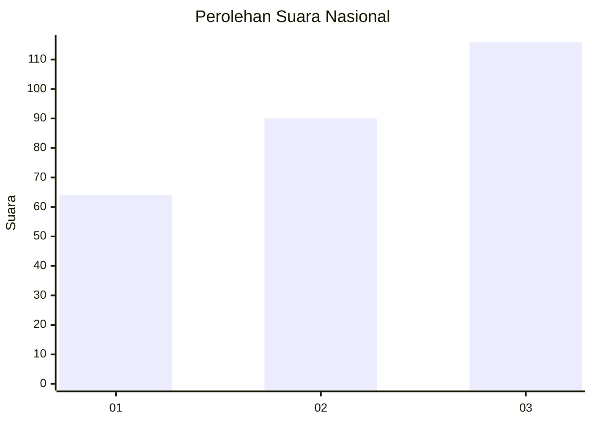
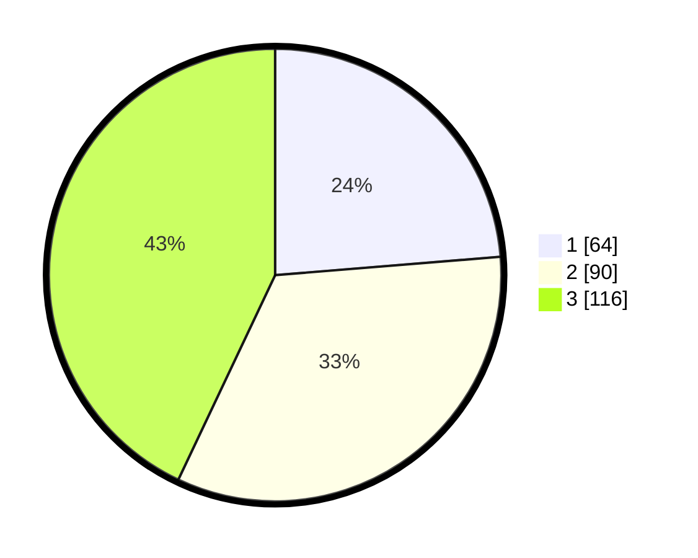

# Hasil

## Grafik

## Tabel

| No. | Nama Paslon    | Suara | Suara (raw) | Persentase |
|:--- |:-------------- | -----:| -----------:| ----------:|
| 1   | ANIES MUHAIMIN | 64    | [64][p-1]   | 23,70      |
| 2   | PRABOWO GIBRAN | 90    | [90][p-2]   | 33,33      |
| 3   | GANJAR MAHFUD  | 116   | [116][p-3]  | 42,96      |

[p-1]: https://github.com/gigit-pemilu/pemilu-2024/blob/main/pilpres/hitung-suara/sub/34-di-yogyakarta/sub/04-sleman/sub/01-gamping/sub/2004-nogotirto/sub/012-tps/sub/paslon-1.txt
[p-2]: https://github.com/gigit-pemilu/pemilu-2024/blob/main/pilpres/hitung-suara/sub/34-di-yogyakarta/sub/04-sleman/sub/01-gamping/sub/2004-nogotirto/sub/012-tps/sub/paslon-2.txt
[p-3]: https://github.com/gigit-pemilu/pemilu-2024/blob/main/pilpres/hitung-suara/sub/34-di-yogyakarta/sub/04-sleman/sub/01-gamping/sub/2004-nogotirto/sub/012-tps/sub/paslon-3.txt

## Foto C Plano

https://sirekap-obj-formc.kpu.go.id/6030/pemilu/ppwp/34/04/01/20/04/3404012004012-20240217-103311--6d534a42-e28a-4e98-8aba-bab59c3b7bc0.jpg

https://sirekap-obj-formc.kpu.go.id/6030/pemilu/ppwp/34/04/01/20/04/3404012004012-20240217-103333--55c27794-63a5-48c1-9d61-65d5264a5abf.jpg

https://sirekap-obj-formc.kpu.go.id/6030/pemilu/ppwp/34/04/01/20/04/3404012004012-20240217-103406--8b8a3ff0-988d-42a0-b474-425da6bdae3e.jpg

## Metadata

| Key        | Value               |
| ---------- | ------------------- |
| Time Stamp | 2024-02-17 11:30:03 |

