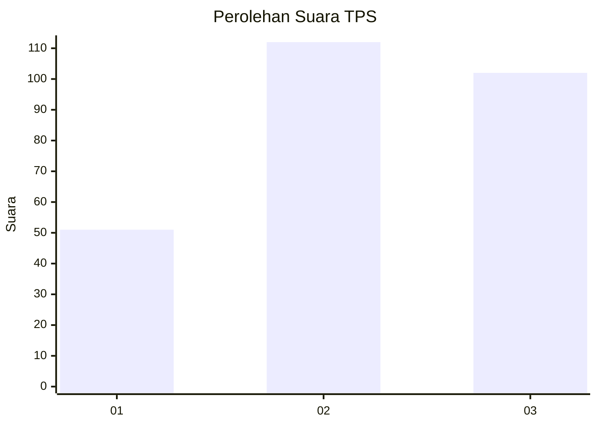
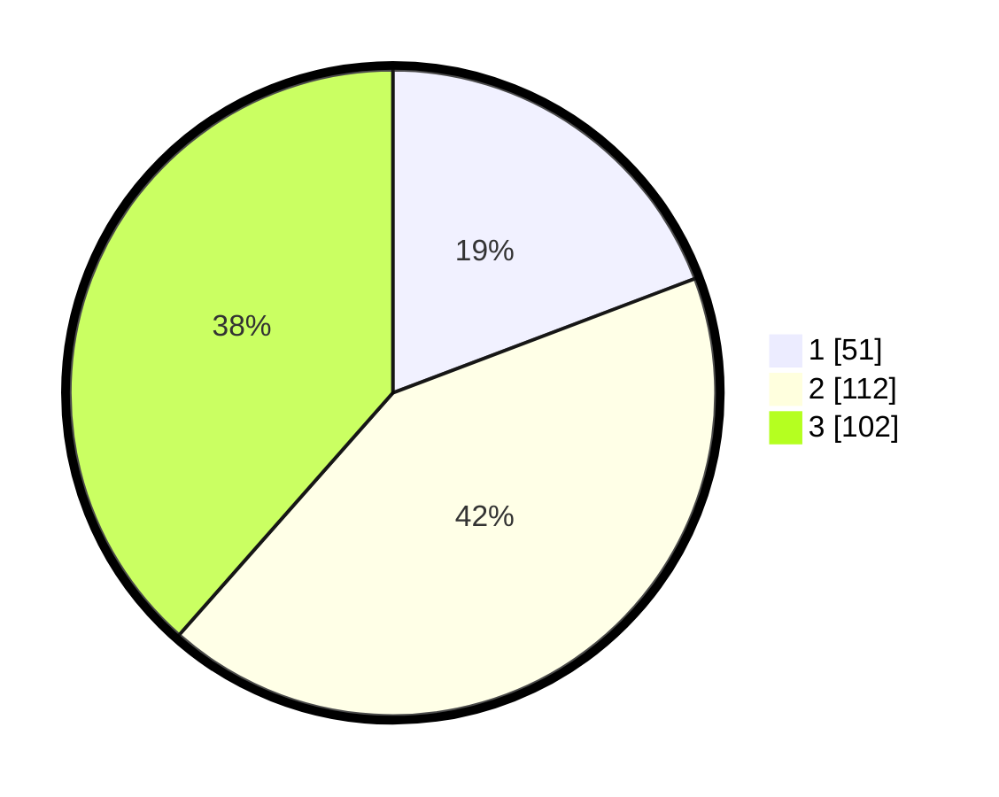

# Hasil

## Grafik

## Tabel

| No. | Nama Paslon    | Suara | Suara (raw) | Persentase |
|:--- |:-------------- | -----:| -----------:| ----------:|
| 1   | ANIES MUHAIMIN | 51    | [51][p-1]   | 19,25      |
| 2   | PRABOWO GIBRAN | 112   | [112][p-2]  | 42,26      |
| 3   | GANJAR MAHFUD  | 102   | [102][p-3]  | 38,49      |

[p-1]: https://github.com/gigit-pemilu/pemilu-2024-34-di-yogyakarta/blob/main/pilpres/hitung-suara/sub/34-di-yogyakarta/sub/04-sleman/sub/01-gamping/sub/2004-nogotirto/sub/013-tps/sub/paslon-1.txt
[p-2]: https://github.com/gigit-pemilu/pemilu-2024-34-di-yogyakarta/blob/main/pilpres/hitung-suara/sub/34-di-yogyakarta/sub/04-sleman/sub/01-gamping/sub/2004-nogotirto/sub/013-tps/sub/paslon-2.txt
[p-3]: https://github.com/gigit-pemilu/pemilu-2024-34-di-yogyakarta/blob/main/pilpres/hitung-suara/sub/34-di-yogyakarta/sub/04-sleman/sub/01-gamping/sub/2004-nogotirto/sub/013-tps/sub/paslon-3.txt

## Foto C Plano

https://sirekap-obj-formc.kpu.go.id/a9dd/pemilu/ppwp/34/04/01/20/04/3404012004013-20240214-203125--c2cd6e1a-1222-437d-959e-3b919d75828c.jpg

https://sirekap-obj-formc.kpu.go.id/a9dd/pemilu/ppwp/34/04/01/20/04/3404012004013-20240214-203529--609dda01-012e-4ade-b11c-c09fdd7da997.jpg

https://sirekap-obj-formc.kpu.go.id/a9dd/pemilu/ppwp/34/04/01/20/04/3404012004013-20240214-202218--722d5940-fa4c-441b-abd7-fdb1f83b6f89.jpg

## Metadata

| Key        | Value               |
| ---------- | ------------------- |
| Time Stamp | 2024-02-15 03:06:03 |

