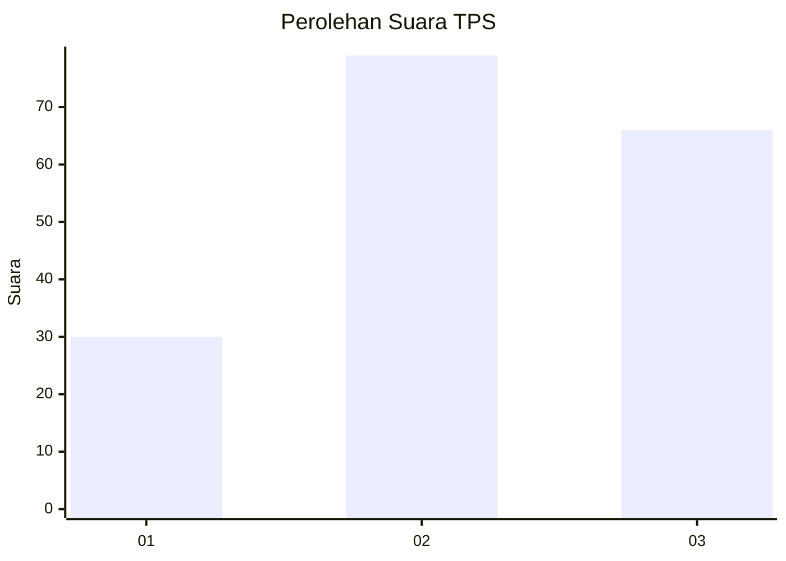
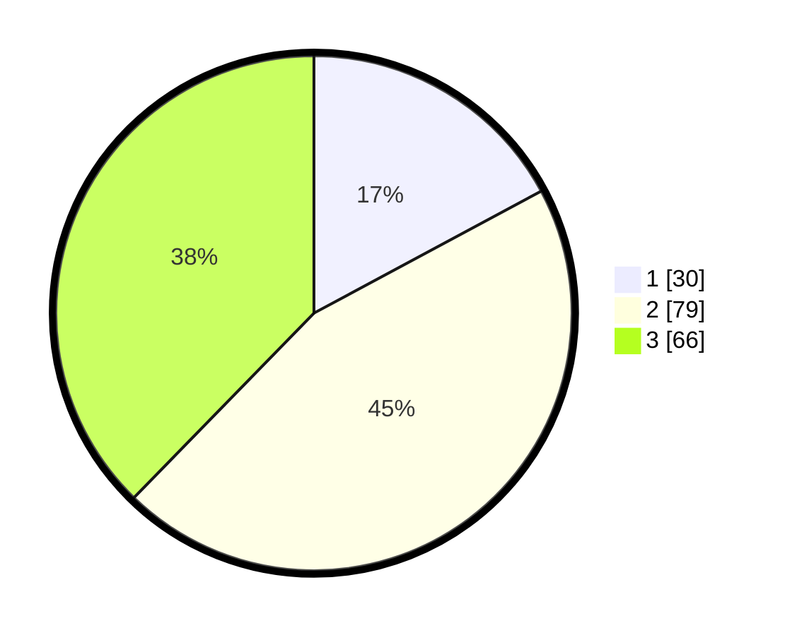

# Hasil

## Grafik

## Tabel

| No. | Nama Paslon    | Suara | Suara (raw) | Persentase |
|:--- |:-------------- | -----:| -----------:| ----------:|
| 1   | ANIES MUHAIMIN | 30    | [30][p-1]   | 17,14      |
| 2   | PRABOWO GIBRAN | 79    | [79][p-2]   | 45,14      |
| 3   | GANJAR MAHFUD  | 66    | [66][p-3]   | 37,71      |

[p-1]: https://github.com/gigit-pemilu/pemilu-2024-34-di-yogyakarta/blob/main/pilpres/hitung-suara/sub/34-di-yogyakarta/sub/04-sleman/sub/01-gamping/sub/2004-nogotirto/sub/014-tps/sub/paslon-1.txt
[p-2]: https://github.com/gigit-pemilu/pemilu-2024-34-di-yogyakarta/blob/main/pilpres/hitung-suara/sub/34-di-yogyakarta/sub/04-sleman/sub/01-gamping/sub/2004-nogotirto/sub/014-tps/sub/paslon-2.txt
[p-3]: https://github.com/gigit-pemilu/pemilu-2024-34-di-yogyakarta/blob/main/pilpres/hitung-suara/sub/34-di-yogyakarta/sub/04-sleman/sub/01-gamping/sub/2004-nogotirto/sub/014-tps/sub/paslon-3.txt

## Foto C Plano

https://sirekap-obj-formc.kpu.go.id/222b/pemilu/ppwp/34/04/01/20/04/3404012004014-20240215-163344--e8cf8750-373d-4bac-a526-55dcc1886232.jpg

https://sirekap-obj-formc.kpu.go.id/222b/pemilu/ppwp/34/04/01/20/04/3404012004014-20240215-163454--ae39635d-fabd-4293-9e68-01f92d34de00.jpg

https://sirekap-obj-formc.kpu.go.id/222b/pemilu/ppwp/34/04/01/20/04/3404012004014-20240215-163629--86fedb56-1c1b-471c-bb8b-c2a1cbe98bbe.jpg

## Metadata

| Key        | Value               |
| ---------- | ------------------- |
| Time Stamp | 2024-02-15 22:00:27 |

