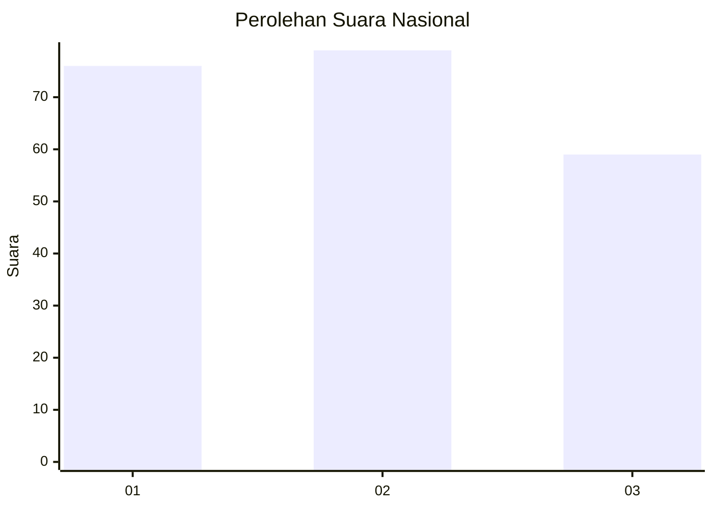
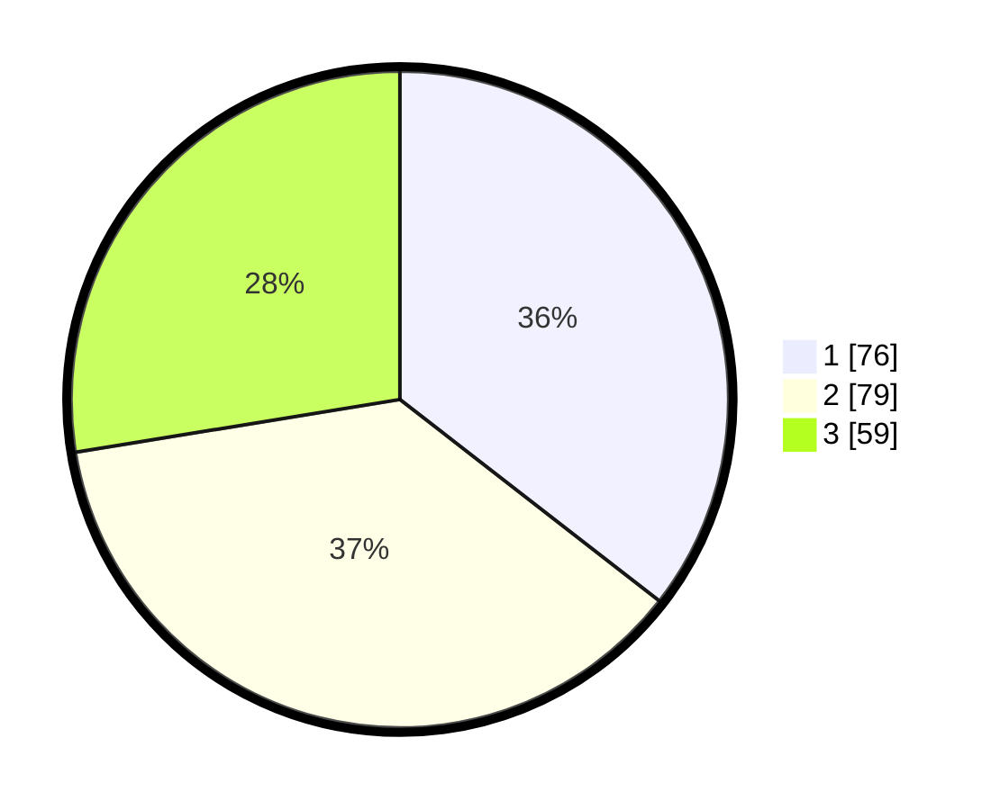

# Hasil

## Grafik

## Tabel

| No. | Nama Paslon    | Suara | Suara (raw) | Persentase |
|:--- |:-------------- | -----:| -----------:| ----------:|
| 1   | ANIES MUHAIMIN | 76    | [76][p-1]   | 35,51      |
| 2   | PRABOWO GIBRAN | 79    | [79][p-2]   | 36,92      |
| 3   | GANJAR MAHFUD  | 59    | [59][p-3]   | 27,57      |

[p-1]: https://github.com/gigit-pemilu/pemilu-2024/blob/main/pilpres/hitung-suara/sub/34-di-yogyakarta/sub/04-sleman/sub/01-gamping/sub/2004-nogotirto/sub/015-tps/sub/paslon-1.txt
[p-2]: https://github.com/gigit-pemilu/pemilu-2024/blob/main/pilpres/hitung-suara/sub/34-di-yogyakarta/sub/04-sleman/sub/01-gamping/sub/2004-nogotirto/sub/015-tps/sub/paslon-2.txt
[p-3]: https://github.com/gigit-pemilu/pemilu-2024/blob/main/pilpres/hitung-suara/sub/34-di-yogyakarta/sub/04-sleman/sub/01-gamping/sub/2004-nogotirto/sub/015-tps/sub/paslon-3.txt

## Foto C Plano

https://sirekap-obj-formc.kpu.go.id/e64c/pemilu/ppwp/34/04/01/20/04/3404012004015-20240215-023114--c2e5ceb9-0bc8-4fb9-8a22-e50cd7915241.jpg

https://sirekap-obj-formc.kpu.go.id/e64c/pemilu/ppwp/34/04/01/20/04/3404012004015-20240215-035646--0c8bd065-5a58-4b2d-a693-4c8decd8186a.jpg

https://sirekap-obj-formc.kpu.go.id/e64c/pemilu/ppwp/34/04/01/20/04/3404012004015-20240215-023337--f3226118-d5d3-4db7-a8b0-4e1155917351.jpg

## Metadata

| Key        | Value               |
| ---------- | ------------------- |
| Time Stamp | 2024-02-15 15:00:29 |

