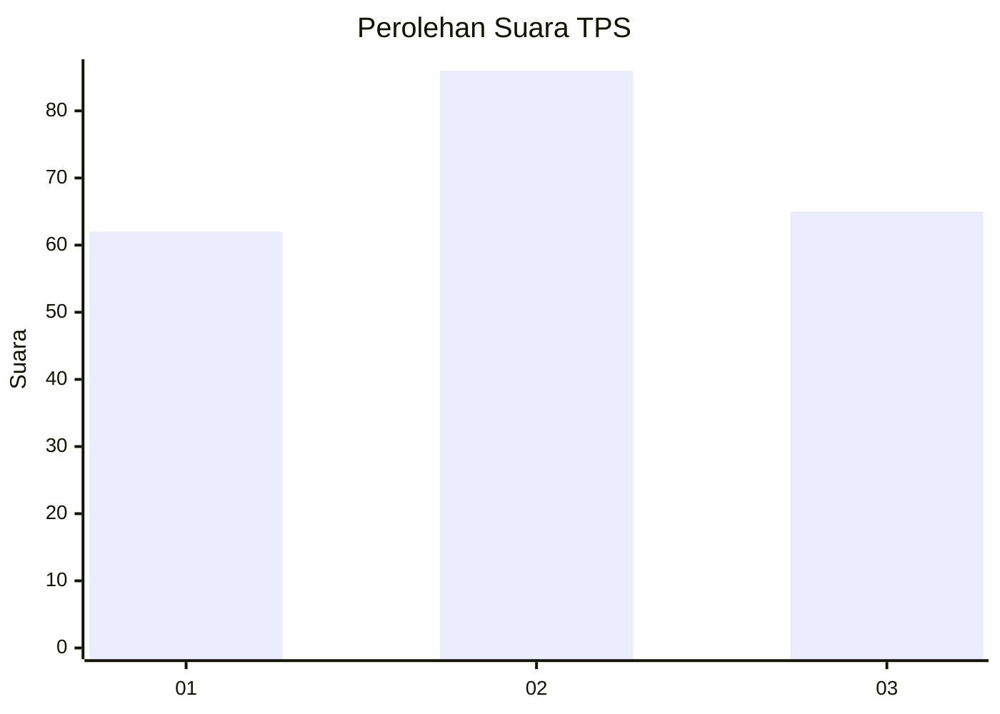
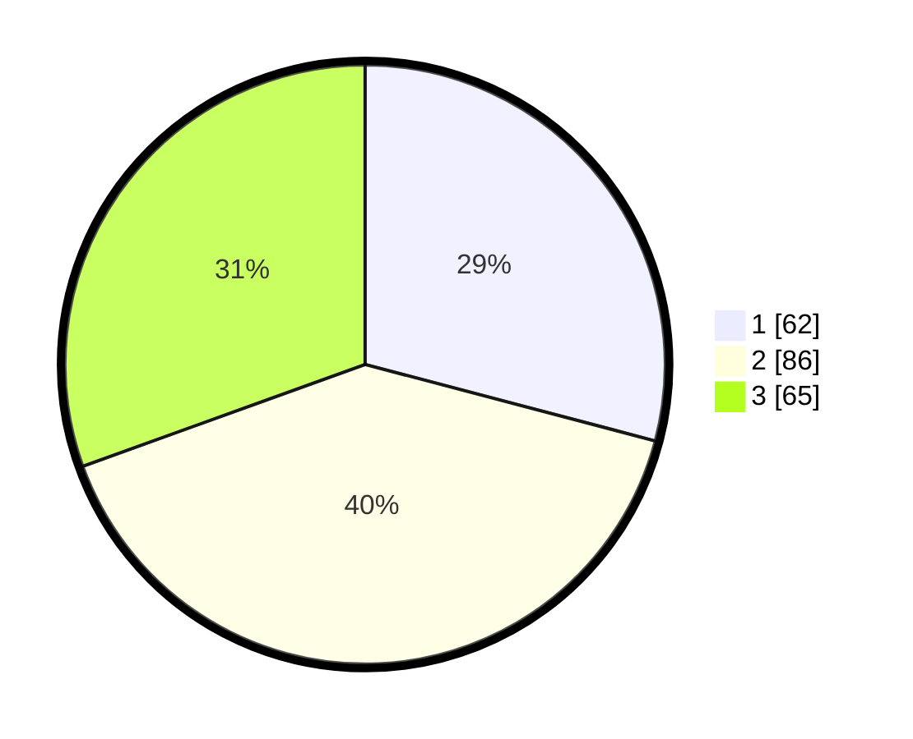

# Hasil

## Grafik

## Tabel

| No. | Nama Paslon    | Suara | Suara (raw) | Persentase |
|:--- |:-------------- | -----:| -----------:| ----------:|
| 1   | ANIES MUHAIMIN | 62    | [62][p-1]   | 29,11      |
| 2   | PRABOWO GIBRAN | 86    | [86][p-2]   | 40,38      |
| 3   | GANJAR MAHFUD  | 65    | [65][p-3]   | 30,52      |

[p-1]: https://github.com/gigit-pemilu/pemilu-2024-34-di-yogyakarta/blob/main/pilpres/hitung-suara/sub/34-di-yogyakarta/sub/04-sleman/sub/01-gamping/sub/2004-nogotirto/sub/025-tps/sub/paslon-1.txt
[p-2]: https://github.com/gigit-pemilu/pemilu-2024-34-di-yogyakarta/blob/main/pilpres/hitung-suara/sub/34-di-yogyakarta/sub/04-sleman/sub/01-gamping/sub/2004-nogotirto/sub/025-tps/sub/paslon-2.txt
[p-3]: https://github.com/gigit-pemilu/pemilu-2024-34-di-yogyakarta/blob/main/pilpres/hitung-suara/sub/34-di-yogyakarta/sub/04-sleman/sub/01-gamping/sub/2004-nogotirto/sub/025-tps/sub/paslon-3.txt

## Foto C Plano

https://sirekap-obj-formc.kpu.go.id/777f/pemilu/ppwp/34/04/01/20/04/3404012004025-20240215-032022--aca74b8d-db31-460b-9c4e-64db850c3104.jpg

https://sirekap-obj-formc.kpu.go.id/777f/pemilu/ppwp/34/04/01/20/04/3404012004025-20240215-032308--acfff61e-e808-4ecf-b4cb-eb17b3ae17b8.jpg

https://sirekap-obj-formc.kpu.go.id/777f/pemilu/ppwp/34/04/01/20/04/3404012004025-20240215-032425--93e1ff43-e3f2-478a-a97b-a607ed53d6e4.jpg

## Metadata

| Key        | Value               |
| ---------- | ------------------- |
| Time Stamp | 2024-02-15 22:00:27 |

