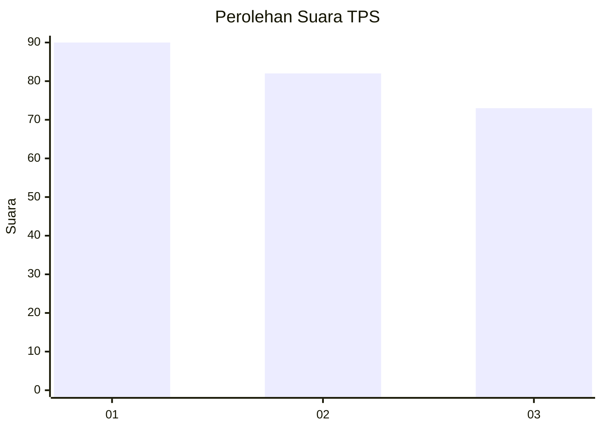
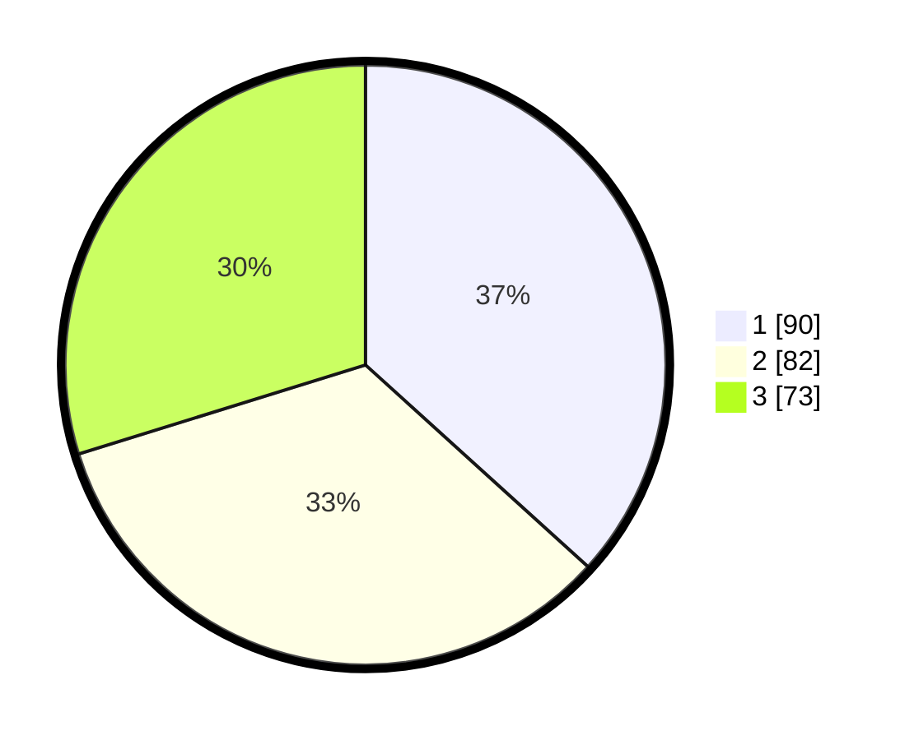

# Hasil

## Grafik

## Tabel

| No. | Nama Paslon    | Suara | Suara (raw) | Persentase |
|:--- |:-------------- | -----:| -----------:| ----------:|
| 1   | ANIES MUHAIMIN | 90    | [90][p-1]   | 36,73      |
| 2   | PRABOWO GIBRAN | 82    | [82][p-2]   | 33,47      |
| 3   | GANJAR MAHFUD  | 73    | [73][p-3]   | 29,80      |

[p-1]: https://github.com/gigit-pemilu/pemilu-2024-34-di-yogyakarta/blob/main/pilpres/hitung-suara/sub/34-di-yogyakarta/sub/04-sleman/sub/01-gamping/sub/2004-nogotirto/sub/026-tps/sub/paslon-1.txt
[p-2]: https://github.com/gigit-pemilu/pemilu-2024-34-di-yogyakarta/blob/main/pilpres/hitung-suara/sub/34-di-yogyakarta/sub/04-sleman/sub/01-gamping/sub/2004-nogotirto/sub/026-tps/sub/paslon-2.txt
[p-3]: https://github.com/gigit-pemilu/pemilu-2024-34-di-yogyakarta/blob/main/pilpres/hitung-suara/sub/34-di-yogyakarta/sub/04-sleman/sub/01-gamping/sub/2004-nogotirto/sub/026-tps/sub/paslon-3.txt

## Foto C Plano

https://sirekap-obj-formc.kpu.go.id/37c6/pemilu/ppwp/34/04/01/20/04/3404012004026-20240216-034926--94d972aa-4a80-4cfa-8baf-41791e0a991d.jpg

https://sirekap-obj-formc.kpu.go.id/37c6/pemilu/ppwp/34/04/01/20/04/3404012004026-20240216-034931--00be8df9-3f81-45f4-9855-6f235de9054a.jpg

https://sirekap-obj-formc.kpu.go.id/37c6/pemilu/ppwp/34/04/01/20/04/3404012004026-20240216-034928--45102fea-8389-4e78-9ce7-dde7fcabc0e5.jpg

## Metadata

| Key        | Value               |
| ---------- | ------------------- |
| Time Stamp | 2024-02-16 13:30:32 |

## DATA PEMILIH TETAP

Jumlah pemilih dalam DPT: **277**.
 * L: **126**.
 * P: **151**.

## DATA PENGGUNA HAK PILIH

Jumlah pengguna hak pilih dalam DPT: **234**.
 * L: **111**.
 * P: **123**.

Jumlah pengguna hak pilih dalam DPTb: **9**.
 * L: **0**.
 * P: **9**.

Jumlah pengguna hak pilih dalam DPK: **6**.
 * L: **2**.
 * P: **4**.

Jumlah pengguna hak pilih: **249**.
 * L: **113**.
 * P: **136**.

## JUMLAH SUARA SAH DAN TIDAK SAH

JUMLAH SELURUH SUARA SAH: **245**.

JUMLAH SUARA TIDAK SAH: **4**.

JUMLAH SELURUH SUARA SAH DAN SUARA TIDAK SAH: **249**.

