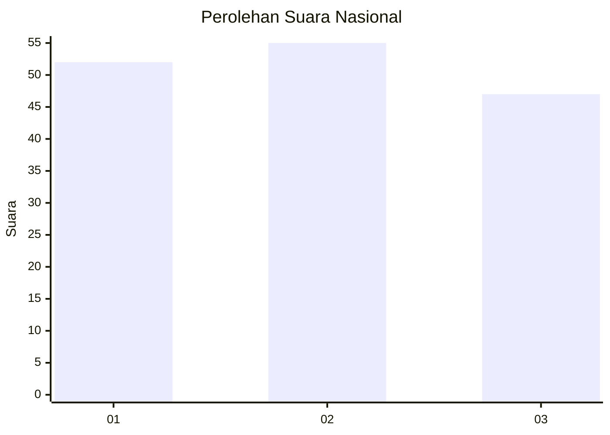
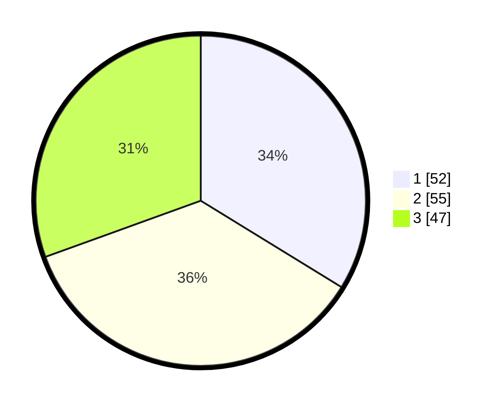

# Hasil

## Grafik

## Tabel

| No. | Nama Paslon    | Suara | Suara (raw) | Persentase |
|:--- |:-------------- | -----:| -----------:| ----------:|
| 1   | ANIES MUHAIMIN | 52    | [52][p-1]   | 33,77      |
| 2   | PRABOWO GIBRAN | 55    | [55][p-2]   | 35,71      |
| 3   | GANJAR MAHFUD  | 47    | [47][p-3]   | 30,52      |

[p-1]: https://github.com/gigit-pemilu/pemilu-2024/blob/main/pilpres/hitung-suara/sub/34-di-yogyakarta/sub/04-sleman/sub/01-gamping/sub/2004-nogotirto/sub/027-tps/sub/paslon-1.txt
[p-2]: https://github.com/gigit-pemilu/pemilu-2024/blob/main/pilpres/hitung-suara/sub/34-di-yogyakarta/sub/04-sleman/sub/01-gamping/sub/2004-nogotirto/sub/027-tps/sub/paslon-2.txt
[p-3]: https://github.com/gigit-pemilu/pemilu-2024/blob/main/pilpres/hitung-suara/sub/34-di-yogyakarta/sub/04-sleman/sub/01-gamping/sub/2004-nogotirto/sub/027-tps/sub/paslon-3.txt

## Foto C Plano

https://sirekap-obj-formc.kpu.go.id/2344/pemilu/ppwp/34/04/01/20/04/3404012004027-20240215-142329--1ac814a5-81ff-4e6a-a0b0-57db4929dec1.jpg

https://sirekap-obj-formc.kpu.go.id/2344/pemilu/ppwp/34/04/01/20/04/3404012004027-20240215-142528--ad72a320-ada0-43e5-aee2-1f934f55e3b1.jpg

https://sirekap-obj-formc.kpu.go.id/2344/pemilu/ppwp/34/04/01/20/04/3404012004027-20240215-142646--6c9386fa-2e5f-490e-a4c8-932fff862f57.jpg

## Metadata

| Key        | Value               |
| ---------- | ------------------- |
| Time Stamp | 2024-02-16 10:00:28 |

