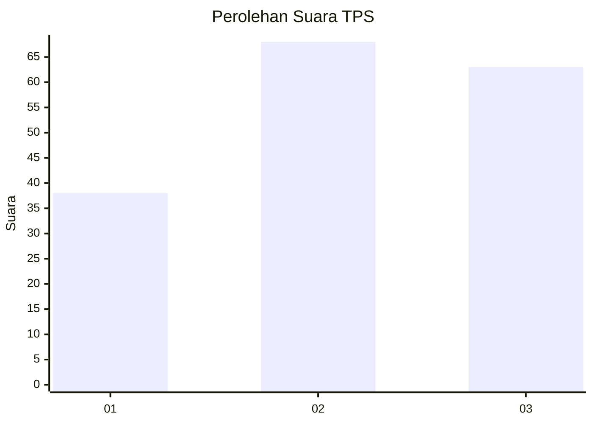
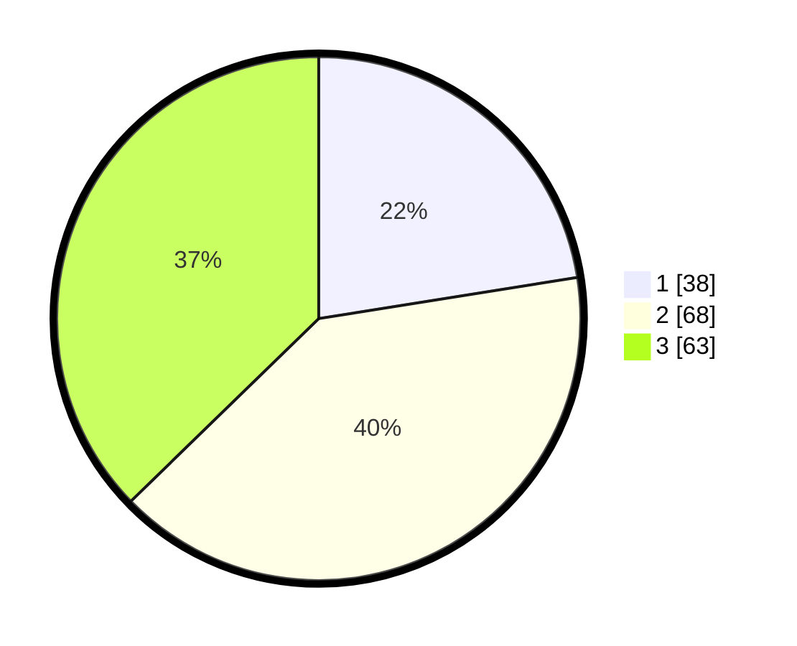

# Hasil

## Grafik

## Tabel

| No. | Nama Paslon    | Suara | Suara (raw) | Persentase |
|:--- |:-------------- | -----:| -----------:| ----------:|
| 1   | ANIES MUHAIMIN | 38    | [38][p-1]   | 22,49      |
| 2   | PRABOWO GIBRAN | 68    | [68][p-2]   | 40,24      |
| 3   | GANJAR MAHFUD  | 63    | [63][p-3]   | 37,28      |

[p-1]: https://github.com/gigit-pemilu/pemilu-2024-34-di-yogyakarta/blob/main/pilpres/hitung-suara/sub/34-di-yogyakarta/sub/04-sleman/sub/01-gamping/sub/2004-nogotirto/sub/033-tps/sub/paslon-1.txt
[p-2]: https://github.com/gigit-pemilu/pemilu-2024-34-di-yogyakarta/blob/main/pilpres/hitung-suara/sub/34-di-yogyakarta/sub/04-sleman/sub/01-gamping/sub/2004-nogotirto/sub/033-tps/sub/paslon-2.txt
[p-3]: https://github.com/gigit-pemilu/pemilu-2024-34-di-yogyakarta/blob/main/pilpres/hitung-suara/sub/34-di-yogyakarta/sub/04-sleman/sub/01-gamping/sub/2004-nogotirto/sub/033-tps/sub/paslon-3.txt

## Foto C Plano

https://sirekap-obj-formc.kpu.go.id/5c23/pemilu/ppwp/34/04/01/20/04/3404012004033-20240214-224826--bf077648-f5fb-466f-8607-494c9a7f6bec.jpg

https://sirekap-obj-formc.kpu.go.id/5c23/pemilu/ppwp/34/04/01/20/04/3404012004033-20240214-224953--2c67d42b-c1b3-468a-82e4-50146ac38ad4.jpg

https://sirekap-obj-formc.kpu.go.id/5c23/pemilu/ppwp/34/04/01/20/04/3404012004033-20240214-225200--b1e1e0ef-9d59-4fb2-85d7-6654d9a8623b.jpg

## Metadata

| Key        | Value               |
| ---------- | ------------------- |
| Time Stamp | 2024-02-15 15:00:29 |

