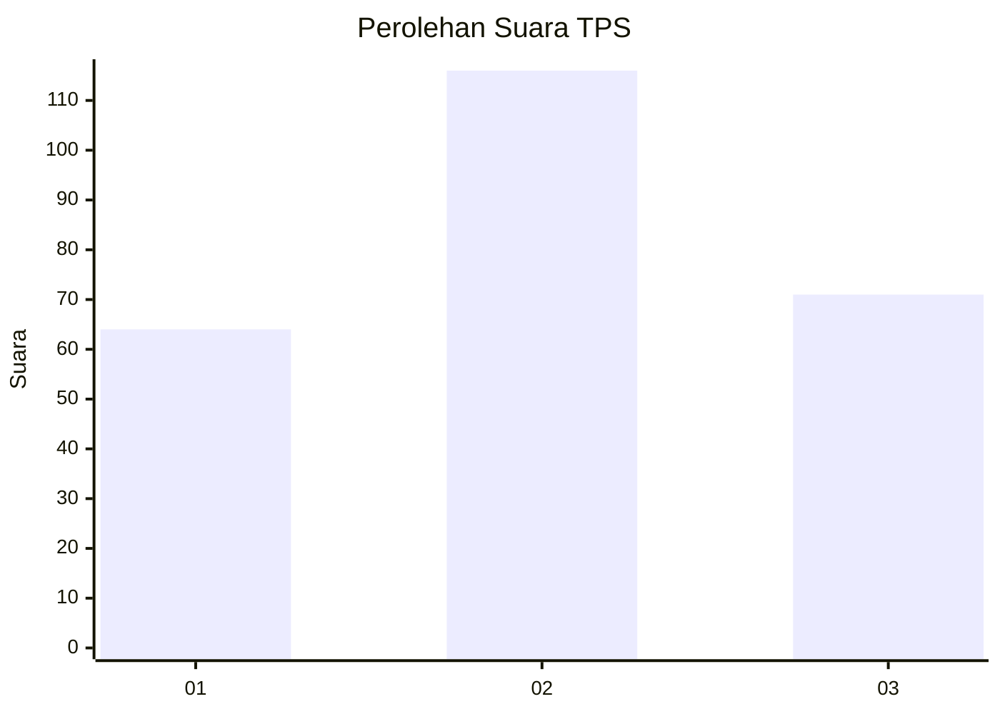
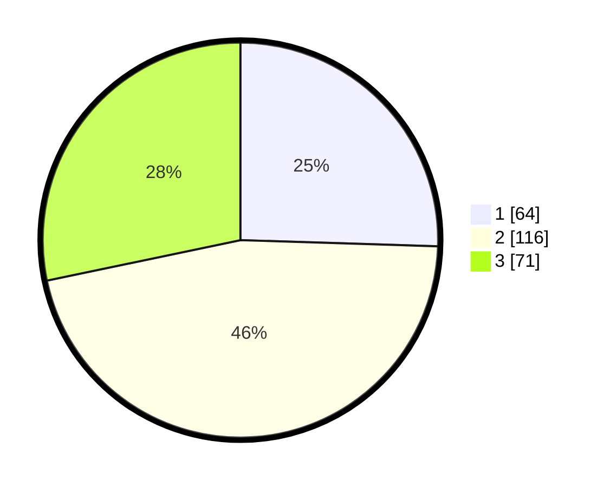

# Hasil

## Grafik

## Tabel

| No. | Nama Paslon    | Suara | Suara (raw) | Persentase |
|:--- |:-------------- | -----:| -----------:| ----------:|
| 1   | ANIES MUHAIMIN | 64    | [64][p-1]   | 25,50      |
| 2   | PRABOWO GIBRAN | 116   | [116][p-2]  | 46,22      |
| 3   | GANJAR MAHFUD  | 71    | [71][p-3]   | 28,29      |

[p-1]: https://github.com/gigit-pemilu/pemilu-2024-34-di-yogyakarta/blob/main/pilpres/hitung-suara/sub/34-di-yogyakarta/sub/04-sleman/sub/01-gamping/sub/2004-nogotirto/sub/035-tps/sub/paslon-1.txt
[p-2]: https://github.com/gigit-pemilu/pemilu-2024-34-di-yogyakarta/blob/main/pilpres/hitung-suara/sub/34-di-yogyakarta/sub/04-sleman/sub/01-gamping/sub/2004-nogotirto/sub/035-tps/sub/paslon-2.txt
[p-3]: https://github.com/gigit-pemilu/pemilu-2024-34-di-yogyakarta/blob/main/pilpres/hitung-suara/sub/34-di-yogyakarta/sub/04-sleman/sub/01-gamping/sub/2004-nogotirto/sub/035-tps/sub/paslon-3.txt

## Foto C Plano

https://sirekap-obj-formc.kpu.go.id/23ad/pemilu/ppwp/34/04/01/20/04/3404012004035-20240214-155116--2d8ce281-1f78-4073-ba11-8dd8f1a3d41a.jpg

https://sirekap-obj-formc.kpu.go.id/23ad/pemilu/ppwp/34/04/01/20/04/3404012004035-20240214-155858--f2799398-ff94-4880-9d0f-9d1f28d91cfd.jpg

https://sirekap-obj-formc.kpu.go.id/23ad/pemilu/ppwp/34/04/01/20/04/3404012004035-20240214-160116--bc93f93d-f75b-43cc-928f-8e183d1ab741.jpg

## Metadata

| Key        | Value               |
| ---------- | ------------------- |
| Time Stamp | 2024-02-14 21:46:01 |

## DATA PEMILIH TETAP

Jumlah pemilih dalam DPT: **289**.
 * L: **132**.
 * P: **157**.

## DATA PENGGUNA HAK PILIH

Jumlah pengguna hak pilih dalam DPT: **234**.
 * L: **103**.
 * P: **131**.

Jumlah pengguna hak pilih dalam DPTb: **7**.
 * L: **5**.
 * P: **2**.

Jumlah pengguna hak pilih dalam DPK: **13**.
 * L: **5**.
 * P: **8**.

Jumlah pengguna hak pilih: **254**.
 * L: **113**.
 * P: **141**.

## JUMLAH SUARA SAH DAN TIDAK SAH

JUMLAH SELURUH SUARA SAH: **251**.

JUMLAH SUARA TIDAK SAH: **3**.

JUMLAH SELURUH SUARA SAH DAN SUARA TIDAK SAH: **254**.

