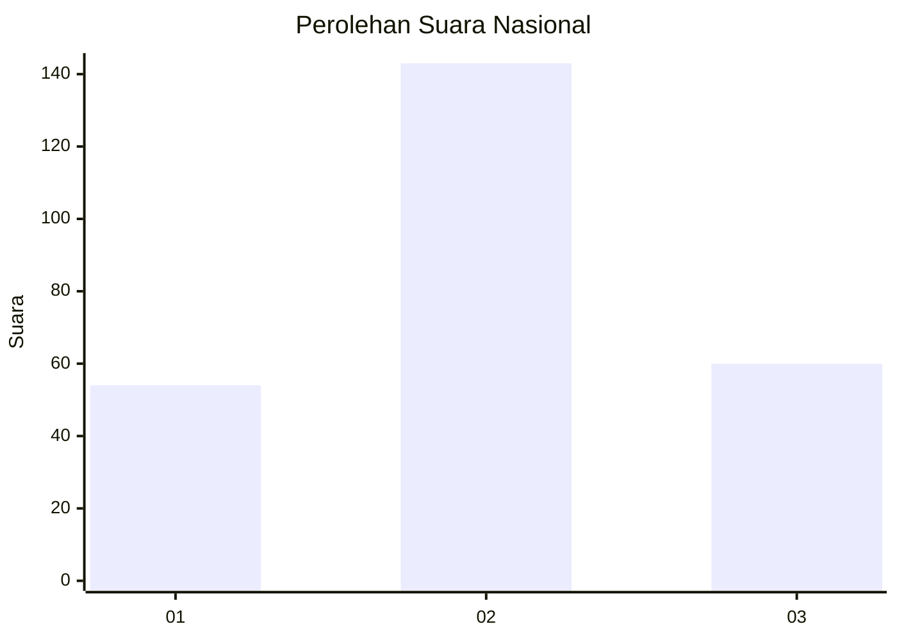
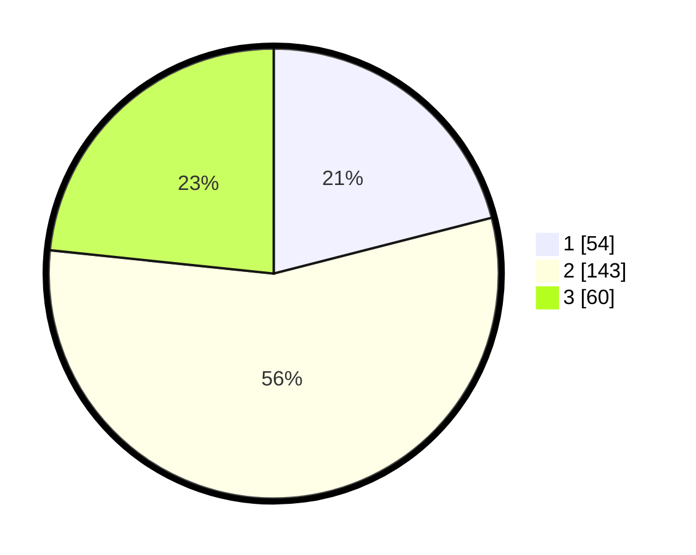

# Hasil

## Grafik

## Tabel

| No. | Nama Paslon    | Suara | Suara (raw) | Persentase |
|:--- |:-------------- | -----:| -----------:| ----------:|
| 1   | ANIES MUHAIMIN | 54    | [54][p-1]   | 21,01      |
| 2   | PRABOWO GIBRAN | 143   | [143][p-2]  | 55,64      |
| 3   | GANJAR MAHFUD  | 60    | [60][p-3]   | 23,35      |

[p-1]: https://github.com/gigit-pemilu/pemilu-2024/blob/main/pilpres/hitung-suara/sub/34-di-yogyakarta/sub/04-sleman/sub/01-gamping/sub/2004-nogotirto/sub/037-tps/sub/paslon-1.txt
[p-2]: https://github.com/gigit-pemilu/pemilu-2024/blob/main/pilpres/hitung-suara/sub/34-di-yogyakarta/sub/04-sleman/sub/01-gamping/sub/2004-nogotirto/sub/037-tps/sub/paslon-2.txt
[p-3]: https://github.com/gigit-pemilu/pemilu-2024/blob/main/pilpres/hitung-suara/sub/34-di-yogyakarta/sub/04-sleman/sub/01-gamping/sub/2004-nogotirto/sub/037-tps/sub/paslon-3.txt

## Foto C Plano

https://sirekap-obj-formc.kpu.go.id/3104/pemilu/ppwp/34/04/01/20/04/3404012004037-20240215-001257--48b373d4-bd0a-4c17-a378-89acd95b1c69.jpg

https://sirekap-obj-formc.kpu.go.id/3104/pemilu/ppwp/34/04/01/20/04/3404012004037-20240215-001322--76723d51-5cc1-4b80-a7cc-f204f52d2889.jpg

https://sirekap-obj-formc.kpu.go.id/3104/pemilu/ppwp/34/04/01/20/04/3404012004037-20240215-001401--20144b2f-5b99-40d8-a9d7-7d543ad6c368.jpg

## Metadata

| Key        | Value               |
| ---------- | ------------------- |
| Time Stamp | 2024-02-15 22:00:27 |

