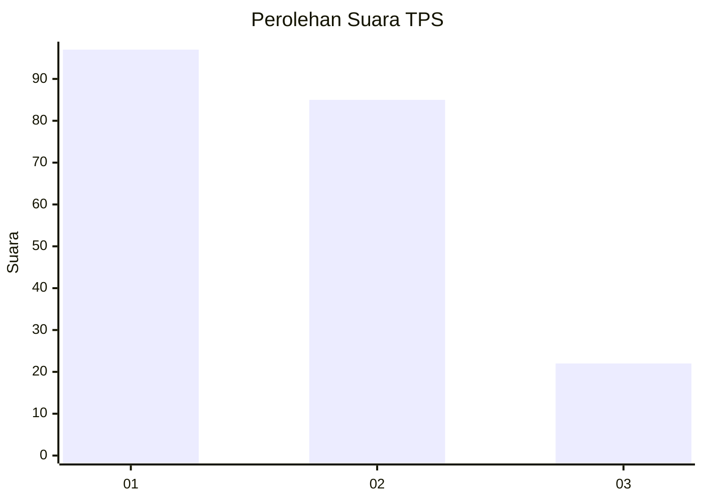
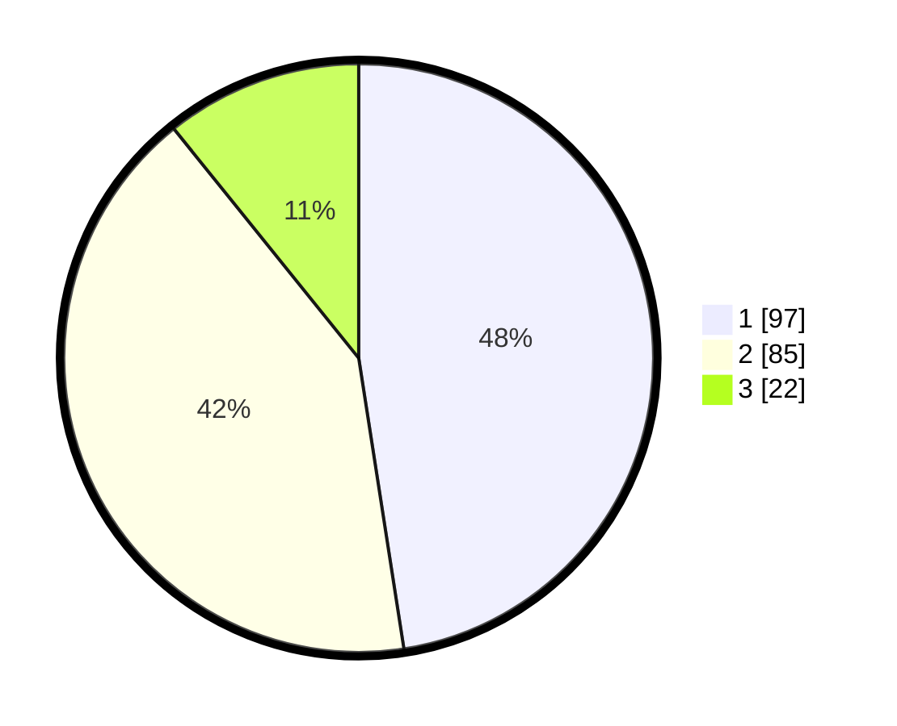

# Hasil

## Grafik

## Tabel

| No. | Nama Paslon    | Suara | Suara (raw) | Persentase |
|:--- |:-------------- | -----:| -----------:| ----------:|
| 1   | ANIES MUHAIMIN | 97    | [97][p-1]   | 47,55      |
| 2   | PRABOWO GIBRAN | 85    | [85][p-2]   | 41,67      |
| 3   | GANJAR MAHFUD  | 22    | [22][p-3]   | 10,78      |

[p-1]: https://github.com/gigit-pemilu/pemilu-2024-34-di-yogyakarta/blob/main/pilpres/hitung-suara/sub/34-di-yogyakarta/sub/04-sleman/sub/01-gamping/sub/2004-nogotirto/sub/046-tps/sub/paslon-1.txt
[p-2]: https://github.com/gigit-pemilu/pemilu-2024-34-di-yogyakarta/blob/main/pilpres/hitung-suara/sub/34-di-yogyakarta/sub/04-sleman/sub/01-gamping/sub/2004-nogotirto/sub/046-tps/sub/paslon-2.txt
[p-3]: https://github.com/gigit-pemilu/pemilu-2024-34-di-yogyakarta/blob/main/pilpres/hitung-suara/sub/34-di-yogyakarta/sub/04-sleman/sub/01-gamping/sub/2004-nogotirto/sub/046-tps/sub/paslon-3.txt

## Foto C Plano

https://sirekap-obj-formc.kpu.go.id/fdbf/pemilu/ppwp/34/04/01/20/04/3404012004046-20240214-192901--617c6acf-7217-4c5a-bc0e-ac0183f4e5c7.jpg

https://sirekap-obj-formc.kpu.go.id/fdbf/pemilu/ppwp/34/04/01/20/04/3404012004046-20240215-182328--7cf13891-a961-4348-971c-f7e241676d8f.jpg

https://sirekap-obj-formc.kpu.go.id/fdbf/pemilu/ppwp/34/04/01/20/04/3404012004046-20240215-182426--60a7adc6-209a-4bd5-9d4a-ca66e1effd9f.jpg

## Metadata

| Key        | Value               |
| ---------- | ------------------- |
| Time Stamp | 2024-02-16 02:30:27 |

