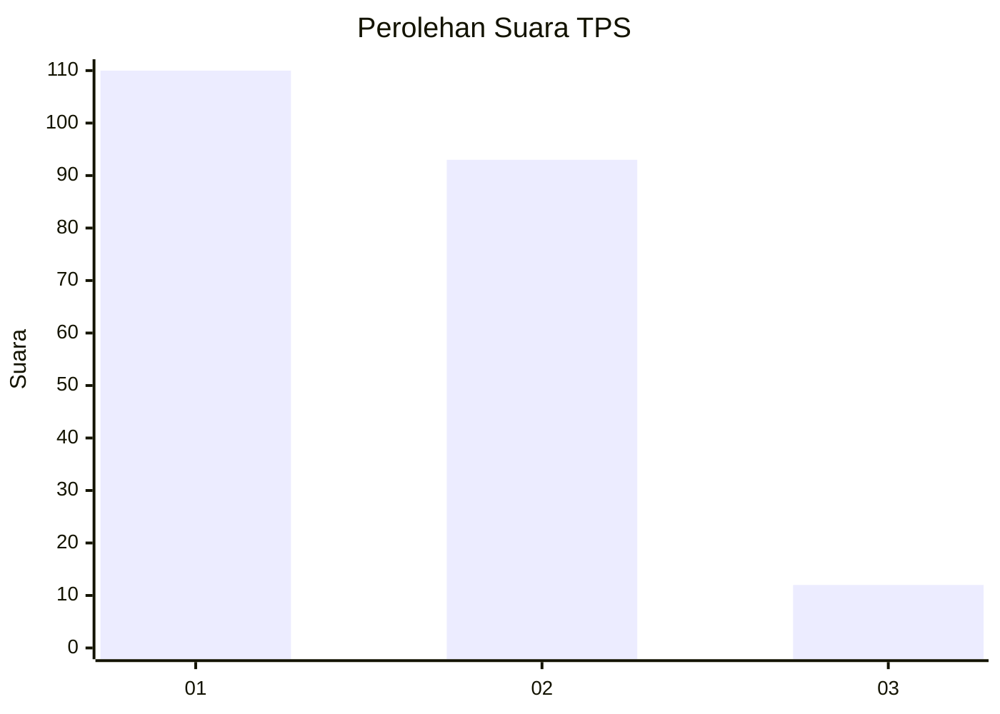
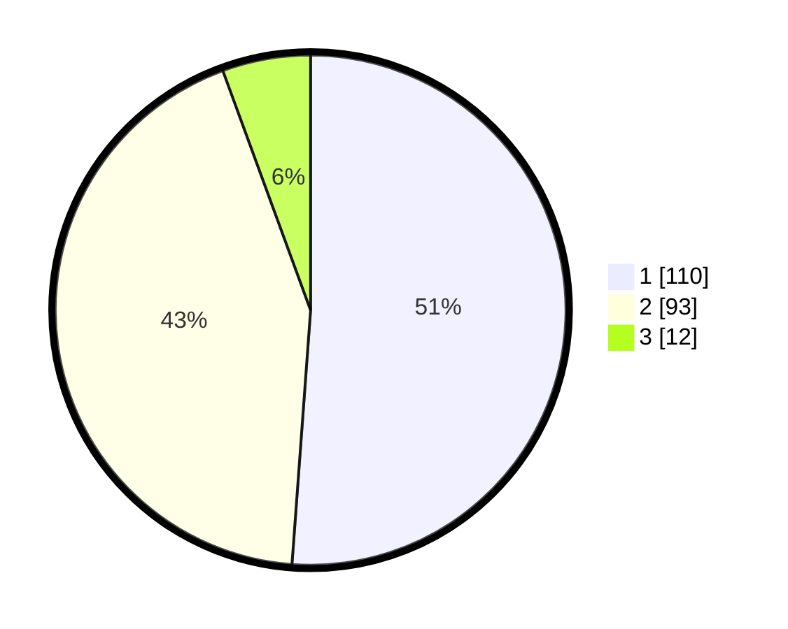

# Hasil

## Grafik

## Tabel

| No. | Nama Paslon    | Suara | Suara (raw) | Persentase |
|:--- |:-------------- | -----:| -----------:| ----------:|
| 1   | ANIES MUHAIMIN | 110   | [110][p-1]  | 51,16      |
| 2   | PRABOWO GIBRAN | 93    | [93][p-2]   | 43,26      |
| 3   | GANJAR MAHFUD  | 12    | [12][p-3]   | 5,58       |

[p-1]: https://github.com/gigit-pemilu/pemilu-2024-34-di-yogyakarta/blob/main/pilpres/hitung-suara/sub/34-di-yogyakarta/sub/04-sleman/sub/01-gamping/sub/2004-nogotirto/sub/050-tps/sub/paslon-1.txt
[p-2]: https://github.com/gigit-pemilu/pemilu-2024-34-di-yogyakarta/blob/main/pilpres/hitung-suara/sub/34-di-yogyakarta/sub/04-sleman/sub/01-gamping/sub/2004-nogotirto/sub/050-tps/sub/paslon-2.txt
[p-3]: https://github.com/gigit-pemilu/pemilu-2024-34-di-yogyakarta/blob/main/pilpres/hitung-suara/sub/34-di-yogyakarta/sub/04-sleman/sub/01-gamping/sub/2004-nogotirto/sub/050-tps/sub/paslon-3.txt

## Foto C Plano

https://sirekap-obj-formc.kpu.go.id/367a/pemilu/ppwp/34/04/01/20/04/3404012004050-20240214-194331--128eef6e-05d0-4834-a978-afbe2dd3c623.jpg

https://sirekap-obj-formc.kpu.go.id/367a/pemilu/ppwp/34/04/01/20/04/3404012004050-20240214-234823--c1d162cb-ae1a-4f4d-90f6-4d90b745c4f4.jpg

https://sirekap-obj-formc.kpu.go.id/367a/pemilu/ppwp/34/04/01/20/04/3404012004050-20240214-155740--90d48725-9b6f-493a-93c4-03f1be710989.jpg

## Metadata

| Key        | Value               |
| ---------- | ------------------- |
| Time Stamp | 2024-02-15 15:00:29 |

