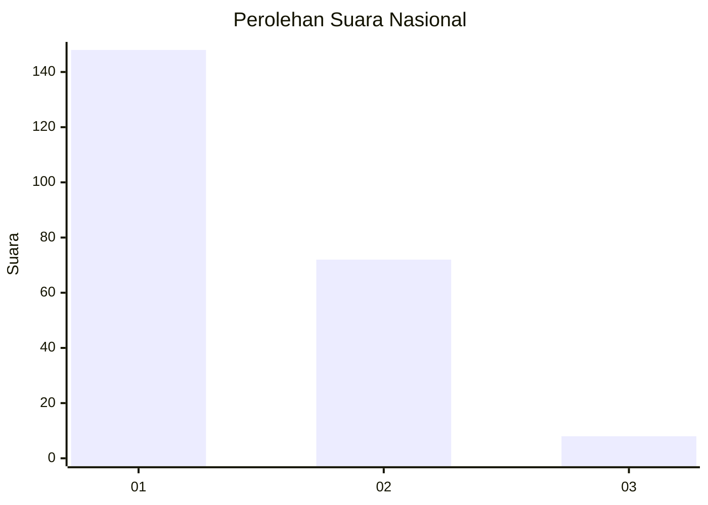
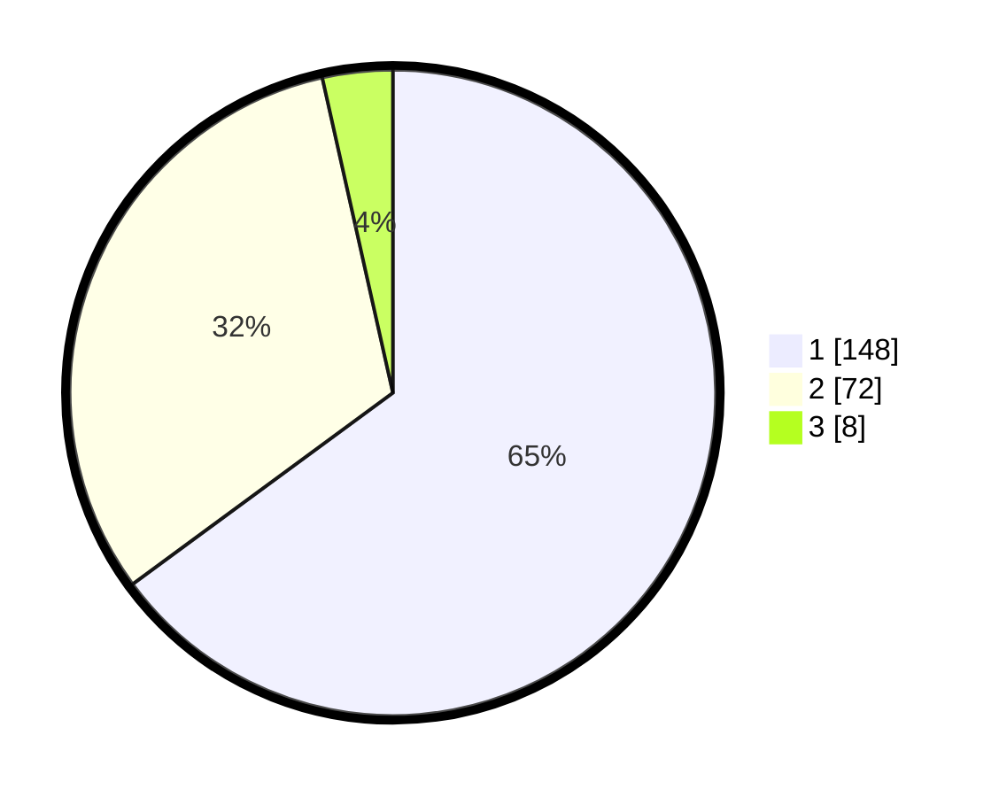

# Hasil

## Grafik

## Tabel

| No. | Nama Paslon    | Suara | Suara (raw) | Persentase |
|:--- |:-------------- | -----:| -----------:| ----------:|
| 1   | ANIES MUHAIMIN | 148   | [148][p-1]  | 64,91      |
| 2   | PRABOWO GIBRAN | 72    | [72][p-2]   | 31,58      |
| 3   | GANJAR MAHFUD  | 8     | [8][p-3]    | 3,51       |

[p-1]: https://github.com/gigit-pemilu/pemilu-2024/blob/main/pilpres/hitung-suara/sub/34-di-yogyakarta/sub/04-sleman/sub/01-gamping/sub/2004-nogotirto/sub/051-tps/sub/paslon-1.txt
[p-2]: https://github.com/gigit-pemilu/pemilu-2024/blob/main/pilpres/hitung-suara/sub/34-di-yogyakarta/sub/04-sleman/sub/01-gamping/sub/2004-nogotirto/sub/051-tps/sub/paslon-2.txt
[p-3]: https://github.com/gigit-pemilu/pemilu-2024/blob/main/pilpres/hitung-suara/sub/34-di-yogyakarta/sub/04-sleman/sub/01-gamping/sub/2004-nogotirto/sub/051-tps/sub/paslon-3.txt

## Foto C Plano

https://sirekap-obj-formc.kpu.go.id/a47f/pemilu/ppwp/34/04/01/20/04/3404012004051-20240215-073418--171c49cb-e45a-4baf-bd23-8c75a5f4b4ee.jpg

https://sirekap-obj-formc.kpu.go.id/a47f/pemilu/ppwp/34/04/01/20/04/3404012004051-20240215-073450--cb2b4d72-e318-4e5c-b759-39e04b887a4f.jpg

## Metadata

| Key        | Value               |
| ---------- | ------------------- |
| Time Stamp | 2024-02-15 22:00:27 |

