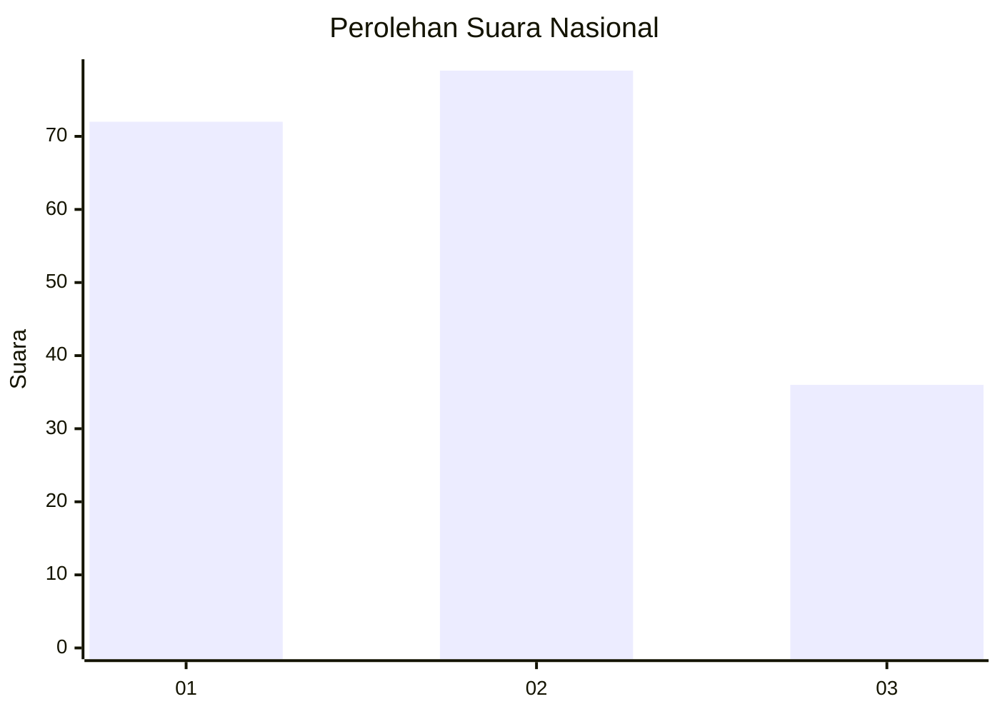
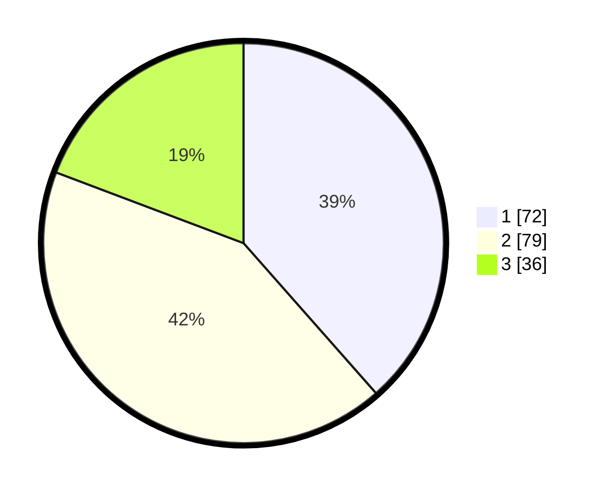

# Hasil

## Grafik

## Tabel

| No. | Nama Paslon    | Suara | Suara (raw) | Persentase |
|:--- |:-------------- | -----:| -----------:| ----------:|
| 1   | ANIES MUHAIMIN | 72    | [72][p-1]   | 38,50      |
| 2   | PRABOWO GIBRAN | 79    | [79][p-2]   | 42,25      |
| 3   | GANJAR MAHFUD  | 36    | [36][p-3]   | 19,25      |

[p-1]: https://github.com/gigit-pemilu/pemilu-2024/blob/main/pilpres/hitung-suara/sub/34-di-yogyakarta/sub/04-sleman/sub/01-gamping/sub/2004-nogotirto/sub/052-tps/sub/paslon-1.txt
[p-2]: https://github.com/gigit-pemilu/pemilu-2024/blob/main/pilpres/hitung-suara/sub/34-di-yogyakarta/sub/04-sleman/sub/01-gamping/sub/2004-nogotirto/sub/052-tps/sub/paslon-2.txt
[p-3]: https://github.com/gigit-pemilu/pemilu-2024/blob/main/pilpres/hitung-suara/sub/34-di-yogyakarta/sub/04-sleman/sub/01-gamping/sub/2004-nogotirto/sub/052-tps/sub/paslon-3.txt

## Foto C Plano

https://sirekap-obj-formc.kpu.go.id/2b00/pemilu/ppwp/34/04/01/20/04/3404012004052-20240214-221012--0258ceff-1a69-4bbf-b2b1-ccb4573d9752.jpg

https://sirekap-obj-formc.kpu.go.id/2b00/pemilu/ppwp/34/04/01/20/04/3404012004052-20240214-221137--76d30db8-7386-4051-821d-d37423428ddf.jpg

https://sirekap-obj-formc.kpu.go.id/2b00/pemilu/ppwp/34/04/01/20/04/3404012004052-20240214-221054--09ef99bb-4526-4ea2-90c2-0e47f6b3b0cb.jpg

## Metadata

| Key        | Value               |
| ---------- | ------------------- |
| Time Stamp | 2024-02-15 12:00:28 |

