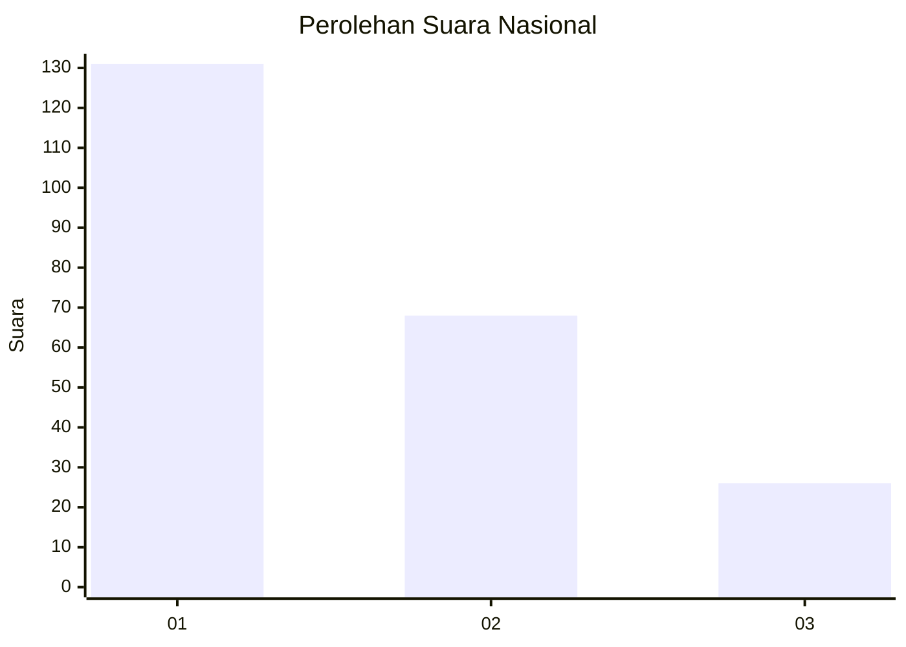
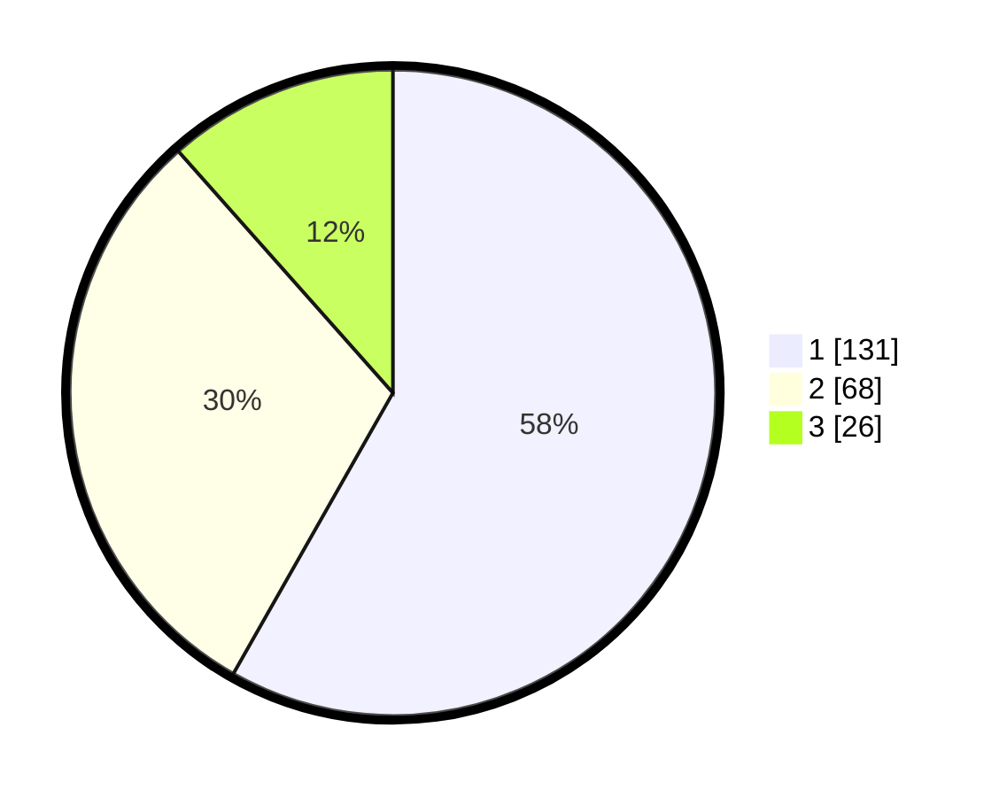

# Hasil

## Grafik

## Tabel

| No. | Nama Paslon    | Suara | Suara (raw) | Persentase |
|:--- |:-------------- | -----:| -----------:| ----------:|
| 1   | ANIES MUHAIMIN | 131   | [131][p-1]  | 58,22      |
| 2   | PRABOWO GIBRAN | 68    | [68][p-2]   | 30,22      |
| 3   | GANJAR MAHFUD  | 26    | [26][p-3]   | 11,56      |

[p-1]: https://github.com/gigit-pemilu/pemilu-2024/blob/main/pilpres/hitung-suara/sub/34-di-yogyakarta/sub/04-sleman/sub/01-gamping/sub/2004-nogotirto/sub/053-tps/sub/paslon-1.txt
[p-2]: https://github.com/gigit-pemilu/pemilu-2024/blob/main/pilpres/hitung-suara/sub/34-di-yogyakarta/sub/04-sleman/sub/01-gamping/sub/2004-nogotirto/sub/053-tps/sub/paslon-2.txt
[p-3]: https://github.com/gigit-pemilu/pemilu-2024/blob/main/pilpres/hitung-suara/sub/34-di-yogyakarta/sub/04-sleman/sub/01-gamping/sub/2004-nogotirto/sub/053-tps/sub/paslon-3.txt

## Foto C Plano

https://sirekap-obj-formc.kpu.go.id/f19d/pemilu/ppwp/34/04/01/20/04/3404012004053-20240214-213345--867bd94b-db06-4411-ba5b-ac26815c7d2b.jpg

https://sirekap-obj-formc.kpu.go.id/f19d/pemilu/ppwp/34/04/01/20/04/3404012004053-20240214-213540--f26a99ed-a1ee-4f02-a106-8cd9e4711cec.jpg

https://sirekap-obj-formc.kpu.go.id/f19d/pemilu/ppwp/34/04/01/20/04/3404012004053-20240214-213716--8197bbf9-6192-4da6-b5cd-d256451f8cf3.jpg

## Metadata

| Key        | Value               |
| ---------- | ------------------- |
| Time Stamp | 2024-02-15 15:00:29 |

