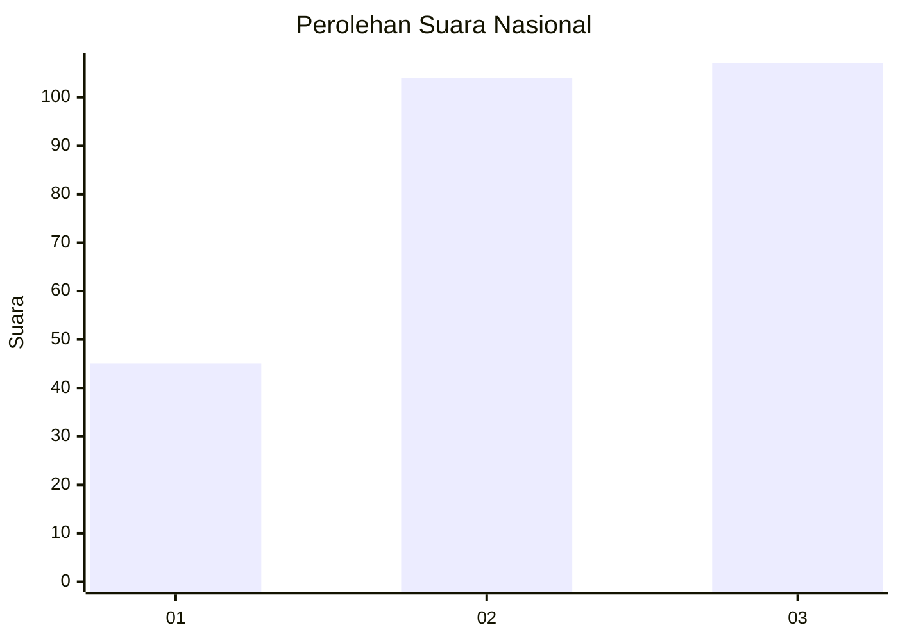
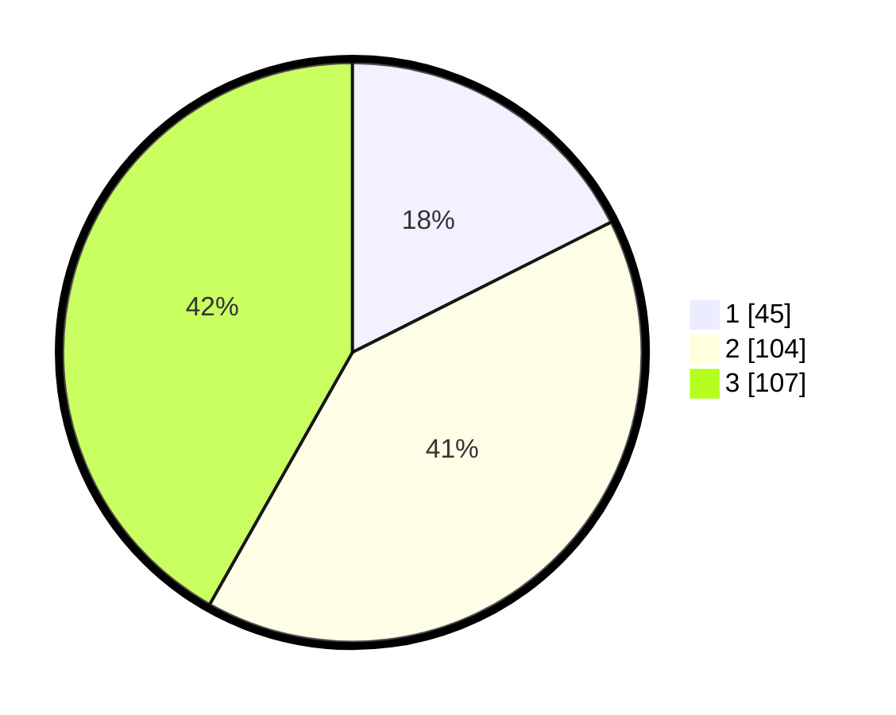

# Hasil

## Grafik

## Tabel

| No. | Nama Paslon    | Suara | Suara (raw) | Persentase |
|:--- |:-------------- | -----:| -----------:| ----------:|
| 1   | ANIES MUHAIMIN | 45    | [45][p-1]   | 17,58      |
| 2   | PRABOWO GIBRAN | 104   | [104][p-2]  | 40,63      |
| 3   | GANJAR MAHFUD  | 107   | [107][p-3]  | 41,80      |

[p-1]: https://github.com/gigit-pemilu/pemilu-2024/blob/main/pilpres/hitung-suara/sub/34-di-yogyakarta/sub/04-sleman/sub/01-gamping/sub/2005-trihanggo/sub/001-tps/sub/paslon-1.txt
[p-2]: https://github.com/gigit-pemilu/pemilu-2024/blob/main/pilpres/hitung-suara/sub/34-di-yogyakarta/sub/04-sleman/sub/01-gamping/sub/2005-trihanggo/sub/001-tps/sub/paslon-2.txt
[p-3]: https://github.com/gigit-pemilu/pemilu-2024/blob/main/pilpres/hitung-suara/sub/34-di-yogyakarta/sub/04-sleman/sub/01-gamping/sub/2005-trihanggo/sub/001-tps/sub/paslon-3.txt

## Foto C Plano

https://sirekap-obj-formc.kpu.go.id/ba5a/pemilu/ppwp/34/04/01/20/05/3404012005001-20240214-232138--dc95bc86-f228-4458-8873-a90315d15aa9.jpg

https://sirekap-obj-formc.kpu.go.id/ba5a/pemilu/ppwp/34/04/01/20/05/3404012005001-20240214-232249--1421b550-b9a6-4d18-aadd-030a5b4c50bc.jpg

## Metadata

| Key        | Value               |
| ---------- | ------------------- |
| Time Stamp | 2024-02-15 17:30:25 |

