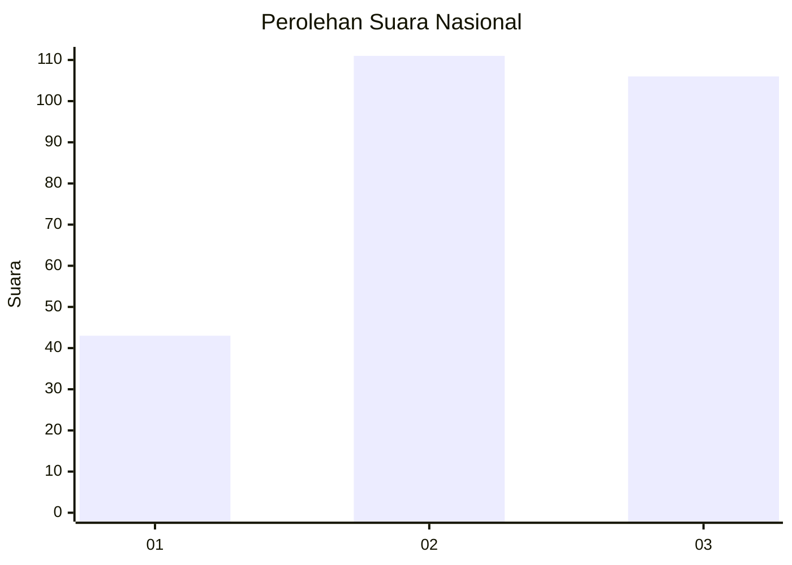
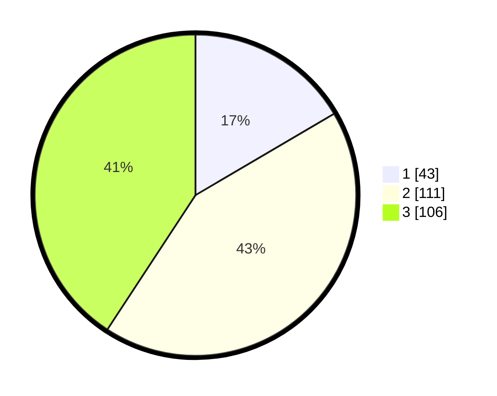

# Hasil

## Grafik

## Tabel

| No. | Nama Paslon    | Suara | Suara (raw) | Persentase |
|:--- |:-------------- | -----:| -----------:| ----------:|
| 1   | ANIES MUHAIMIN | 43    | [43][p-1]   | 16,54      |
| 2   | PRABOWO GIBRAN | 111   | [111][p-2]  | 42,69      |
| 3   | GANJAR MAHFUD  | 106   | [106][p-3]  | 40,77      |

[p-1]: https://github.com/gigit-pemilu/pemilu-2024/blob/main/pilpres/hitung-suara/sub/34-di-yogyakarta/sub/04-sleman/sub/01-gamping/sub/2005-trihanggo/sub/013-tps/sub/paslon-1.txt
[p-2]: https://github.com/gigit-pemilu/pemilu-2024/blob/main/pilpres/hitung-suara/sub/34-di-yogyakarta/sub/04-sleman/sub/01-gamping/sub/2005-trihanggo/sub/013-tps/sub/paslon-2.txt
[p-3]: https://github.com/gigit-pemilu/pemilu-2024/blob/main/pilpres/hitung-suara/sub/34-di-yogyakarta/sub/04-sleman/sub/01-gamping/sub/2005-trihanggo/sub/013-tps/sub/paslon-3.txt

## Foto C Plano

https://sirekap-obj-formc.kpu.go.id/e74c/pemilu/ppwp/34/04/01/20/05/3404012005013-20240214-231359--727aaa30-4546-4808-9a28-d2a7b9f7ff3e.jpg

https://sirekap-obj-formc.kpu.go.id/e74c/pemilu/ppwp/34/04/01/20/05/3404012005013-20240214-231537--ec456fd0-730b-40f4-9755-99fc22293357.jpg

https://sirekap-obj-formc.kpu.go.id/e74c/pemilu/ppwp/34/04/01/20/05/3404012005013-20240214-231608--2f028ced-8aee-4d8f-8844-6c2e6b3fe35a.jpg

## Metadata

| Key        | Value               |
| ---------- | ------------------- |
| Time Stamp | 2024-02-15 16:30:25 |

