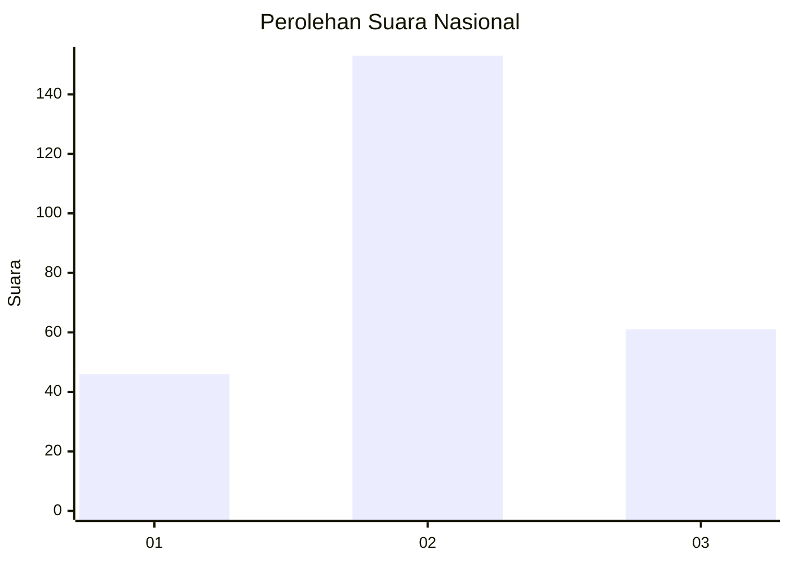
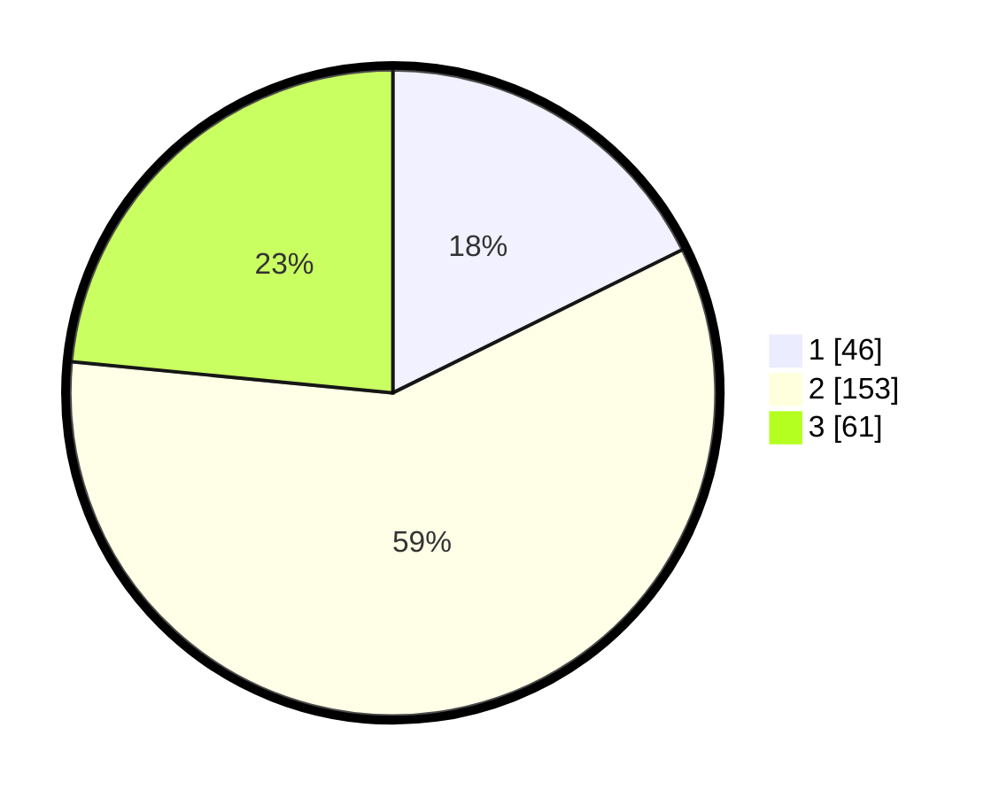

# Hasil

## Grafik

## Tabel

| No. | Nama Paslon    | Suara | Suara (raw) | Persentase |
|:--- |:-------------- | -----:| -----------:| ----------:|
| 1   | ANIES MUHAIMIN | 46    | [46][p-1]   | 17,69      |
| 2   | PRABOWO GIBRAN | 153   | [153][p-2]  | 58,85      |
| 3   | GANJAR MAHFUD  | 61    | [61][p-3]   | 23,46      |

[p-1]: https://github.com/gigit-pemilu/pemilu-2024/blob/main/pilpres/hitung-suara/sub/34-di-yogyakarta/sub/04-sleman/sub/01-gamping/sub/2005-trihanggo/sub/016-tps/sub/paslon-1.txt
[p-2]: https://github.com/gigit-pemilu/pemilu-2024/blob/main/pilpres/hitung-suara/sub/34-di-yogyakarta/sub/04-sleman/sub/01-gamping/sub/2005-trihanggo/sub/016-tps/sub/paslon-2.txt
[p-3]: https://github.com/gigit-pemilu/pemilu-2024/blob/main/pilpres/hitung-suara/sub/34-di-yogyakarta/sub/04-sleman/sub/01-gamping/sub/2005-trihanggo/sub/016-tps/sub/paslon-3.txt

## Foto C Plano

https://sirekap-obj-formc.kpu.go.id/0e70/pemilu/ppwp/34/04/01/20/05/3404012005016-20240215-003256--76677a6e-1328-4423-8854-c4ae12398af6.jpg

https://sirekap-obj-formc.kpu.go.id/0e70/pemilu/ppwp/34/04/01/20/05/3404012005016-20240215-003458--e4e94e9b-801a-4087-9f42-3e4691f7edbb.jpg

https://sirekap-obj-formc.kpu.go.id/0e70/pemilu/ppwp/34/04/01/20/05/3404012005016-20240215-003651--995dac58-835c-43b0-9872-e1449d7de76a.jpg

## Metadata

| Key        | Value               |
| ---------- | ------------------- |
| Time Stamp | 2024-02-15 15:00:29 |

