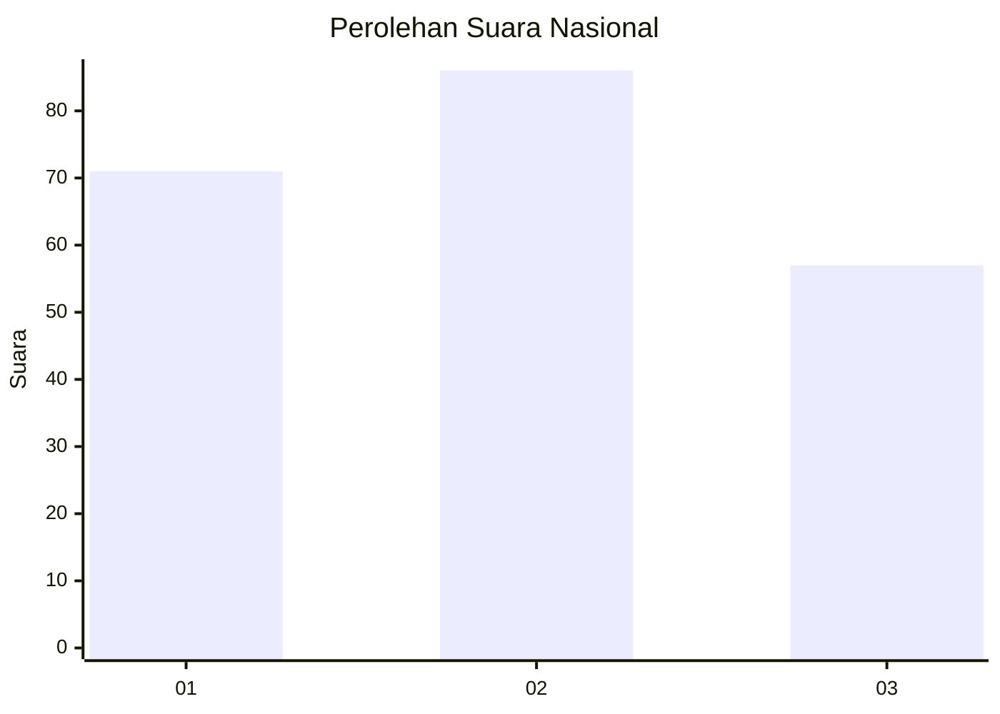
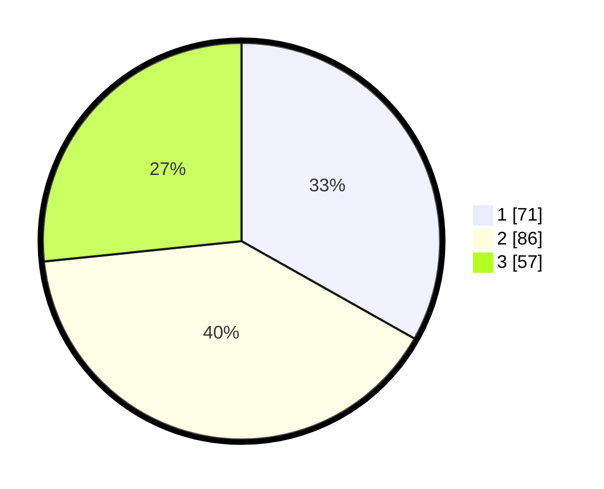

# Hasil

## Grafik

## Tabel

| No. | Nama Paslon    | Suara | Suara (raw) | Persentase |
|:--- |:-------------- | -----:| -----------:| ----------:|
| 1   | ANIES MUHAIMIN | 71    | [71][p-1]   | 33,18      |
| 2   | PRABOWO GIBRAN | 86    | [86][p-2]   | 40,19      |
| 3   | GANJAR MAHFUD  | 57    | [57][p-3]   | 26,64      |

[p-1]: https://github.com/gigit-pemilu/pemilu-2024/blob/main/pilpres/hitung-suara/sub/34-di-yogyakarta/sub/04-sleman/sub/01-gamping/sub/2005-trihanggo/sub/019-tps/sub/paslon-1.txt
[p-2]: https://github.com/gigit-pemilu/pemilu-2024/blob/main/pilpres/hitung-suara/sub/34-di-yogyakarta/sub/04-sleman/sub/01-gamping/sub/2005-trihanggo/sub/019-tps/sub/paslon-2.txt
[p-3]: https://github.com/gigit-pemilu/pemilu-2024/blob/main/pilpres/hitung-suara/sub/34-di-yogyakarta/sub/04-sleman/sub/01-gamping/sub/2005-trihanggo/sub/019-tps/sub/paslon-3.txt

## Foto C Plano

https://sirekap-obj-formc.kpu.go.id/7333/pemilu/ppwp/34/04/01/20/05/3404012005019-20240214-193837--d43b63c4-384b-4959-bf98-418a3f3e0dc3.jpg

https://sirekap-obj-formc.kpu.go.id/7333/pemilu/ppwp/34/04/01/20/05/3404012005019-20240214-190807--c0b7388a-1f10-4374-b88d-00bd3d17b1c1.jpg

https://sirekap-obj-formc.kpu.go.id/7333/pemilu/ppwp/34/04/01/20/05/3404012005019-20240214-201236--8e881dcd-4bb6-4502-8a29-faa10bc05644.jpg

## Metadata

| Key        | Value               |
| ---------- | ------------------- |
| Time Stamp | 2024-02-14 21:46:01 |

