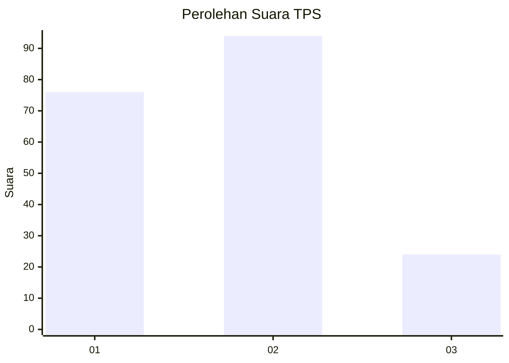
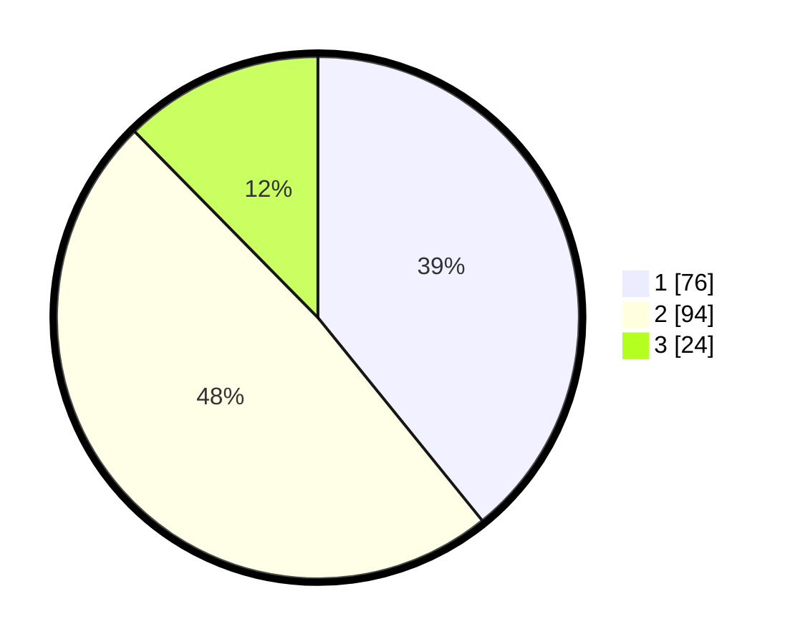

# Hasil

## Grafik

## Tabel

| No. | Nama Paslon    | Suara | Suara (raw) | Persentase |
|:--- |:-------------- | -----:| -----------:| ----------:|
| 1   | ANIES MUHAIMIN | 76    | [76][p-1]   | 39,18      |
| 2   | PRABOWO GIBRAN | 94    | [94][p-2]   | 48,45      |
| 3   | GANJAR MAHFUD  | 24    | [24][p-3]   | 12,37      |

[p-1]: https://github.com/gigit-pemilu/pemilu-2024-34-di-yogyakarta/blob/main/pilpres/hitung-suara/sub/34-di-yogyakarta/sub/04-sleman/sub/01-gamping/sub/2005-trihanggo/sub/020-tps/sub/paslon-1.txt
[p-2]: https://github.com/gigit-pemilu/pemilu-2024-34-di-yogyakarta/blob/main/pilpres/hitung-suara/sub/34-di-yogyakarta/sub/04-sleman/sub/01-gamping/sub/2005-trihanggo/sub/020-tps/sub/paslon-2.txt
[p-3]: https://github.com/gigit-pemilu/pemilu-2024-34-di-yogyakarta/blob/main/pilpres/hitung-suara/sub/34-di-yogyakarta/sub/04-sleman/sub/01-gamping/sub/2005-trihanggo/sub/020-tps/sub/paslon-3.txt

## Foto C Plano

https://sirekap-obj-formc.kpu.go.id/7993/pemilu/ppwp/34/04/01/20/05/3404012005020-20240214-214950--2943a7af-6495-4a98-a8df-709bd24ddfc2.jpg

https://sirekap-obj-formc.kpu.go.id/7993/pemilu/ppwp/34/04/01/20/05/3404012005020-20240214-215025--a97fd712-1d71-44db-abfa-20f28a1645aa.jpg

https://sirekap-obj-formc.kpu.go.id/7993/pemilu/ppwp/34/04/01/20/05/3404012005020-20240214-215107--96cbfec6-39c4-4c0b-95e8-a62347549662.jpg

## Metadata

| Key        | Value               |
| ---------- | ------------------- |
| Time Stamp | 2024-02-15 22:30:27 |

