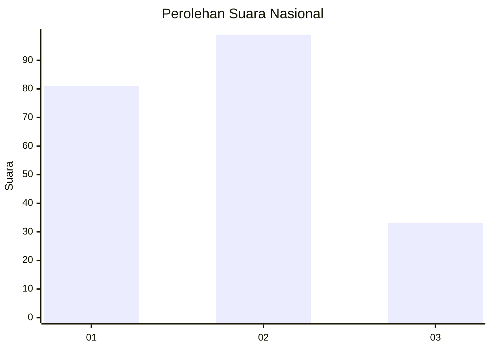
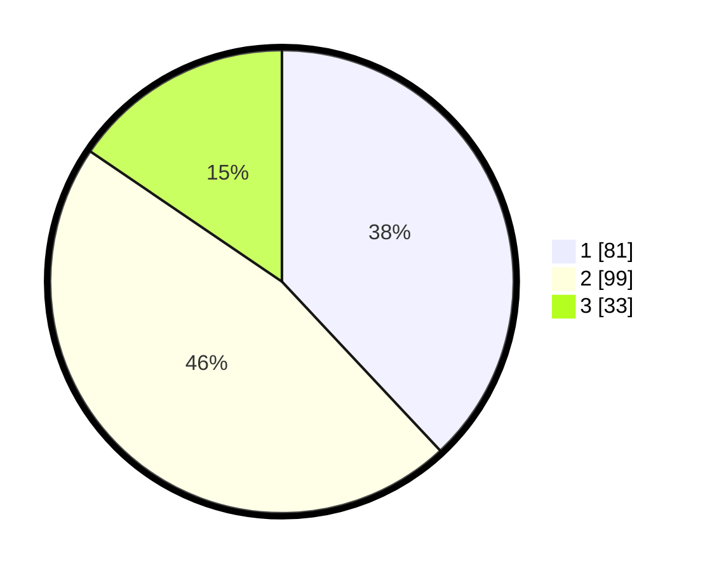

# Hasil

## Grafik

## Tabel

| No. | Nama Paslon    | Suara | Suara (raw) | Persentase |
|:--- |:-------------- | -----:| -----------:| ----------:|
| 1   | ANIES MUHAIMIN | 81    | [81][p-1]   | 38,03      |
| 2   | PRABOWO GIBRAN | 99    | [99][p-2]   | 46,48      |
| 3   | GANJAR MAHFUD  | 33    | [33][p-3]   | 15,49      |

[p-1]: https://github.com/gigit-pemilu/pemilu-2024/blob/main/pilpres/hitung-suara/sub/34-di-yogyakarta/sub/04-sleman/sub/01-gamping/sub/2005-trihanggo/sub/021-tps/sub/paslon-1.txt
[p-2]: https://github.com/gigit-pemilu/pemilu-2024/blob/main/pilpres/hitung-suara/sub/34-di-yogyakarta/sub/04-sleman/sub/01-gamping/sub/2005-trihanggo/sub/021-tps/sub/paslon-2.txt
[p-3]: https://github.com/gigit-pemilu/pemilu-2024/blob/main/pilpres/hitung-suara/sub/34-di-yogyakarta/sub/04-sleman/sub/01-gamping/sub/2005-trihanggo/sub/021-tps/sub/paslon-3.txt

## Foto C Plano

https://sirekap-obj-formc.kpu.go.id/dc16/pemilu/ppwp/34/04/01/20/05/3404012005021-20240215-010459--54eda13c-47ed-4cd3-8bd1-c6e4cd24f4d9.jpg

https://sirekap-obj-formc.kpu.go.id/dc16/pemilu/ppwp/34/04/01/20/05/3404012005021-20240215-010647--6ac5adc8-00e6-43c3-ab57-5574dd247542.jpg

https://sirekap-obj-formc.kpu.go.id/dc16/pemilu/ppwp/34/04/01/20/05/3404012005021-20240215-010741--8ed966b1-d791-4828-ab18-a9cd2163e55e.jpg

## Metadata

| Key        | Value               |
| ---------- | ------------------- |
| Time Stamp | 2024-02-15 17:30:25 |

