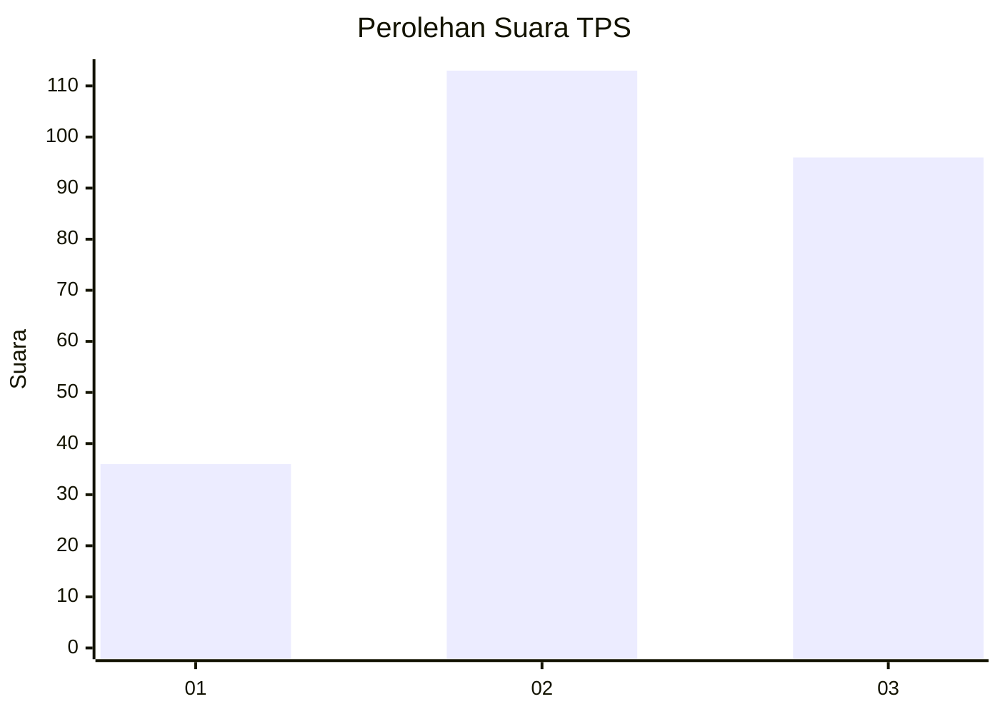
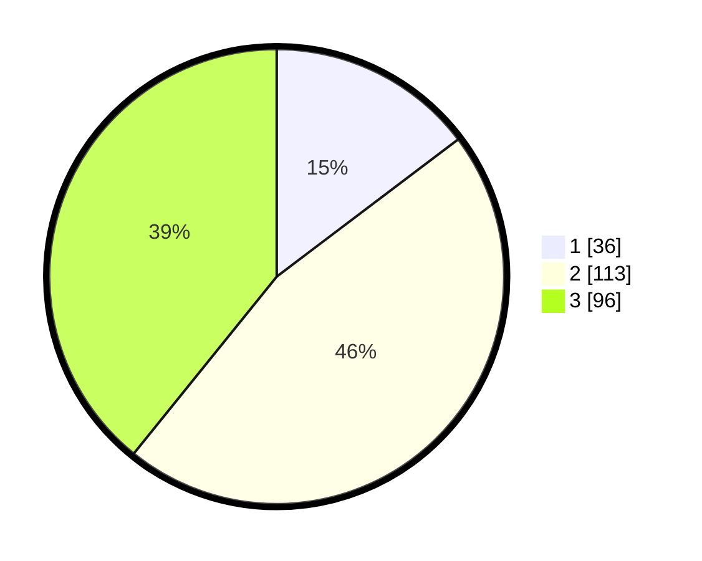

# Hasil

## Grafik

## Tabel

| No. | Nama Paslon    | Suara | Suara (raw) | Persentase |
|:--- |:-------------- | -----:| -----------:| ----------:|
| 1   | ANIES MUHAIMIN | 36    | [36][p-1]   | 14,69      |
| 2   | PRABOWO GIBRAN | 113   | [113][p-2]  | 46,12      |
| 3   | GANJAR MAHFUD  | 96    | [96][p-3]   | 39,18      |

[p-1]: https://github.com/gigit-pemilu/pemilu-2024-34-di-yogyakarta/blob/main/pilpres/hitung-suara/sub/34-di-yogyakarta/sub/04-sleman/sub/01-gamping/sub/2005-trihanggo/sub/035-tps/sub/paslon-1.txt
[p-2]: https://github.com/gigit-pemilu/pemilu-2024-34-di-yogyakarta/blob/main/pilpres/hitung-suara/sub/34-di-yogyakarta/sub/04-sleman/sub/01-gamping/sub/2005-trihanggo/sub/035-tps/sub/paslon-2.txt
[p-3]: https://github.com/gigit-pemilu/pemilu-2024-34-di-yogyakarta/blob/main/pilpres/hitung-suara/sub/34-di-yogyakarta/sub/04-sleman/sub/01-gamping/sub/2005-trihanggo/sub/035-tps/sub/paslon-3.txt

## Foto C Plano

https://sirekap-obj-formc.kpu.go.id/72a1/pemilu/ppwp/34/04/01/20/05/3404012005035-20240214-160106--12e6d01b-6a8e-48b3-8980-dc8eb0d4582c.jpg

https://sirekap-obj-formc.kpu.go.id/72a1/pemilu/ppwp/34/04/01/20/05/3404012005035-20240214-160054--18f3d62c-b297-45dd-b140-e5e9ac450129.jpg

https://sirekap-obj-formc.kpu.go.id/72a1/pemilu/ppwp/34/04/01/20/05/3404012005035-20240214-160112--7bef83ad-8557-4aba-bb19-4f3524928f83.jpg

## Metadata

| Key        | Value               |
| ---------- | ------------------- |
| Time Stamp | 2024-02-15 15:00:29 |

