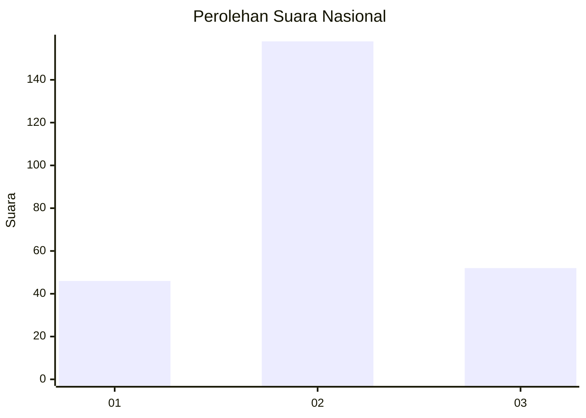
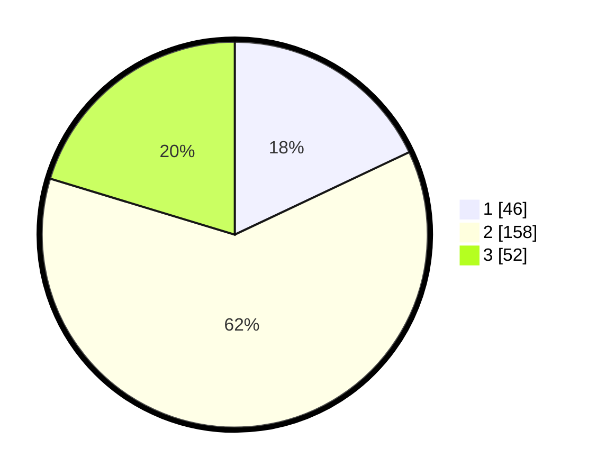

# Hasil

## Grafik

## Tabel

| No. | Nama Paslon    | Suara | Suara (raw) | Persentase |
|:--- |:-------------- | -----:| -----------:| ----------:|
| 1   | ANIES MUHAIMIN | 46    | [46][p-1]   | 17,97      |
| 2   | PRABOWO GIBRAN | 158   | [158][p-2]  | 61,72      |
| 3   | GANJAR MAHFUD  | 52    | [52][p-3]   | 20,31      |

[p-1]: https://github.com/gigit-pemilu/pemilu-2024/blob/main/pilpres/hitung-suara/sub/34-di-yogyakarta/sub/04-sleman/sub/01-gamping/sub/2005-trihanggo/sub/037-tps/sub/paslon-1.txt
[p-2]: https://github.com/gigit-pemilu/pemilu-2024/blob/main/pilpres/hitung-suara/sub/34-di-yogyakarta/sub/04-sleman/sub/01-gamping/sub/2005-trihanggo/sub/037-tps/sub/paslon-2.txt
[p-3]: https://github.com/gigit-pemilu/pemilu-2024/blob/main/pilpres/hitung-suara/sub/34-di-yogyakarta/sub/04-sleman/sub/01-gamping/sub/2005-trihanggo/sub/037-tps/sub/paslon-3.txt

## Foto C Plano

https://sirekap-obj-formc.kpu.go.id/23c7/pemilu/ppwp/34/04/01/20/05/3404012005037-20240215-024816--3450dfb9-7c2c-4cc2-8789-8b3cb9c115ec.jpg

https://sirekap-obj-formc.kpu.go.id/23c7/pemilu/ppwp/34/04/01/20/05/3404012005037-20240215-024937--8b6e6d62-cc66-4cdc-a14e-b46af4c528df.jpg

https://sirekap-obj-formc.kpu.go.id/23c7/pemilu/ppwp/34/04/01/20/05/3404012005037-20240215-025116--ca6d5be9-3329-46c8-8396-d90a16976f68.jpg

## Metadata

| Key        | Value               |
| ---------- | ------------------- |
| Time Stamp | 2024-02-15 15:00:29 |

