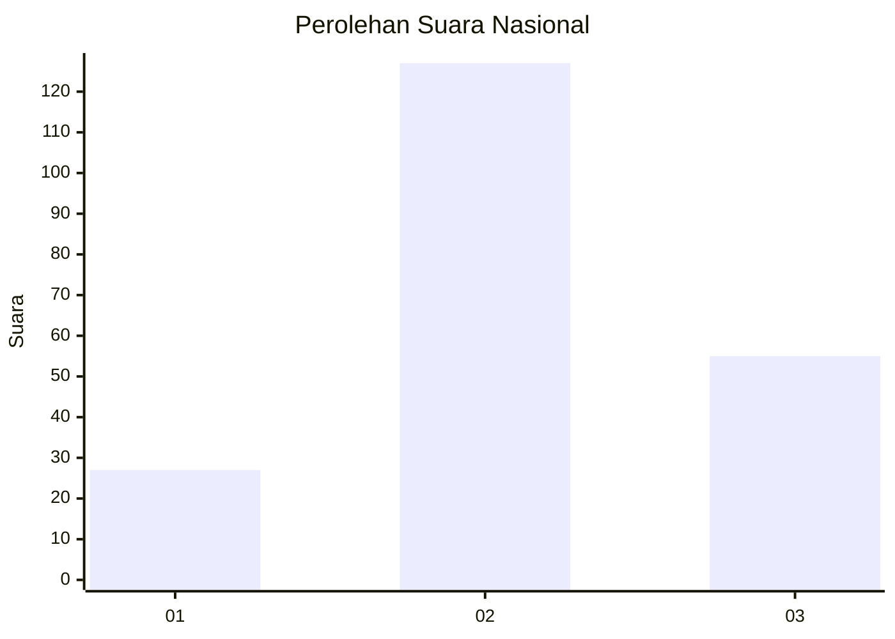
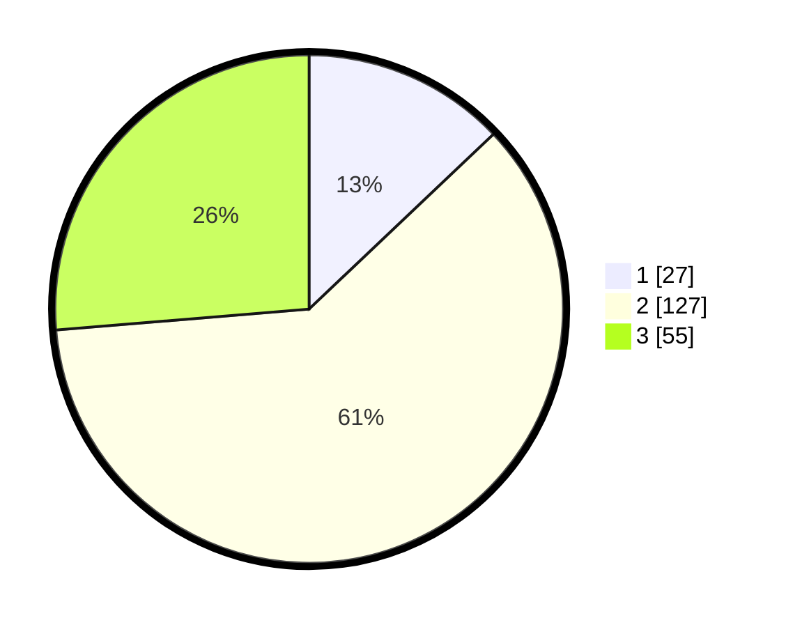

# Hasil

## Grafik

## Tabel

| No. | Nama Paslon    | Suara | Suara (raw) | Persentase |
|:--- |:-------------- | -----:| -----------:| ----------:|
| 1   | ANIES MUHAIMIN | 27    | [27][p-1]   | 12,92      |
| 2   | PRABOWO GIBRAN | 127   | [127][p-2]  | 60,77      |
| 3   | GANJAR MAHFUD  | 55    | [55][p-3]   | 26,32      |

[p-1]: https://github.com/gigit-pemilu/pemilu-2024/blob/main/pilpres/hitung-suara/sub/34-di-yogyakarta/sub/04-sleman/sub/01-gamping/sub/2005-trihanggo/sub/039-tps/sub/paslon-1.txt
[p-2]: https://github.com/gigit-pemilu/pemilu-2024/blob/main/pilpres/hitung-suara/sub/34-di-yogyakarta/sub/04-sleman/sub/01-gamping/sub/2005-trihanggo/sub/039-tps/sub/paslon-2.txt
[p-3]: https://github.com/gigit-pemilu/pemilu-2024/blob/main/pilpres/hitung-suara/sub/34-di-yogyakarta/sub/04-sleman/sub/01-gamping/sub/2005-trihanggo/sub/039-tps/sub/paslon-3.txt

## Foto C Plano

https://sirekap-obj-formc.kpu.go.id/89bd/pemilu/ppwp/34/04/01/20/05/3404012005039-20240215-224855--e3b35a14-763c-467f-8878-188e20f80902.jpg

https://sirekap-obj-formc.kpu.go.id/89bd/pemilu/ppwp/34/04/01/20/05/3404012005039-20240215-224912--343282f5-43b8-467b-be9f-ee6d18b9d33c.jpg

https://sirekap-obj-formc.kpu.go.id/89bd/pemilu/ppwp/34/04/01/20/05/3404012005039-20240215-224916--b978ded6-391a-4896-89f8-630cb3d77c16.jpg

## Metadata

| Key        | Value               |
| ---------- | ------------------- |
| Time Stamp | 2024-02-16 16:25:10 |

