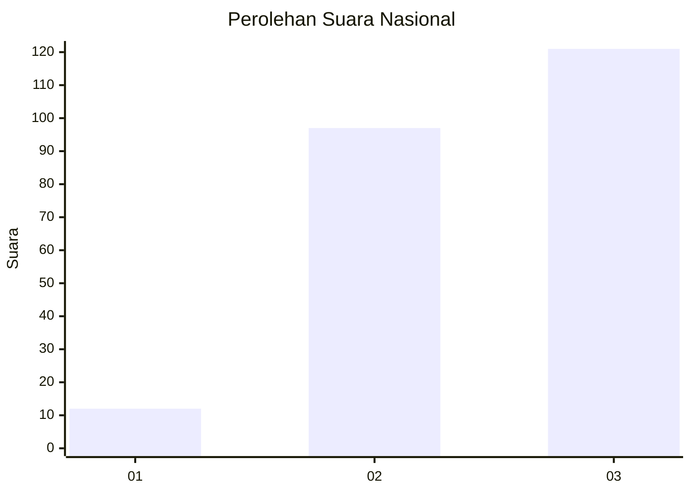
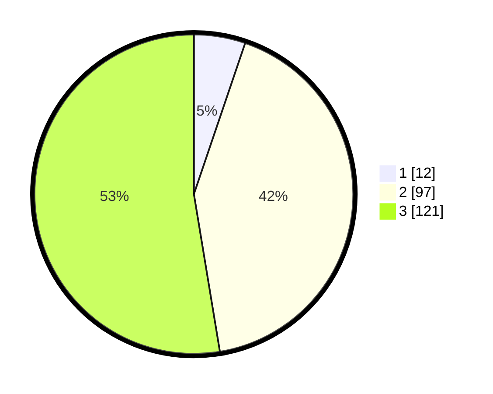

# Hasil

## Grafik

## Tabel

| No. | Nama Paslon    | Suara | Suara (raw) | Persentase |
|:--- |:-------------- | -----:| -----------:| ----------:|
| 1   | ANIES MUHAIMIN | 12    | [12][p-1]   | 5,22       |
| 2   | PRABOWO GIBRAN | 97    | [97][p-2]   | 42,17      |
| 3   | GANJAR MAHFUD  | 121   | [121][p-3]  | 52,61      |

[p-1]: https://github.com/gigit-pemilu/pemilu-2024/blob/main/pilpres/hitung-suara/sub/34-di-yogyakarta/sub/04-sleman/sub/01-gamping/sub/2005-trihanggo/sub/041-tps/sub/paslon-1.txt
[p-2]: https://github.com/gigit-pemilu/pemilu-2024/blob/main/pilpres/hitung-suara/sub/34-di-yogyakarta/sub/04-sleman/sub/01-gamping/sub/2005-trihanggo/sub/041-tps/sub/paslon-2.txt
[p-3]: https://github.com/gigit-pemilu/pemilu-2024/blob/main/pilpres/hitung-suara/sub/34-di-yogyakarta/sub/04-sleman/sub/01-gamping/sub/2005-trihanggo/sub/041-tps/sub/paslon-3.txt

## Foto C Plano

https://sirekap-obj-formc.kpu.go.id/0356/pemilu/ppwp/34/04/01/20/05/3404012005041-20240215-050329--7853fb1c-2c6b-49fd-8ef4-2998ac940361.jpg

https://sirekap-obj-formc.kpu.go.id/0356/pemilu/ppwp/34/04/01/20/05/3404012005041-20240215-050548--1b647282-fd3d-4ab5-b12d-ffc760c8b5b8.jpg

https://sirekap-obj-formc.kpu.go.id/0356/pemilu/ppwp/34/04/01/20/05/3404012005041-20240215-053926--44f40f38-d398-48c9-bc35-51d2eb59c5b0.jpg

## Metadata

| Key        | Value               |
| ---------- | ------------------- |
| Time Stamp | 2024-02-24 22:31:28 |

