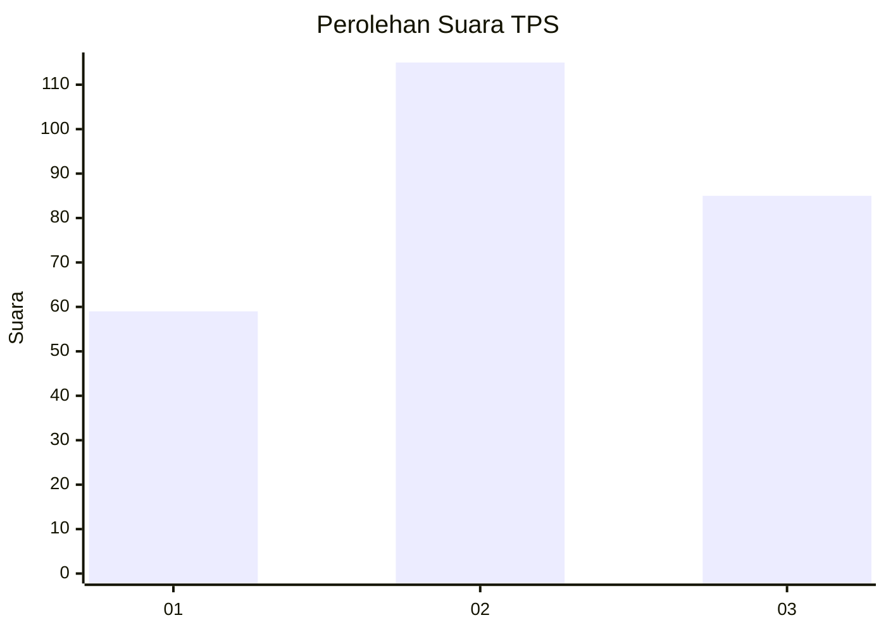
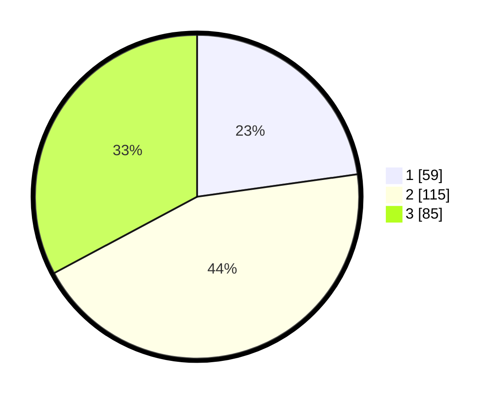

# Hasil

## Grafik

## Tabel

| No. | Nama Paslon    | Suara | Suara (raw) | Persentase |
|:--- |:-------------- | -----:| -----------:| ----------:|
| 1   | ANIES MUHAIMIN | 59    | [59][p-1]   | 22,78      |
| 2   | PRABOWO GIBRAN | 115   | [115][p-2]  | 44,40      |
| 3   | GANJAR MAHFUD  | 85    | [85][p-3]   | 32,82      |

[p-1]: https://github.com/gigit-pemilu/pemilu-2024-34-di-yogyakarta/blob/main/pilpres/hitung-suara/sub/34-di-yogyakarta/sub/04-sleman/sub/01-gamping/sub/2005-trihanggo/sub/043-tps/sub/paslon-1.txt
[p-2]: https://github.com/gigit-pemilu/pemilu-2024-34-di-yogyakarta/blob/main/pilpres/hitung-suara/sub/34-di-yogyakarta/sub/04-sleman/sub/01-gamping/sub/2005-trihanggo/sub/043-tps/sub/paslon-2.txt
[p-3]: https://github.com/gigit-pemilu/pemilu-2024-34-di-yogyakarta/blob/main/pilpres/hitung-suara/sub/34-di-yogyakarta/sub/04-sleman/sub/01-gamping/sub/2005-trihanggo/sub/043-tps/sub/paslon-3.txt

## Foto C Plano

https://sirekap-obj-formc.kpu.go.id/4e7e/pemilu/ppwp/34/04/01/20/05/3404012005043-20240215-010756--ca3aa0cf-7c55-4a4e-bb41-0ba963c0fa91.jpg

https://sirekap-obj-formc.kpu.go.id/4e7e/pemilu/ppwp/34/04/01/20/05/3404012005043-20240215-010827--e52fb0fc-d903-452f-886d-efcd3d11a07e.jpg

https://sirekap-obj-formc.kpu.go.id/4e7e/pemilu/ppwp/34/04/01/20/05/3404012005043-20240215-011758--c8ddb3f5-a2c9-4f3e-9756-6a838f36846b.jpg

## Metadata

| Key        | Value               |
| ---------- | ------------------- |
| Time Stamp | 2024-02-15 22:30:27 |

