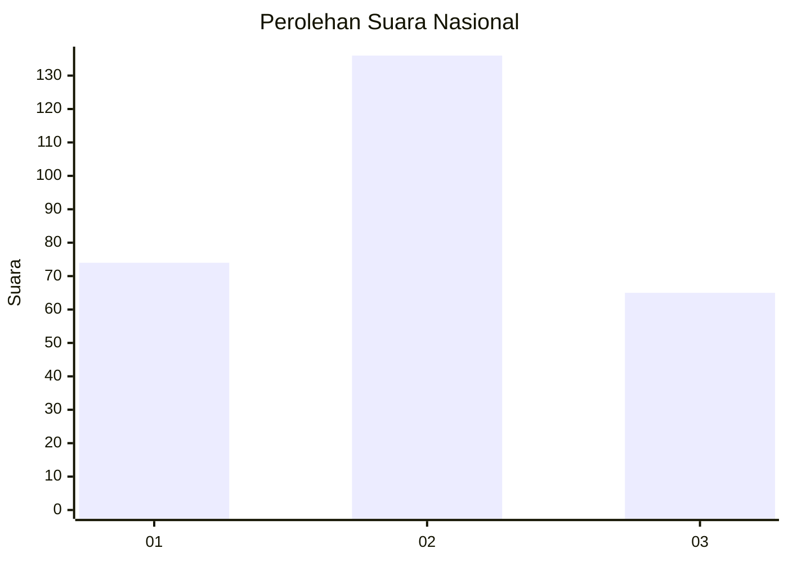
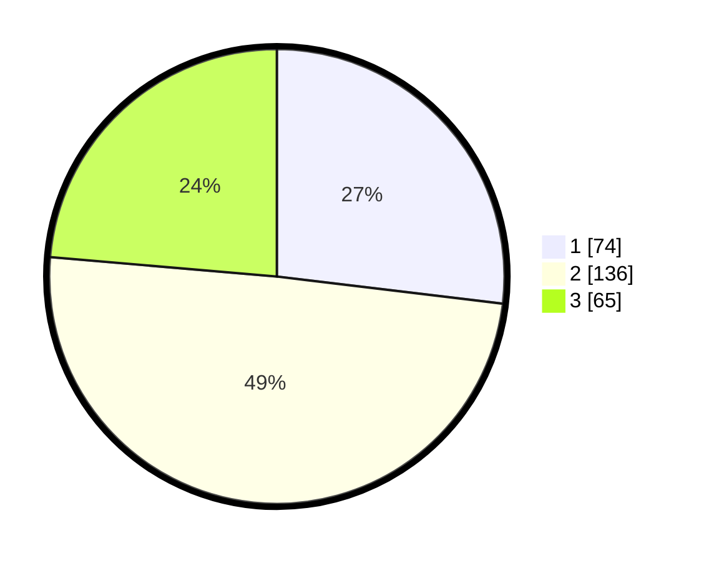

# Hasil

## Grafik

## Tabel

| No. | Nama Paslon    | Suara | Suara (raw) | Persentase |
|:--- |:-------------- | -----:| -----------:| ----------:|
| 1   | ANIES MUHAIMIN | 74    | [74][p-1]   | 26,91      |
| 2   | PRABOWO GIBRAN | 136   | [136][p-2]  | 49,45      |
| 3   | GANJAR MAHFUD  | 65    | [65][p-3]   | 23,64      |

[p-1]: https://github.com/gigit-pemilu/pemilu-2024/blob/main/pilpres/hitung-suara/sub/34-di-yogyakarta/sub/04-sleman/sub/01-gamping/sub/2005-trihanggo/sub/045-tps/sub/paslon-1.txt
[p-2]: https://github.com/gigit-pemilu/pemilu-2024/blob/main/pilpres/hitung-suara/sub/34-di-yogyakarta/sub/04-sleman/sub/01-gamping/sub/2005-trihanggo/sub/045-tps/sub/paslon-2.txt
[p-3]: https://github.com/gigit-pemilu/pemilu-2024/blob/main/pilpres/hitung-suara/sub/34-di-yogyakarta/sub/04-sleman/sub/01-gamping/sub/2005-trihanggo/sub/045-tps/sub/paslon-3.txt

## Foto C Plano

https://sirekap-obj-formc.kpu.go.id/0a29/pemilu/ppwp/34/04/01/20/05/3404012005045-20240214-190242--1a9c0025-cfa0-44fd-b61c-c88ce37b363f.jpg

https://sirekap-obj-formc.kpu.go.id/0a29/pemilu/ppwp/34/04/01/20/05/3404012005045-20240214-190140--65cea2fd-ce2a-4c71-978c-8f0442a1f59f.jpg

https://sirekap-obj-formc.kpu.go.id/0a29/pemilu/ppwp/34/04/01/20/05/3404012005045-20240214-233449--407346a8-a3ce-4b9d-9982-a099a4cde386.jpg

## Metadata

| Key        | Value               |
| ---------- | ------------------- |
| Time Stamp | 2024-02-15 15:00:29 |

