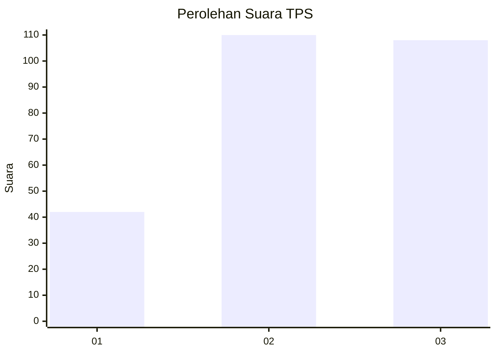
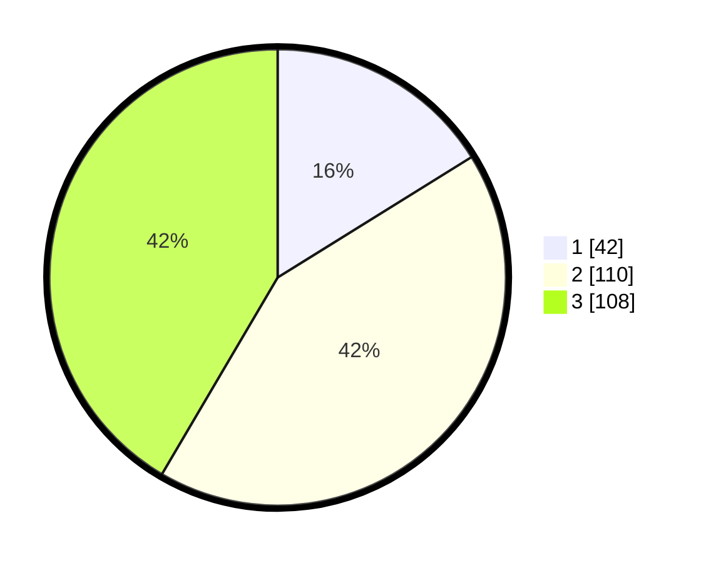

# Hasil

## Grafik

## Tabel

| No. | Nama Paslon    | Suara | Suara (raw) | Persentase |
|:--- |:-------------- | -----:| -----------:| ----------:|
| 1   | ANIES MUHAIMIN | 42    | [42][p-1]   | 16,15      |
| 2   | PRABOWO GIBRAN | 110   | [110][p-2]  | 42,31      |
| 3   | GANJAR MAHFUD  | 108   | [108][p-3]  | 41,54      |

[p-1]: https://github.com/gigit-pemilu/pemilu-2024-34-di-yogyakarta/blob/main/pilpres/hitung-suara/sub/34-di-yogyakarta/sub/04-sleman/sub/01-gamping/sub/2005-trihanggo/sub/046-tps/sub/paslon-1.txt
[p-2]: https://github.com/gigit-pemilu/pemilu-2024-34-di-yogyakarta/blob/main/pilpres/hitung-suara/sub/34-di-yogyakarta/sub/04-sleman/sub/01-gamping/sub/2005-trihanggo/sub/046-tps/sub/paslon-2.txt
[p-3]: https://github.com/gigit-pemilu/pemilu-2024-34-di-yogyakarta/blob/main/pilpres/hitung-suara/sub/34-di-yogyakarta/sub/04-sleman/sub/01-gamping/sub/2005-trihanggo/sub/046-tps/sub/paslon-3.txt

## Foto C Plano

https://sirekap-obj-formc.kpu.go.id/a6c2/pemilu/ppwp/34/04/01/20/05/3404012005046-20240214-223212--586b7c94-1b16-402b-871a-e7b63181fde7.jpg

https://sirekap-obj-formc.kpu.go.id/a6c2/pemilu/ppwp/34/04/01/20/05/3404012005046-20240214-230312--a50e6738-46a5-48f9-b5ed-ff49fa4c52ce.jpg

https://sirekap-obj-formc.kpu.go.id/a6c2/pemilu/ppwp/34/04/01/20/05/3404012005046-20240214-230346--5dad5c18-5b6e-43cb-a80c-96c5d9c71798.jpg

## Metadata

| Key        | Value               |
| ---------- | ------------------- |
| Time Stamp | 2024-02-15 15:00:29 |

