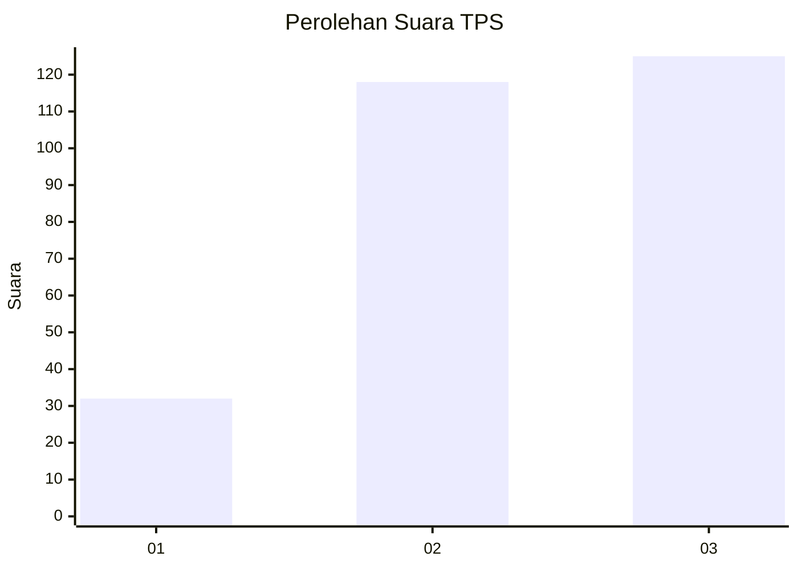
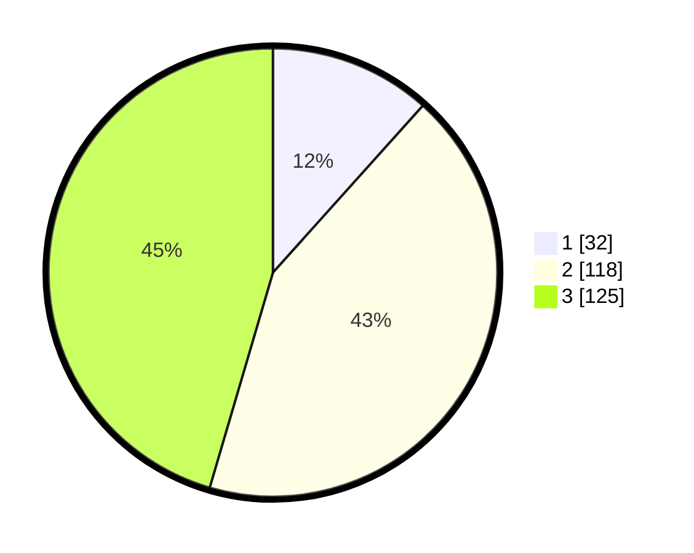

# Hasil

## Grafik

## Tabel

| No. | Nama Paslon    | Suara | Suara (raw) | Persentase |
|:--- |:-------------- | -----:| -----------:| ----------:|
| 1   | ANIES MUHAIMIN | 32    | [32][p-1]   | 11,64      |
| 2   | PRABOWO GIBRAN | 118   | [118][p-2]  | 42,91      |
| 3   | GANJAR MAHFUD  | 125   | [125][p-3]  | 45,45      |

[p-1]: https://github.com/gigit-pemilu/pemilu-2024-34-di-yogyakarta/blob/main/pilpres/hitung-suara/sub/34-di-yogyakarta/sub/04-sleman/sub/01-gamping/sub/2005-trihanggo/sub/047-tps/sub/paslon-1.txt
[p-2]: https://github.com/gigit-pemilu/pemilu-2024-34-di-yogyakarta/blob/main/pilpres/hitung-suara/sub/34-di-yogyakarta/sub/04-sleman/sub/01-gamping/sub/2005-trihanggo/sub/047-tps/sub/paslon-2.txt
[p-3]: https://github.com/gigit-pemilu/pemilu-2024-34-di-yogyakarta/blob/main/pilpres/hitung-suara/sub/34-di-yogyakarta/sub/04-sleman/sub/01-gamping/sub/2005-trihanggo/sub/047-tps/sub/paslon-3.txt

## Foto C Plano

https://sirekap-obj-formc.kpu.go.id/171d/pemilu/ppwp/34/04/01/20/05/3404012005047-20240214-214214--62fdfe88-6a53-4983-b0f7-cc8c36e33a4e.jpg

https://sirekap-obj-formc.kpu.go.id/171d/pemilu/ppwp/34/04/01/20/05/3404012005047-20240214-214410--a29f0d16-d0c6-4be1-aec1-9cf378b7a9a3.jpg

https://sirekap-obj-formc.kpu.go.id/171d/pemilu/ppwp/34/04/01/20/05/3404012005047-20240214-214632--f2c4c2ef-f975-43fc-90ab-f42450cf559f.jpg

## Metadata

| Key        | Value               |
| ---------- | ------------------- |
| Time Stamp | 2024-02-15 22:30:27 |

