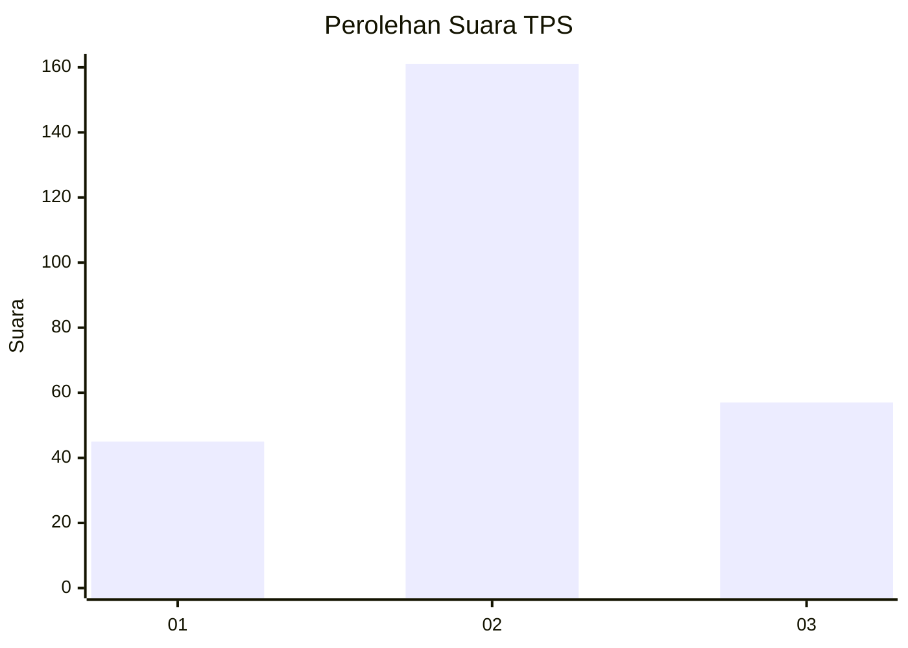
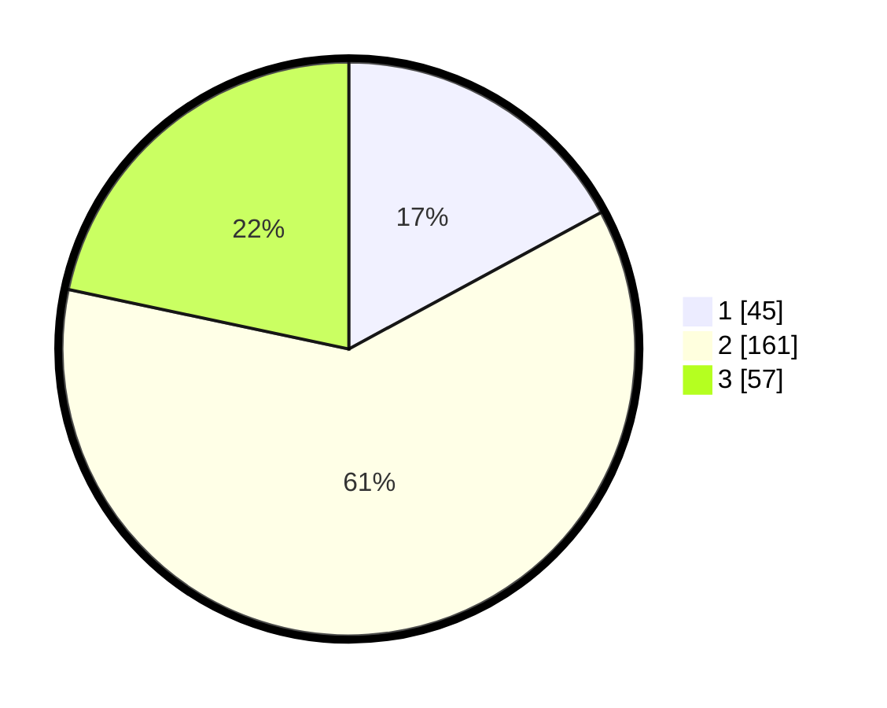

# Hasil

## Grafik

## Tabel

| No. | Nama Paslon    | Suara | Suara (raw) | Persentase |
|:--- |:-------------- | -----:| -----------:| ----------:|
| 1   | ANIES MUHAIMIN | 45    | [45][p-1]   | 17,11      |
| 2   | PRABOWO GIBRAN | 161   | [161][p-2]  | 61,22      |
| 3   | GANJAR MAHFUD  | 57    | [57][p-3]   | 21,67      |

[p-1]: https://github.com/gigit-pemilu/pemilu-2024-34-di-yogyakarta/blob/main/pilpres/hitung-suara/sub/34-di-yogyakarta/sub/04-sleman/sub/02-godean/sub/2001-sidorejo/sub/004-tps/sub/paslon-1.txt
[p-2]: https://github.com/gigit-pemilu/pemilu-2024-34-di-yogyakarta/blob/main/pilpres/hitung-suara/sub/34-di-yogyakarta/sub/04-sleman/sub/02-godean/sub/2001-sidorejo/sub/004-tps/sub/paslon-2.txt
[p-3]: https://github.com/gigit-pemilu/pemilu-2024-34-di-yogyakarta/blob/main/pilpres/hitung-suara/sub/34-di-yogyakarta/sub/04-sleman/sub/02-godean/sub/2001-sidorejo/sub/004-tps/sub/paslon-3.txt

## Foto C Plano

https://sirekap-obj-formc.kpu.go.id/f868/pemilu/ppwp/34/04/02/20/01/3404022001004-20240216-203825--f7abc192-a034-4caf-b1b0-23cad5c6311e.jpg

https://sirekap-obj-formc.kpu.go.id/f868/pemilu/ppwp/34/04/02/20/01/3404022001004-20240214-214545--8b1a503c-7d2f-4cd1-9bf3-f9cd33b9ba8e.jpg

https://sirekap-obj-formc.kpu.go.id/f868/pemilu/ppwp/34/04/02/20/01/3404022001004-20240214-214941--46218c4c-8177-4ef8-a27d-7538fb7a13f9.jpg

## Metadata

| Key        | Value               |
| ---------- | ------------------- |
| Time Stamp | 2024-02-16 21:01:00 |

## DATA PEMILIH TETAP

Jumlah pemilih dalam DPT: **293**.
 * L: **145**.
 * P: **148**.

## DATA PENGGUNA HAK PILIH

Jumlah pengguna hak pilih dalam DPT: **261**.
 * L: **125**.
 * P: **136**.

Jumlah pengguna hak pilih dalam DPTb: **8**.
 * L: **2**.
 * P: **6**.

Jumlah pengguna hak pilih dalam DPK: **1**.
 * L: **0**.
 * P: **1**.

Jumlah pengguna hak pilih: **270**.
 * L: **127**.
 * P: **143**.

## JUMLAH SUARA SAH DAN TIDAK SAH

JUMLAH SELURUH SUARA SAH: **263**.

JUMLAH SUARA TIDAK SAH: **7**.

JUMLAH SELURUH SUARA SAH DAN SUARA TIDAK SAH: **270**.

