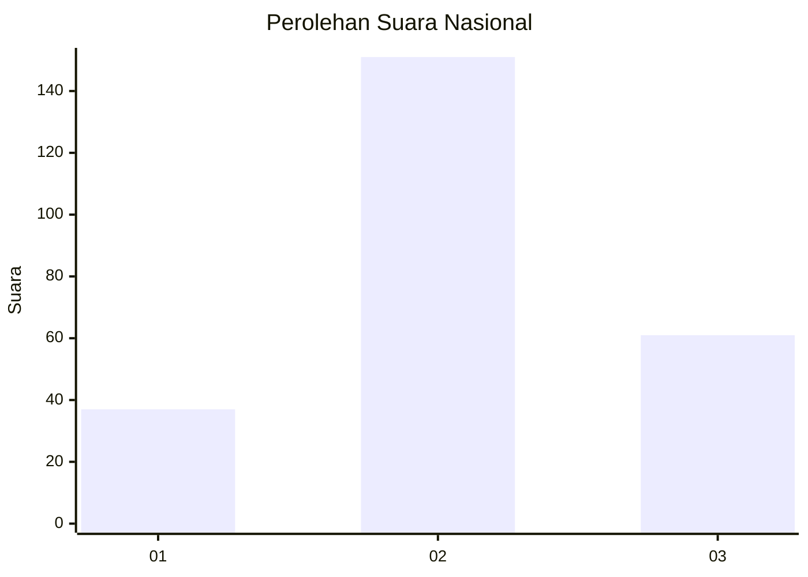
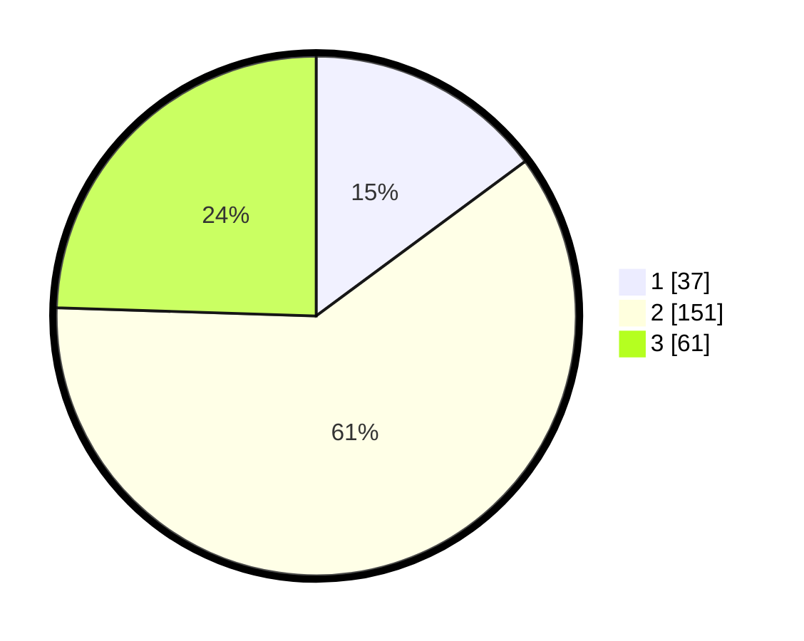

# Hasil

## Grafik

## Tabel

| No. | Nama Paslon    | Suara | Suara (raw) | Persentase |
|:--- |:-------------- | -----:| -----------:| ----------:|
| 1   | ANIES MUHAIMIN | 37    | [37][p-1]   | 14,86      |
| 2   | PRABOWO GIBRAN | 151   | [151][p-2]  | 60,64      |
| 3   | GANJAR MAHFUD  | 61    | [61][p-3]   | 24,50      |

[p-1]: https://github.com/gigit-pemilu/pemilu-2024/blob/main/pilpres/hitung-suara/sub/34-di-yogyakarta/sub/04-sleman/sub/02-godean/sub/2001-sidorejo/sub/005-tps/sub/paslon-1.txt
[p-2]: https://github.com/gigit-pemilu/pemilu-2024/blob/main/pilpres/hitung-suara/sub/34-di-yogyakarta/sub/04-sleman/sub/02-godean/sub/2001-sidorejo/sub/005-tps/sub/paslon-2.txt
[p-3]: https://github.com/gigit-pemilu/pemilu-2024/blob/main/pilpres/hitung-suara/sub/34-di-yogyakarta/sub/04-sleman/sub/02-godean/sub/2001-sidorejo/sub/005-tps/sub/paslon-3.txt

## Foto C Plano

https://sirekap-obj-formc.kpu.go.id/9473/pemilu/ppwp/34/04/02/20/01/3404022001005-20240214-222454--001b6fe6-5097-47a4-b051-0359cc80010a.jpg

https://sirekap-obj-formc.kpu.go.id/9473/pemilu/ppwp/34/04/02/20/01/3404022001005-20240214-175308--ee0c1cb8-a8be-45d9-bb6b-91a9378db7f4.jpg

https://sirekap-obj-formc.kpu.go.id/9473/pemilu/ppwp/34/04/02/20/01/3404022001005-20240214-202811--d4fcb03e-e2e2-4e69-bb12-8a7b92e83682.jpg

## Metadata

| Key        | Value               |
| ---------- | ------------------- |
| Time Stamp | 2024-02-15 12:00:28 |

