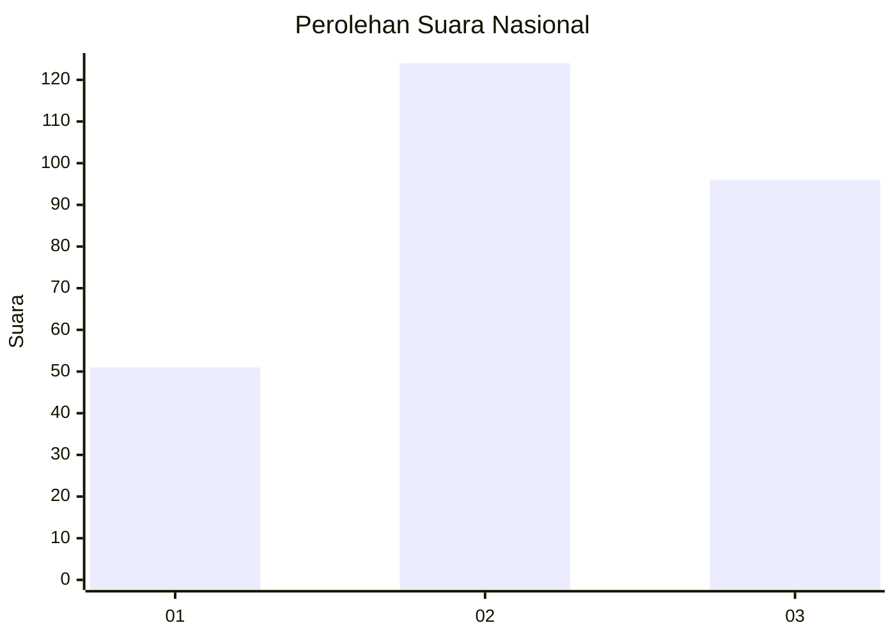
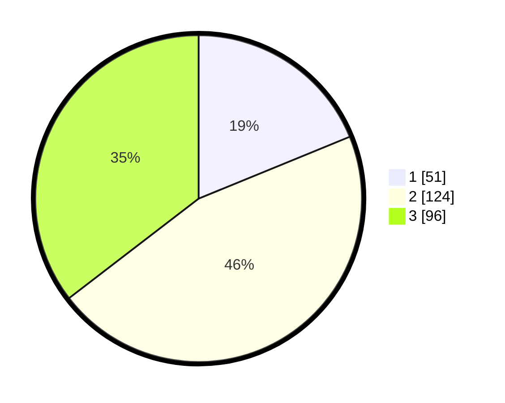

# Hasil

## Grafik

## Tabel

| No. | Nama Paslon    | Suara | Suara (raw) | Persentase |
|:--- |:-------------- | -----:| -----------:| ----------:|
| 1   | ANIES MUHAIMIN | 51    | [51][p-1]   | 18,82      |
| 2   | PRABOWO GIBRAN | 124   | [124][p-2]  | 45,76      |
| 3   | GANJAR MAHFUD  | 96    | [96][p-3]   | 35,42      |

[p-1]: https://github.com/gigit-pemilu/pemilu-2024/blob/main/pilpres/hitung-suara/sub/34-di-yogyakarta/sub/04-sleman/sub/02-godean/sub/2001-sidorejo/sub/007-tps/sub/paslon-1.txt
[p-2]: https://github.com/gigit-pemilu/pemilu-2024/blob/main/pilpres/hitung-suara/sub/34-di-yogyakarta/sub/04-sleman/sub/02-godean/sub/2001-sidorejo/sub/007-tps/sub/paslon-2.txt
[p-3]: https://github.com/gigit-pemilu/pemilu-2024/blob/main/pilpres/hitung-suara/sub/34-di-yogyakarta/sub/04-sleman/sub/02-godean/sub/2001-sidorejo/sub/007-tps/sub/paslon-3.txt

## Foto C Plano

https://sirekap-obj-formc.kpu.go.id/8a88/pemilu/ppwp/34/04/02/20/01/3404022001007-20240214-155719--6a17cf1c-c0b5-4018-aabc-69572d28a2d0.jpg

https://sirekap-obj-formc.kpu.go.id/8a88/pemilu/ppwp/34/04/02/20/01/3404022001007-20240214-155731--d722f733-cab1-4aa4-9d31-269ee3462700.jpg

https://sirekap-obj-formc.kpu.go.id/8a88/pemilu/ppwp/34/04/02/20/01/3404022001007-20240214-155740--b0427011-e5e4-4724-8f7c-5cda6cc64ef9.jpg

## Metadata

| Key        | Value               |
| ---------- | ------------------- |
| Time Stamp | 2024-02-15 09:00:24 |

## DATA PEMILIH TETAP

Jumlah pemilih dalam DPT: **294**.
 * L: **137**.
 * P: **157**.

## DATA PENGGUNA HAK PILIH

Jumlah pengguna hak pilih dalam DPT: **263**.
 * L: **122**.
 * P: **141**.

Jumlah pengguna hak pilih dalam DPTb: **6**.
 * L: **3**.
 * P: **3**.

Jumlah pengguna hak pilih dalam DPK: **11**.
 * L: **3**.
 * P: **8**.

Jumlah pengguna hak pilih: **280**.
 * L: **128**.
 * P: **152**.

## JUMLAH SUARA SAH DAN TIDAK SAH

JUMLAH SELURUH SUARA SAH: **271**.

JUMLAH SUARA TIDAK SAH: **9**.

JUMLAH SELURUH SUARA SAH DAN SUARA TIDAK SAH: **280**.

