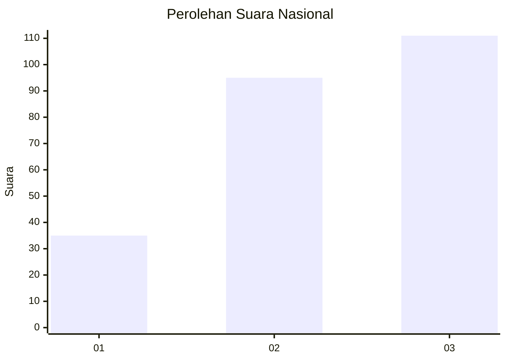
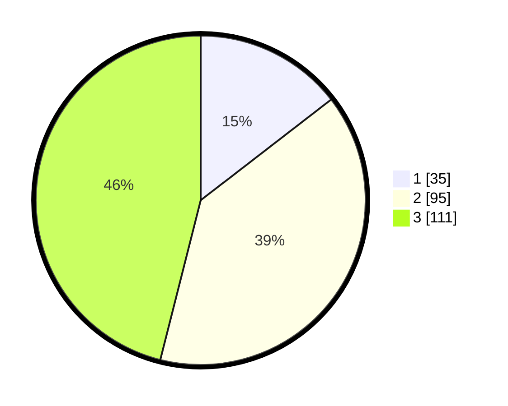

# Hasil

## Grafik

## Tabel

| No. | Nama Paslon    | Suara | Suara (raw) | Persentase |
|:--- |:-------------- | -----:| -----------:| ----------:|
| 1   | ANIES MUHAIMIN | 35    | [35][p-1]   | 14,52      |
| 2   | PRABOWO GIBRAN | 95    | [95][p-2]   | 39,42      |
| 3   | GANJAR MAHFUD  | 111   | [111][p-3]  | 46,06      |

[p-1]: https://github.com/gigit-pemilu/pemilu-2024/blob/main/pilpres/hitung-suara/sub/34-di-yogyakarta/sub/04-sleman/sub/02-godean/sub/2001-sidorejo/sub/008-tps/sub/paslon-1.txt
[p-2]: https://github.com/gigit-pemilu/pemilu-2024/blob/main/pilpres/hitung-suara/sub/34-di-yogyakarta/sub/04-sleman/sub/02-godean/sub/2001-sidorejo/sub/008-tps/sub/paslon-2.txt
[p-3]: https://github.com/gigit-pemilu/pemilu-2024/blob/main/pilpres/hitung-suara/sub/34-di-yogyakarta/sub/04-sleman/sub/02-godean/sub/2001-sidorejo/sub/008-tps/sub/paslon-3.txt

## Foto C Plano

https://sirekap-obj-formc.kpu.go.id/533c/pemilu/ppwp/34/04/02/20/01/3404022001008-20240214-155100--aadefe2b-c80e-4db8-baf1-7f457b296d6d.jpg

https://sirekap-obj-formc.kpu.go.id/533c/pemilu/ppwp/34/04/02/20/01/3404022001008-20240214-155021--40b41412-becf-41cd-870c-d887d03feae7.jpg

https://sirekap-obj-formc.kpu.go.id/533c/pemilu/ppwp/34/04/02/20/01/3404022001008-20240214-155024--4651c580-e9a4-4265-a1d0-5719c9337ea9.jpg

## Metadata

| Key        | Value               |
| ---------- | ------------------- |
| Time Stamp | 2024-02-14 21:46:01 |

## DATA PEMILIH TETAP

Jumlah pemilih dalam DPT: **294**.
 * L: **142**.
 * P: **152**.

## DATA PENGGUNA HAK PILIH

Jumlah pengguna hak pilih dalam DPT: **248**.
 * L: **117**.
 * P: **131**.

Jumlah pengguna hak pilih dalam DPTb: **7**.
 * L: **5**.
 * P: **2**.

Jumlah pengguna hak pilih dalam DPK: **3**.
 * L: **3**.
 * P: **0**.

Jumlah pengguna hak pilih: **258**.
 * L: **125**.
 * P: **133**.

## JUMLAH SUARA SAH DAN TIDAK SAH

JUMLAH SELURUH SUARA SAH: **241**.

JUMLAH SUARA TIDAK SAH: **17**.

JUMLAH SELURUH SUARA SAH DAN SUARA TIDAK SAH: **258**.

