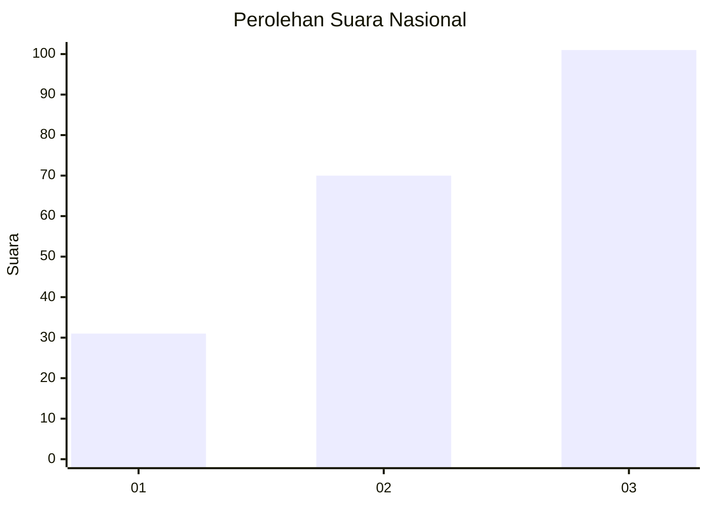
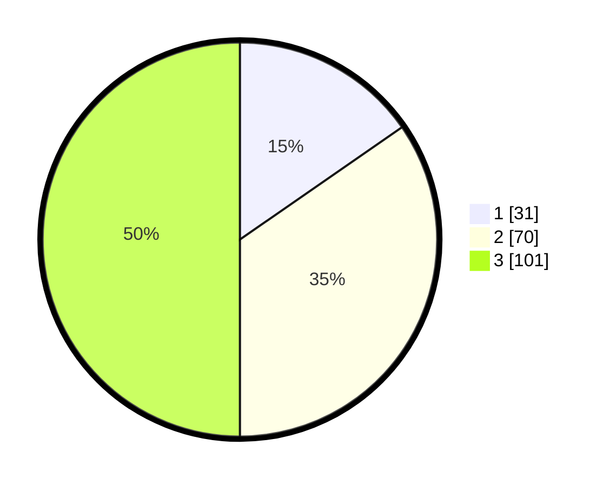

# Hasil

## Grafik

## Tabel

| No. | Nama Paslon    | Suara | Suara (raw) | Persentase |
|:--- |:-------------- | -----:| -----------:| ----------:|
| 1   | ANIES MUHAIMIN | 31    | [31][p-1]   | 15,35      |
| 2   | PRABOWO GIBRAN | 70    | [70][p-2]   | 34,65      |
| 3   | GANJAR MAHFUD  | 101   | [101][p-3]  | 50,00      |

[p-1]: https://github.com/gigit-pemilu/pemilu-2024/blob/main/pilpres/hitung-suara/sub/34-di-yogyakarta/sub/04-sleman/sub/02-godean/sub/2001-sidorejo/sub/013-tps/sub/paslon-1.txt
[p-2]: https://github.com/gigit-pemilu/pemilu-2024/blob/main/pilpres/hitung-suara/sub/34-di-yogyakarta/sub/04-sleman/sub/02-godean/sub/2001-sidorejo/sub/013-tps/sub/paslon-2.txt
[p-3]: https://github.com/gigit-pemilu/pemilu-2024/blob/main/pilpres/hitung-suara/sub/34-di-yogyakarta/sub/04-sleman/sub/02-godean/sub/2001-sidorejo/sub/013-tps/sub/paslon-3.txt

## Foto C Plano

https://sirekap-obj-formc.kpu.go.id/87fd/pemilu/ppwp/34/04/02/20/01/3404022001013-20240214-204425--9708075c-f88d-49de-95a6-0205a2d8f0e6.jpg

https://sirekap-obj-formc.kpu.go.id/87fd/pemilu/ppwp/34/04/02/20/01/3404022001013-20240214-204511--db2e7ad4-3b26-4c17-b8a0-e83153c03480.jpg

https://sirekap-obj-formc.kpu.go.id/87fd/pemilu/ppwp/34/04/02/20/01/3404022001013-20240214-204853--6b95293b-5cfe-45a2-80af-faf87d642bf3.jpg

## Metadata

| Key        | Value               |
| ---------- | ------------------- |
| Time Stamp | 2024-02-15 20:30:46 |

