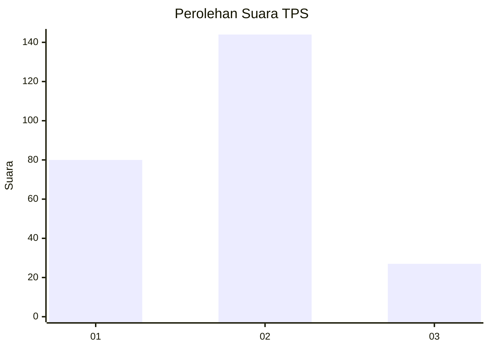
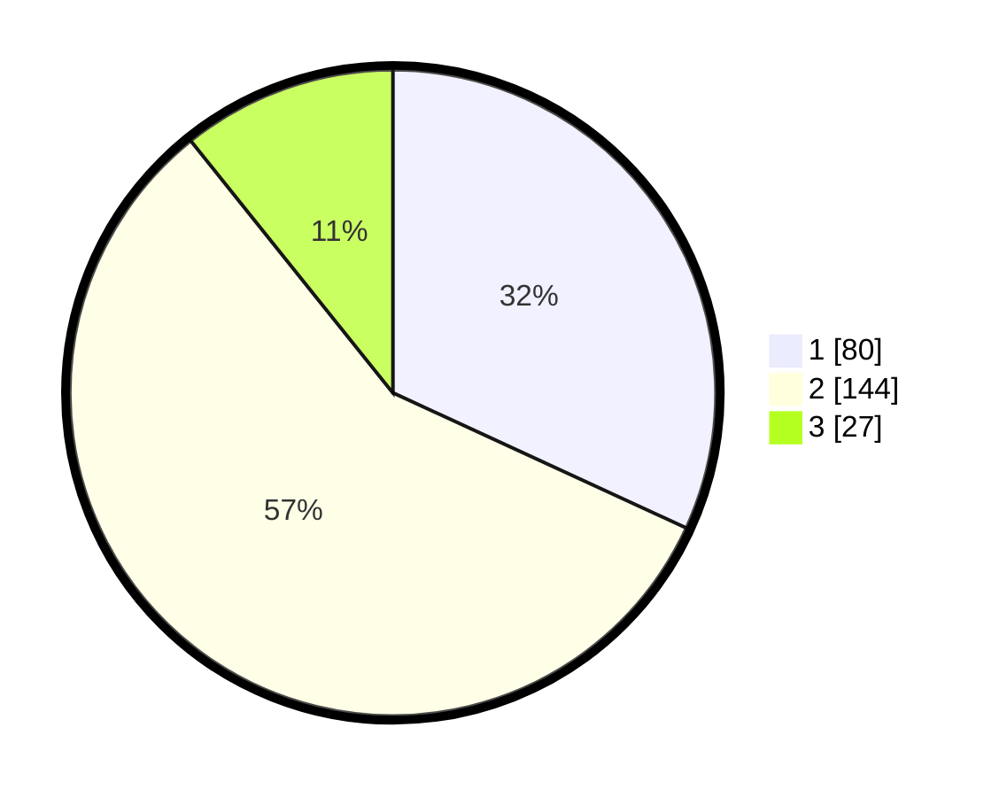

# Hasil

## Grafik

## Tabel

| No. | Nama Paslon    | Suara | Suara (raw) | Persentase |
|:--- |:-------------- | -----:| -----------:| ----------:|
| 1   | ANIES MUHAIMIN | 80    | [80][p-1]   | 31,87      |
| 2   | PRABOWO GIBRAN | 144   | [144][p-2]  | 57,37      |
| 3   | GANJAR MAHFUD  | 27    | [27][p-3]   | 10,76      |

[p-1]: https://github.com/gigit-pemilu/pemilu-2024-34-di-yogyakarta/blob/main/pilpres/hitung-suara/sub/34-di-yogyakarta/sub/04-sleman/sub/02-godean/sub/2001-sidorejo/sub/016-tps/sub/paslon-1.txt
[p-2]: https://github.com/gigit-pemilu/pemilu-2024-34-di-yogyakarta/blob/main/pilpres/hitung-suara/sub/34-di-yogyakarta/sub/04-sleman/sub/02-godean/sub/2001-sidorejo/sub/016-tps/sub/paslon-2.txt
[p-3]: https://github.com/gigit-pemilu/pemilu-2024-34-di-yogyakarta/blob/main/pilpres/hitung-suara/sub/34-di-yogyakarta/sub/04-sleman/sub/02-godean/sub/2001-sidorejo/sub/016-tps/sub/paslon-3.txt

## Foto C Plano

https://sirekap-obj-formc.kpu.go.id/3167/pemilu/ppwp/34/04/02/20/01/3404022001016-20240214-222446--a6a4e72c-164a-4728-9c28-a257e38f13b6.jpg

https://sirekap-obj-formc.kpu.go.id/3167/pemilu/ppwp/34/04/02/20/01/3404022001016-20240214-194141--08e1c654-141e-4a06-b2ef-a6b67877dd18.jpg

https://sirekap-obj-formc.kpu.go.id/3167/pemilu/ppwp/34/04/02/20/01/3404022001016-20240214-194525--eca9933a-59a4-4eb5-bc15-ed5d044157a8.jpg

## Metadata

| Key        | Value               |
| ---------- | ------------------- |
| Time Stamp | 2024-02-15 15:00:29 |

