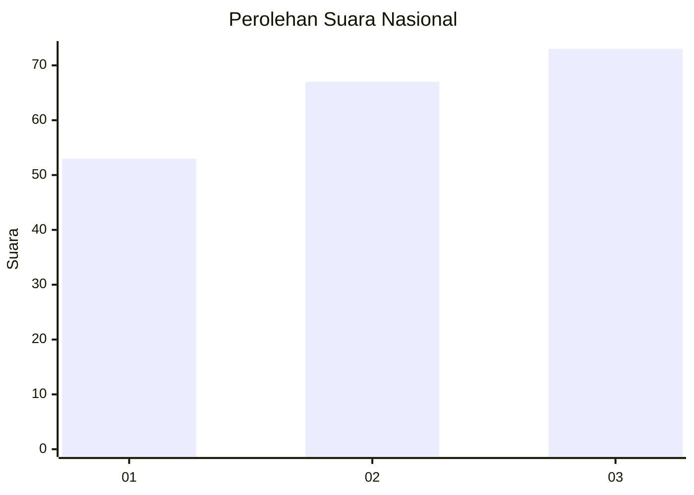
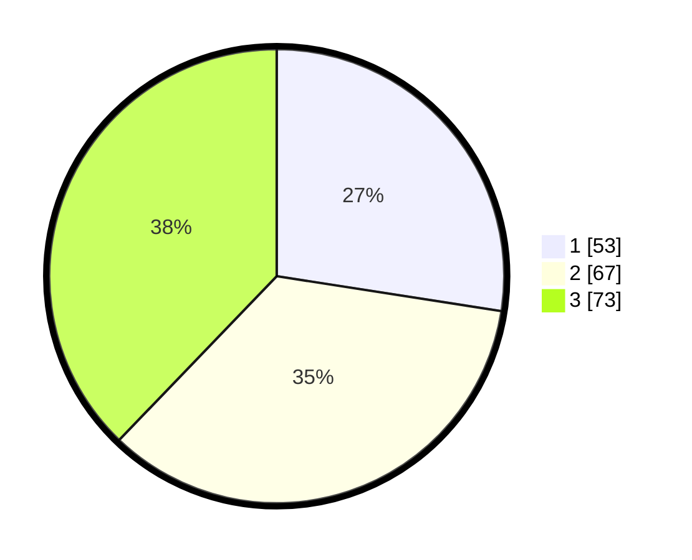

# Hasil

## Grafik

## Tabel

| No. | Nama Paslon    | Suara | Suara (raw) | Persentase |
|:--- |:-------------- | -----:| -----------:| ----------:|
| 1   | ANIES MUHAIMIN | 53    | [53][p-1]   | 27,46      |
| 2   | PRABOWO GIBRAN | 67    | [67][p-2]   | 34,72      |
| 3   | GANJAR MAHFUD  | 73    | [73][p-3]   | 37,82      |

[p-1]: https://github.com/gigit-pemilu/pemilu-2024/blob/main/pilpres/hitung-suara/sub/34-di-yogyakarta/sub/04-sleman/sub/02-godean/sub/2002-sidoluhur/sub/001-tps/sub/paslon-1.txt
[p-2]: https://github.com/gigit-pemilu/pemilu-2024/blob/main/pilpres/hitung-suara/sub/34-di-yogyakarta/sub/04-sleman/sub/02-godean/sub/2002-sidoluhur/sub/001-tps/sub/paslon-2.txt
[p-3]: https://github.com/gigit-pemilu/pemilu-2024/blob/main/pilpres/hitung-suara/sub/34-di-yogyakarta/sub/04-sleman/sub/02-godean/sub/2002-sidoluhur/sub/001-tps/sub/paslon-3.txt

## Foto C Plano

https://sirekap-obj-formc.kpu.go.id/a773/pemilu/ppwp/34/04/02/20/02/3404022002001-20240214-190056--264e2164-1218-44dd-80a3-ee26cbcf55ae.jpg

https://sirekap-obj-formc.kpu.go.id/a773/pemilu/ppwp/34/04/02/20/02/3404022002001-20240214-190259--ec449783-4ec6-4f9c-9b38-7e7bb4a4907a.jpg

https://sirekap-obj-formc.kpu.go.id/a773/pemilu/ppwp/34/04/02/20/02/3404022002001-20240214-190503--2b0bfa2e-1ac5-4c28-a04a-82d997f8bdfb.jpg

## Metadata

| Key        | Value               |
| ---------- | ------------------- |
| Time Stamp | 2024-02-15 17:30:25 |

## DATA PEMILIH TETAP

Jumlah pemilih dalam DPT: **218**.
 * L: **104**.
 * P: **114**.

## DATA PENGGUNA HAK PILIH

Jumlah pengguna hak pilih dalam DPT: **189**.
 * L: **87**.
 * P: **102**.

Jumlah pengguna hak pilih dalam DPTb: **6**.
 * L: **1**.
 * P: **5**.

Jumlah pengguna hak pilih dalam DPK: **2**.
 * L: **1**.
 * P: **1**.

Jumlah pengguna hak pilih: **197**.
 * L: **89**.
 * P: **108**.

## JUMLAH SUARA SAH DAN TIDAK SAH

JUMLAH SELURUH SUARA SAH: **193**.

JUMLAH SUARA TIDAK SAH: **4**.

JUMLAH SELURUH SUARA SAH DAN SUARA TIDAK SAH: **197**.

