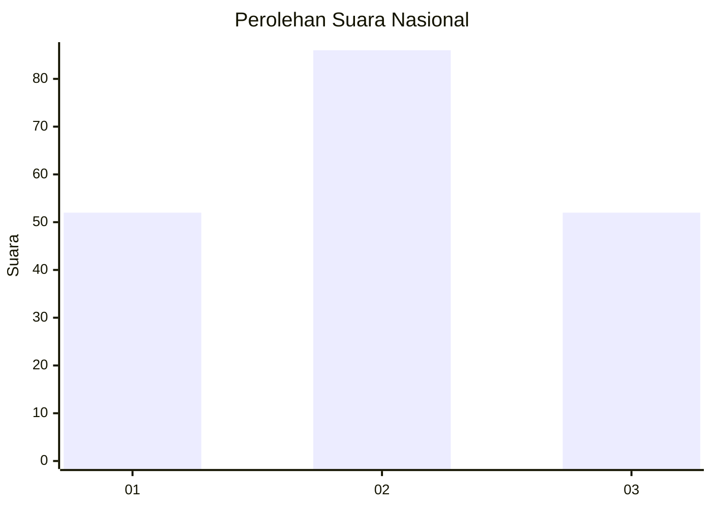
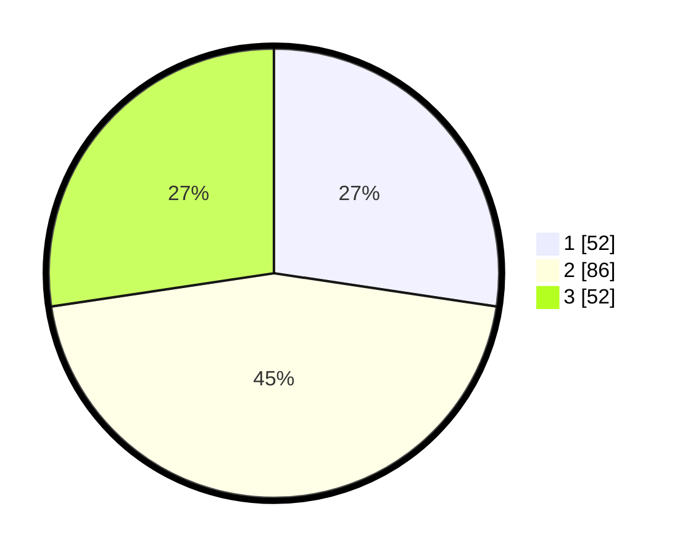

# Hasil

## Grafik

## Tabel

| No. | Nama Paslon    | Suara | Suara (raw) | Persentase |
|:--- |:-------------- | -----:| -----------:| ----------:|
| 1   | ANIES MUHAIMIN | 52    | [52][p-1]   | 27,37      |
| 2   | PRABOWO GIBRAN | 86    | [86][p-2]   | 45,26      |
| 3   | GANJAR MAHFUD  | 52    | [52][p-3]   | 27,37      |

[p-1]: https://github.com/gigit-pemilu/pemilu-2024/blob/main/pilpres/hitung-suara/sub/34-di-yogyakarta/sub/04-sleman/sub/02-godean/sub/2002-sidoluhur/sub/002-tps/sub/paslon-1.txt
[p-2]: https://github.com/gigit-pemilu/pemilu-2024/blob/main/pilpres/hitung-suara/sub/34-di-yogyakarta/sub/04-sleman/sub/02-godean/sub/2002-sidoluhur/sub/002-tps/sub/paslon-2.txt
[p-3]: https://github.com/gigit-pemilu/pemilu-2024/blob/main/pilpres/hitung-suara/sub/34-di-yogyakarta/sub/04-sleman/sub/02-godean/sub/2002-sidoluhur/sub/002-tps/sub/paslon-3.txt

## Foto C Plano

https://sirekap-obj-formc.kpu.go.id/91e7/pemilu/ppwp/34/04/02/20/02/3404022002002-20240214-220113--3271719f-5e22-4da2-bd1b-d82db1055f04.jpg

https://sirekap-obj-formc.kpu.go.id/91e7/pemilu/ppwp/34/04/02/20/02/3404022002002-20240214-220226--ae7bcd59-51e1-4d49-a790-ab942467a147.jpg

https://sirekap-obj-formc.kpu.go.id/91e7/pemilu/ppwp/34/04/02/20/02/3404022002002-20240214-220307--cb437be0-e39f-4fb8-b9b6-831b7aa9f4fb.jpg

## Metadata

| Key        | Value               |
| ---------- | ------------------- |
| Time Stamp | 2024-02-15 17:00:25 |

## DATA PEMILIH TETAP

Jumlah pemilih dalam DPT: **202**.
 * L: **91**.
 * P: **111**.

## DATA PENGGUNA HAK PILIH

Jumlah pengguna hak pilih dalam DPT: **186**.
 * L: **82**.
 * P: **104**.

Jumlah pengguna hak pilih dalam DPTb: **6**.
 * L: **0**.
 * P: **6**.

Jumlah pengguna hak pilih dalam DPK: **3**.
 * L: **1**.
 * P: **2**.

Jumlah pengguna hak pilih: **195**.
 * L: **83**.
 * P: **112**.

## JUMLAH SUARA SAH DAN TIDAK SAH

JUMLAH SELURUH SUARA SAH: **190**.

JUMLAH SUARA TIDAK SAH: **5**.

JUMLAH SELURUH SUARA SAH DAN SUARA TIDAK SAH: **195**.

