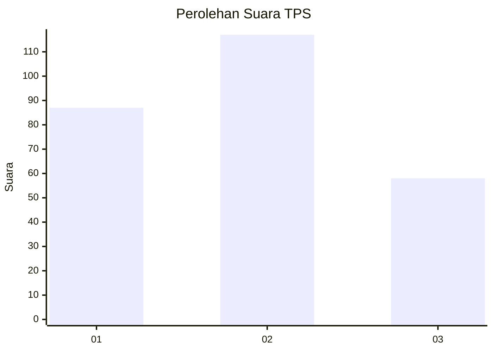
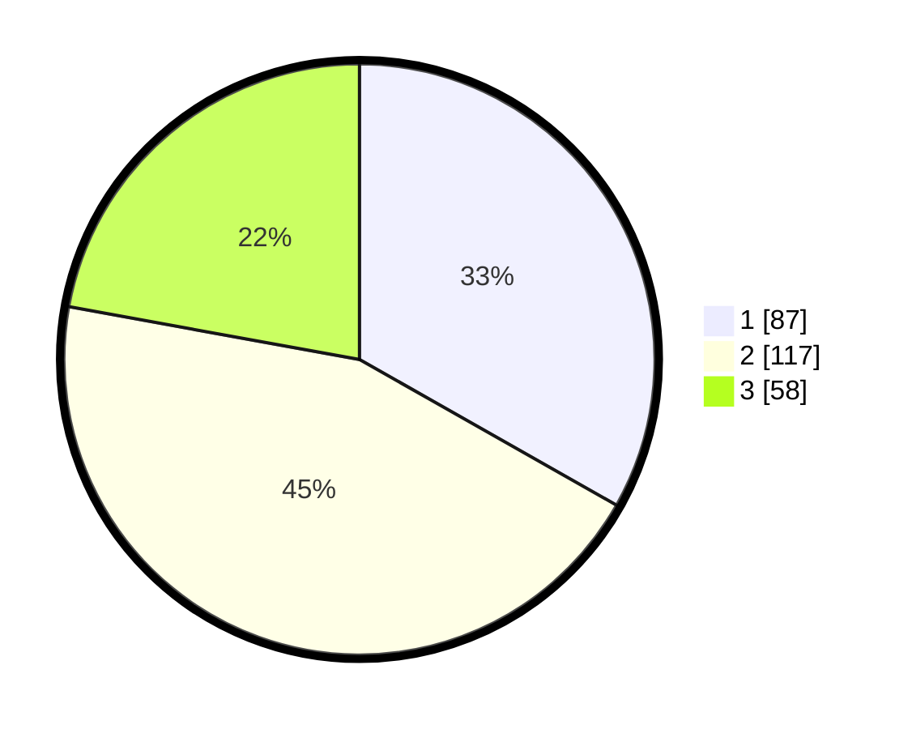

# Hasil

## Grafik

## Tabel

| No. | Nama Paslon    | Suara | Suara (raw) | Persentase |
|:--- |:-------------- | -----:| -----------:| ----------:|
| 1   | ANIES MUHAIMIN | 87    | [87][p-1]   | 33,21      |
| 2   | PRABOWO GIBRAN | 117   | [117][p-2]  | 44,66      |
| 3   | GANJAR MAHFUD  | 58    | [58][p-3]   | 22,14      |

[p-1]: https://github.com/gigit-pemilu/pemilu-2024-34-di-yogyakarta/blob/main/pilpres/hitung-suara/sub/34-di-yogyakarta/sub/04-sleman/sub/02-godean/sub/2002-sidoluhur/sub/005-tps/sub/paslon-1.txt
[p-2]: https://github.com/gigit-pemilu/pemilu-2024-34-di-yogyakarta/blob/main/pilpres/hitung-suara/sub/34-di-yogyakarta/sub/04-sleman/sub/02-godean/sub/2002-sidoluhur/sub/005-tps/sub/paslon-2.txt
[p-3]: https://github.com/gigit-pemilu/pemilu-2024-34-di-yogyakarta/blob/main/pilpres/hitung-suara/sub/34-di-yogyakarta/sub/04-sleman/sub/02-godean/sub/2002-sidoluhur/sub/005-tps/sub/paslon-3.txt

## Foto C Plano

https://sirekap-obj-formc.kpu.go.id/2fd9/pemilu/ppwp/34/04/02/20/02/3404022002005-20240215-214104--9bcc2dd9-7789-42b6-a850-9a2b01e72769.jpg

https://sirekap-obj-formc.kpu.go.id/2fd9/pemilu/ppwp/34/04/02/20/02/3404022002005-20240216-184602--b7adb900-0594-4809-a62b-b55626d471d8.jpg

https://sirekap-obj-formc.kpu.go.id/2fd9/pemilu/ppwp/34/04/02/20/02/3404022002005-20240215-214750--67b1f808-5ded-4ef6-afdc-43e1780a817f.jpg

## Metadata

| Key        | Value               |
| ---------- | ------------------- |
| Time Stamp | 2024-02-17 10:30:03 |

