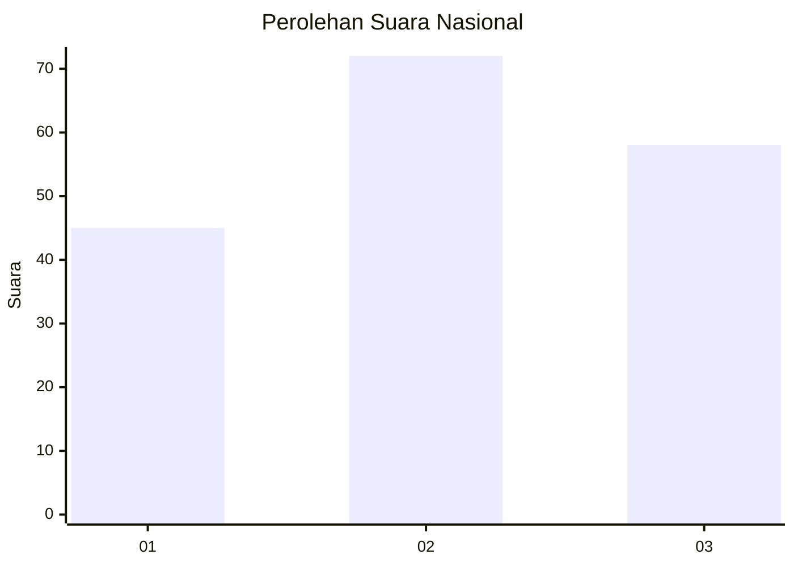
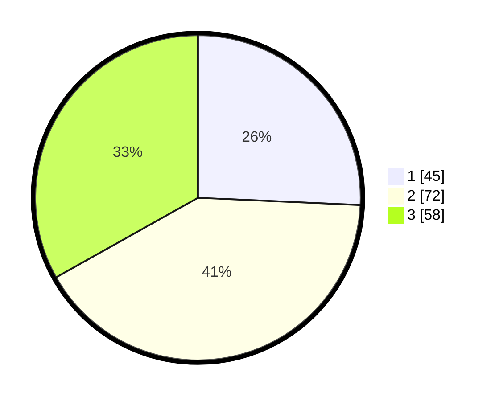

# Hasil

## Grafik

## Tabel

| No. | Nama Paslon    | Suara | Suara (raw) | Persentase |
|:--- |:-------------- | -----:| -----------:| ----------:|
| 1   | ANIES MUHAIMIN | 45    | [45][p-1]   | 25,71      |
| 2   | PRABOWO GIBRAN | 72    | [72][p-2]   | 41,14      |
| 3   | GANJAR MAHFUD  | 58    | [58][p-3]   | 33,14      |

[p-1]: https://github.com/gigit-pemilu/pemilu-2024/blob/main/pilpres/hitung-suara/sub/34-di-yogyakarta/sub/04-sleman/sub/02-godean/sub/2003-sidomulyo/sub/004-tps/sub/paslon-1.txt
[p-2]: https://github.com/gigit-pemilu/pemilu-2024/blob/main/pilpres/hitung-suara/sub/34-di-yogyakarta/sub/04-sleman/sub/02-godean/sub/2003-sidomulyo/sub/004-tps/sub/paslon-2.txt
[p-3]: https://github.com/gigit-pemilu/pemilu-2024/blob/main/pilpres/hitung-suara/sub/34-di-yogyakarta/sub/04-sleman/sub/02-godean/sub/2003-sidomulyo/sub/004-tps/sub/paslon-3.txt

## Foto C Plano

https://sirekap-obj-formc.kpu.go.id/3bb1/pemilu/ppwp/34/04/02/20/03/3404022003004-20240216-095631--e9ffa4a5-240d-4dea-95aa-0b47b56a19ea.jpg

https://sirekap-obj-formc.kpu.go.id/3bb1/pemilu/ppwp/34/04/02/20/03/3404022003004-20240216-095635--51e373cd-34dd-48be-88ed-7cdb4bf75227.jpg

https://sirekap-obj-formc.kpu.go.id/3bb1/pemilu/ppwp/34/04/02/20/03/3404022003004-20240216-095638--ab7ce7ab-f6c7-488f-9c36-8400bd97a4b8.jpg

## Metadata

| Key        | Value               |
| ---------- | ------------------- |
| Time Stamp | 2024-02-16 10:30:29 |

## DATA PEMILIH TETAP

Jumlah pemilih dalam DPT: **192**.
 * L: **94**.
 * P: **98**.

## DATA PENGGUNA HAK PILIH

Jumlah pengguna hak pilih dalam DPT: **170**.
 * L: **83**.
 * P: **87**.

Jumlah pengguna hak pilih dalam DPTb: **4**.
 * L: **1**.
 * P: **3**.

Jumlah pengguna hak pilih dalam DPK: **3**.
 * L: **2**.
 * P: **1**.

Jumlah pengguna hak pilih: **177**.
 * L: **86**.
 * P: **91**.

## JUMLAH SUARA SAH DAN TIDAK SAH

JUMLAH SELURUH SUARA SAH: **175**.

JUMLAH SUARA TIDAK SAH: **2**.

JUMLAH SELURUH SUARA SAH DAN SUARA TIDAK SAH: **177**.

