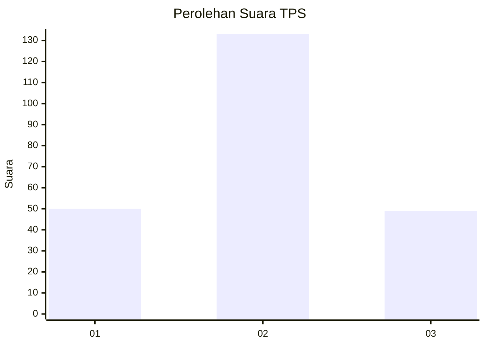
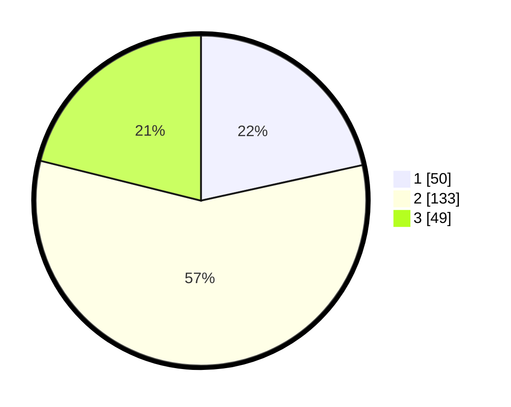

# Hasil

## Grafik

## Tabel

| No. | Nama Paslon    | Suara | Suara (raw) | Persentase |
|:--- |:-------------- | -----:| -----------:| ----------:|
| 1   | ANIES MUHAIMIN | 50    | [50][p-1]   | 21,55      |
| 2   | PRABOWO GIBRAN | 133   | [133][p-2]  | 57,33      |
| 3   | GANJAR MAHFUD  | 49    | [49][p-3]   | 21,12      |

[p-1]: https://github.com/gigit-pemilu/pemilu-2024-34-di-yogyakarta/blob/main/pilpres/hitung-suara/sub/34-di-yogyakarta/sub/04-sleman/sub/02-godean/sub/2003-sidomulyo/sub/017-tps/sub/paslon-1.txt
[p-2]: https://github.com/gigit-pemilu/pemilu-2024-34-di-yogyakarta/blob/main/pilpres/hitung-suara/sub/34-di-yogyakarta/sub/04-sleman/sub/02-godean/sub/2003-sidomulyo/sub/017-tps/sub/paslon-2.txt
[p-3]: https://github.com/gigit-pemilu/pemilu-2024-34-di-yogyakarta/blob/main/pilpres/hitung-suara/sub/34-di-yogyakarta/sub/04-sleman/sub/02-godean/sub/2003-sidomulyo/sub/017-tps/sub/paslon-3.txt

## Foto C Plano

https://sirekap-obj-formc.kpu.go.id/8fe1/pemilu/ppwp/34/04/02/20/03/3404022003017-20240214-235841--94c4af86-4012-4342-b2e5-974b94d7e15b.jpg

https://sirekap-obj-formc.kpu.go.id/8fe1/pemilu/ppwp/34/04/02/20/03/3404022003017-20240215-000043--937c8d78-346f-4b5b-af7f-43097146fe6b.jpg

https://sirekap-obj-formc.kpu.go.id/8fe1/pemilu/ppwp/34/04/02/20/03/3404022003017-20240215-000118--57017455-9ed7-4ef3-802a-bc25b45388d8.jpg

## Metadata

| Key        | Value               |
| ---------- | ------------------- |
| Time Stamp | 2024-02-15 15:00:29 |

