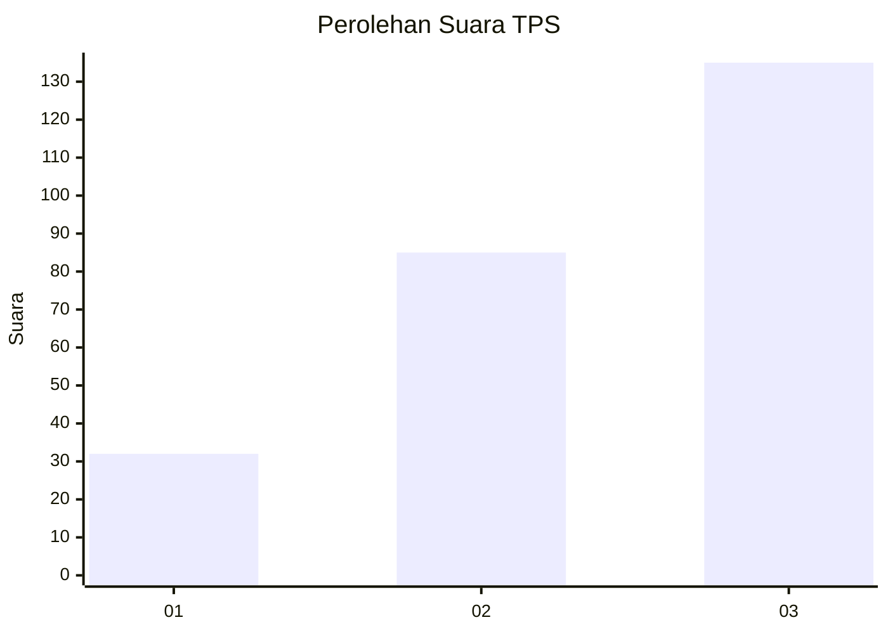
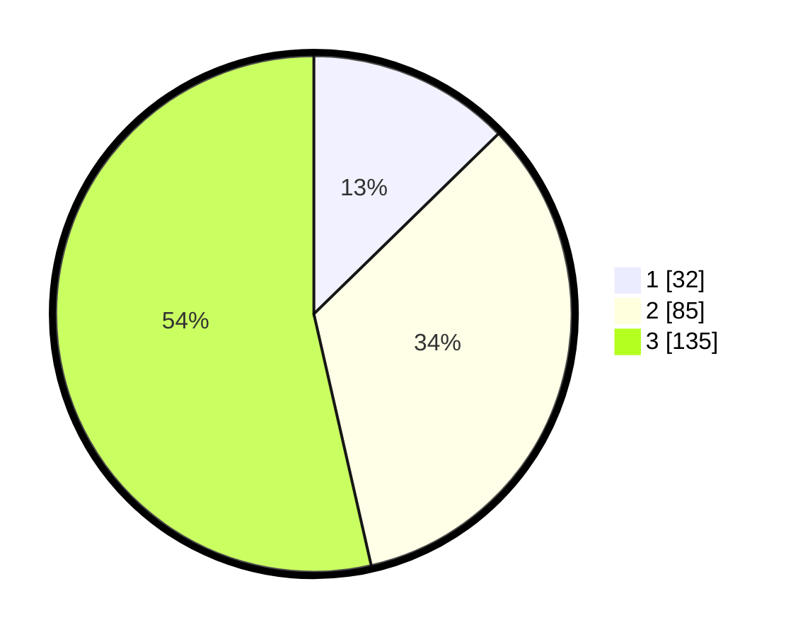

# Hasil

## Grafik

## Tabel

| No. | Nama Paslon    | Suara | Suara (raw) | Persentase |
|:--- |:-------------- | -----:| -----------:| ----------:|
| 1   | ANIES MUHAIMIN | 32    | [32][p-1]   | 12,70      |
| 2   | PRABOWO GIBRAN | 85    | [85][p-2]   | 33,73      |
| 3   | GANJAR MAHFUD  | 135   | [135][p-3]  | 53,57      |

[p-1]: https://github.com/gigit-pemilu/pemilu-2024-34-di-yogyakarta/blob/main/pilpres/hitung-suara/sub/34-di-yogyakarta/sub/04-sleman/sub/02-godean/sub/2003-sidomulyo/sub/018-tps/sub/paslon-1.txt
[p-2]: https://github.com/gigit-pemilu/pemilu-2024-34-di-yogyakarta/blob/main/pilpres/hitung-suara/sub/34-di-yogyakarta/sub/04-sleman/sub/02-godean/sub/2003-sidomulyo/sub/018-tps/sub/paslon-2.txt
[p-3]: https://github.com/gigit-pemilu/pemilu-2024-34-di-yogyakarta/blob/main/pilpres/hitung-suara/sub/34-di-yogyakarta/sub/04-sleman/sub/02-godean/sub/2003-sidomulyo/sub/018-tps/sub/paslon-3.txt

## Foto C Plano

https://sirekap-obj-formc.kpu.go.id/47f0/pemilu/ppwp/34/04/02/20/03/3404022003018-20240214-201956--9bbf7387-7c6f-4a72-81df-df549b45fbb2.jpg

https://sirekap-obj-formc.kpu.go.id/47f0/pemilu/ppwp/34/04/02/20/03/3404022003018-20240214-202027--d9c8e04d-237f-4e75-955b-336a37947076.jpg

https://sirekap-obj-formc.kpu.go.id/47f0/pemilu/ppwp/34/04/02/20/03/3404022003018-20240214-202034--14900a14-917f-4391-8db1-a5e9032f8605.jpg

## Metadata

| Key        | Value               |
| ---------- | ------------------- |
| Time Stamp | 2024-02-15 15:00:29 |

