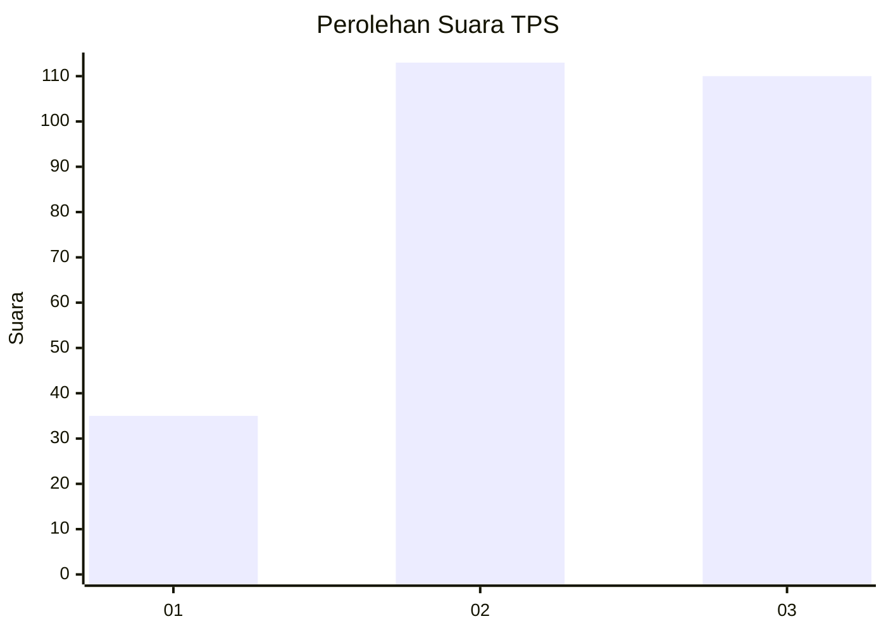
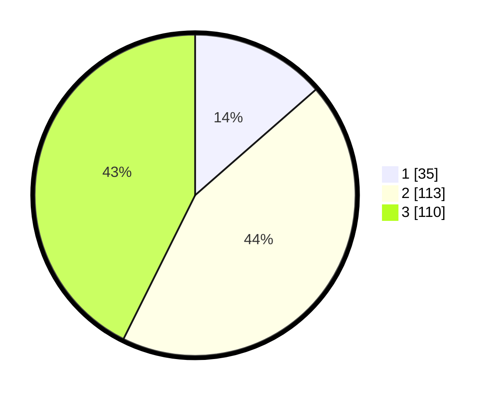

# Hasil

## Grafik

## Tabel

| No. | Nama Paslon    | Suara | Suara (raw) | Persentase |
|:--- |:-------------- | -----:| -----------:| ----------:|
| 1   | ANIES MUHAIMIN | 35    | [35][p-1]   | 13,57      |
| 2   | PRABOWO GIBRAN | 113   | [113][p-2]  | 43,80      |
| 3   | GANJAR MAHFUD  | 110   | [110][p-3]  | 42,64      |

[p-1]: https://github.com/gigit-pemilu/pemilu-2024-34-di-yogyakarta/blob/main/pilpres/hitung-suara/sub/34-di-yogyakarta/sub/04-sleman/sub/02-godean/sub/2003-sidomulyo/sub/021-tps/sub/paslon-1.txt
[p-2]: https://github.com/gigit-pemilu/pemilu-2024-34-di-yogyakarta/blob/main/pilpres/hitung-suara/sub/34-di-yogyakarta/sub/04-sleman/sub/02-godean/sub/2003-sidomulyo/sub/021-tps/sub/paslon-2.txt
[p-3]: https://github.com/gigit-pemilu/pemilu-2024-34-di-yogyakarta/blob/main/pilpres/hitung-suara/sub/34-di-yogyakarta/sub/04-sleman/sub/02-godean/sub/2003-sidomulyo/sub/021-tps/sub/paslon-3.txt

## Foto C Plano

https://sirekap-obj-formc.kpu.go.id/5031/pemilu/ppwp/34/04/02/20/03/3404022003021-20240215-005333--7ef1042d-b47e-457a-a71c-84db33ebbaff.jpg

https://sirekap-obj-formc.kpu.go.id/5031/pemilu/ppwp/34/04/02/20/03/3404022003021-20240215-005418--66547a17-fccc-4c9c-a49c-1bc5491ec857.jpg

https://sirekap-obj-formc.kpu.go.id/5031/pemilu/ppwp/34/04/02/20/03/3404022003021-20240215-005452--c857b87c-50aa-4ed3-a718-8931894062db.jpg

## Metadata

| Key        | Value               |
| ---------- | ------------------- |
| Time Stamp | 2024-02-15 15:00:29 |

