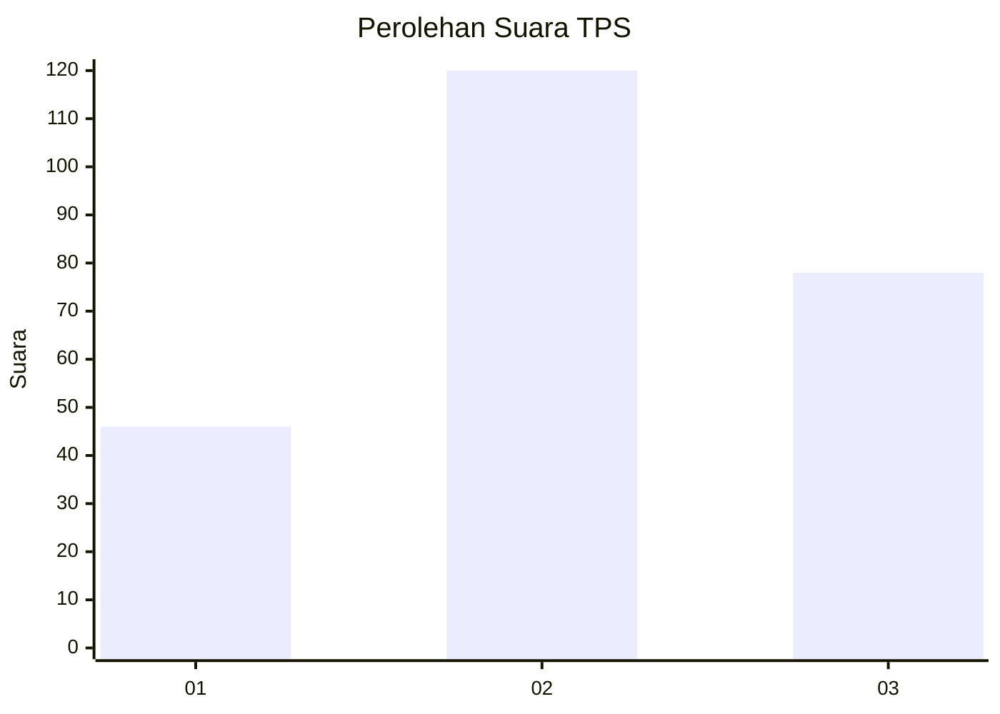
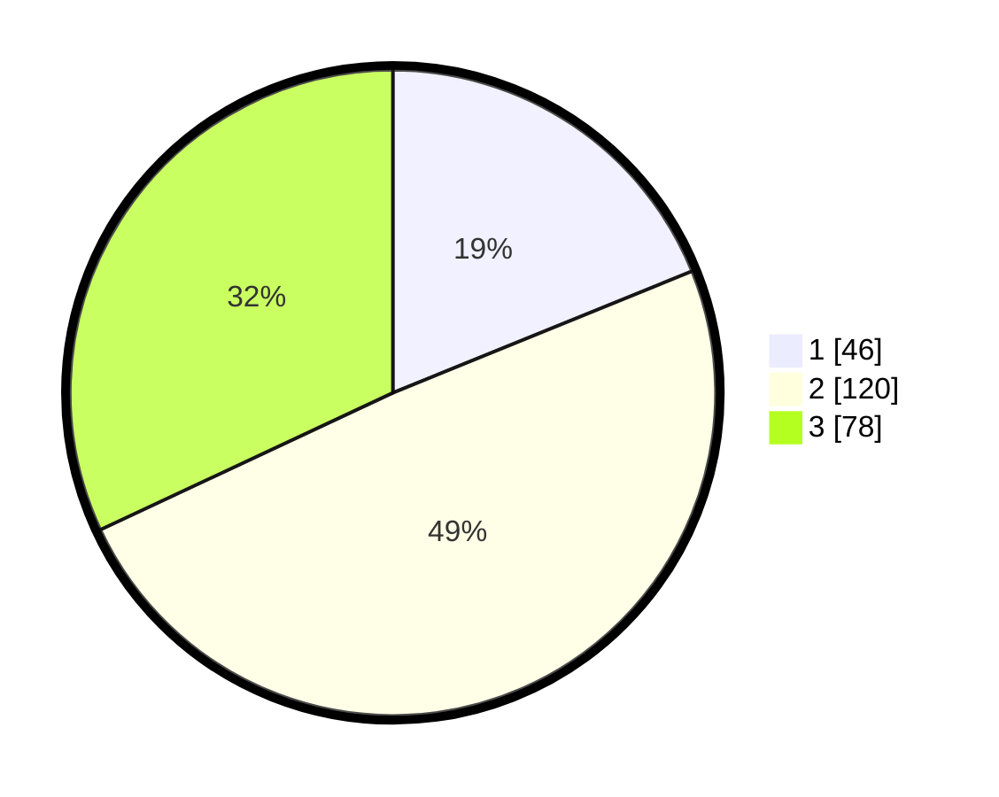

# Hasil

## Grafik

## Tabel

| No. | Nama Paslon    | Suara | Suara (raw) | Persentase |
|:--- |:-------------- | -----:| -----------:| ----------:|
| 1   | ANIES MUHAIMIN | 46    | [46][p-1]   | 18,85      |
| 2   | PRABOWO GIBRAN | 120   | [120][p-2]  | 49,18      |
| 3   | GANJAR MAHFUD  | 78    | [78][p-3]   | 31,97      |

[p-1]: https://github.com/gigit-pemilu/pemilu-2024-34-di-yogyakarta/blob/main/pilpres/hitung-suara/sub/34-di-yogyakarta/sub/04-sleman/sub/02-godean/sub/2004-sidoagung/sub/009-tps/sub/paslon-1.txt
[p-2]: https://github.com/gigit-pemilu/pemilu-2024-34-di-yogyakarta/blob/main/pilpres/hitung-suara/sub/34-di-yogyakarta/sub/04-sleman/sub/02-godean/sub/2004-sidoagung/sub/009-tps/sub/paslon-2.txt
[p-3]: https://github.com/gigit-pemilu/pemilu-2024-34-di-yogyakarta/blob/main/pilpres/hitung-suara/sub/34-di-yogyakarta/sub/04-sleman/sub/02-godean/sub/2004-sidoagung/sub/009-tps/sub/paslon-3.txt

## Foto C Plano

https://sirekap-obj-formc.kpu.go.id/4d7f/pemilu/ppwp/34/04/02/20/04/3404022004009-20240215-002030--3e8b0721-ce75-4e40-a670-cf9c02ee28cb.jpg

https://sirekap-obj-formc.kpu.go.id/4d7f/pemilu/ppwp/34/04/02/20/04/3404022004009-20240215-001826--8eb8014b-4e6f-4a6d-b85e-da3b5a59021b.jpg

https://sirekap-obj-formc.kpu.go.id/4d7f/pemilu/ppwp/34/04/02/20/04/3404022004009-20240215-002136--99cc0315-6870-4175-88ff-840a25f05f9d.jpg

## Metadata

| Key        | Value               |
| ---------- | ------------------- |
| Time Stamp | 2024-02-15 15:00:29 |

