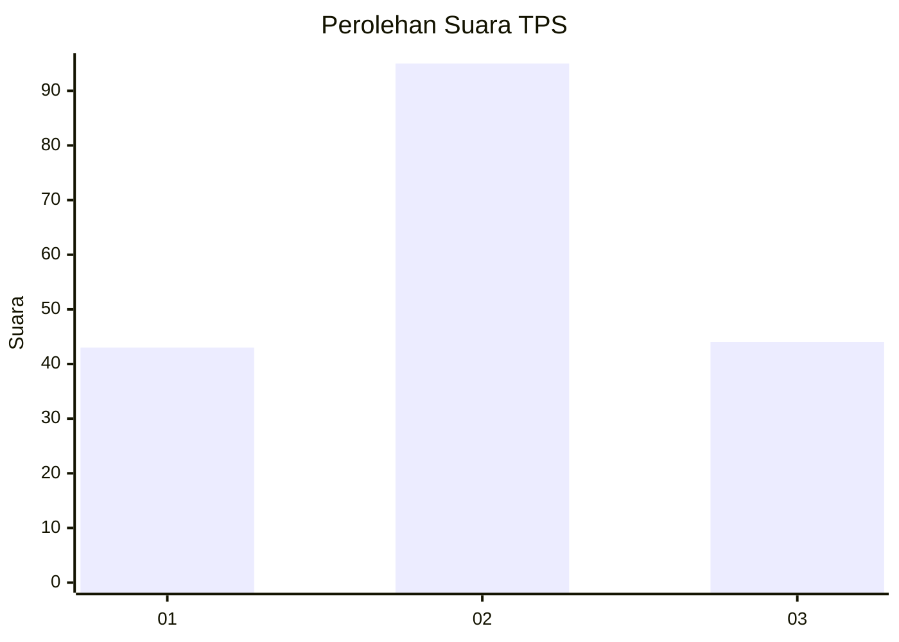
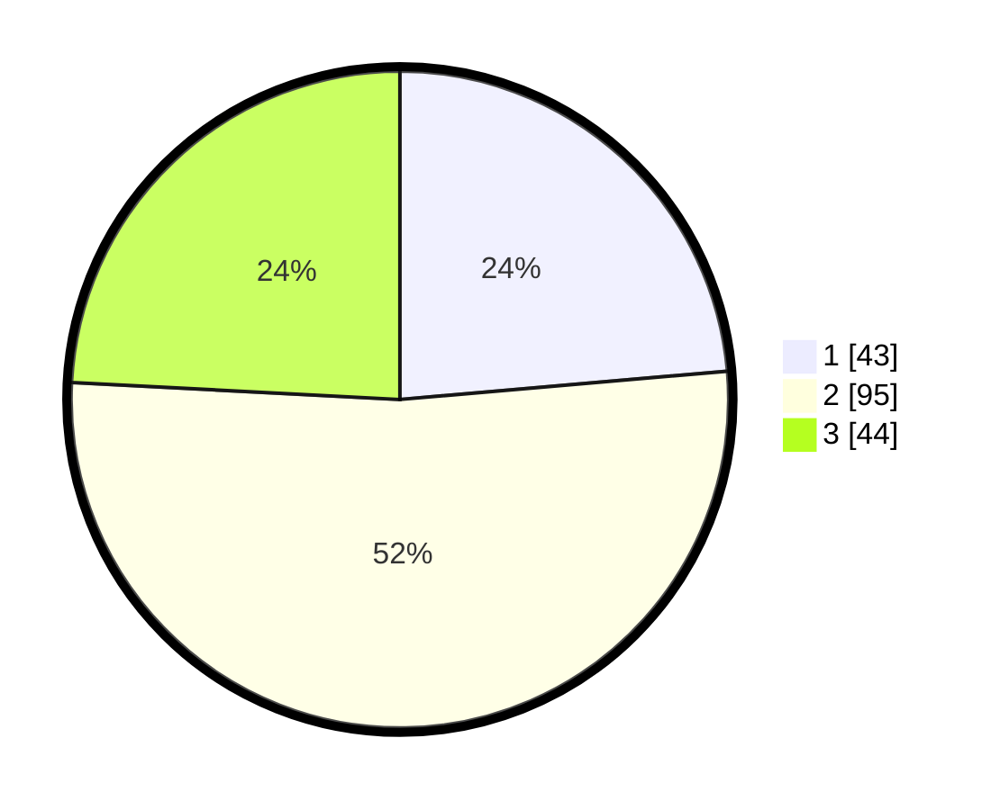

# Hasil

## Grafik

## Tabel

| No. | Nama Paslon    | Suara | Suara (raw) | Persentase |
|:--- |:-------------- | -----:| -----------:| ----------:|
| 1   | ANIES MUHAIMIN | 43    | [43][p-1]   | 23,63      |
| 2   | PRABOWO GIBRAN | 95    | [95][p-2]   | 52,20      |
| 3   | GANJAR MAHFUD  | 44    | [44][p-3]   | 24,18      |

[p-1]: https://github.com/gigit-pemilu/pemilu-2024-34-di-yogyakarta/blob/main/pilpres/hitung-suara/sub/34-di-yogyakarta/sub/04-sleman/sub/02-godean/sub/2004-sidoagung/sub/012-tps/sub/paslon-1.txt
[p-2]: https://github.com/gigit-pemilu/pemilu-2024-34-di-yogyakarta/blob/main/pilpres/hitung-suara/sub/34-di-yogyakarta/sub/04-sleman/sub/02-godean/sub/2004-sidoagung/sub/012-tps/sub/paslon-2.txt
[p-3]: https://github.com/gigit-pemilu/pemilu-2024-34-di-yogyakarta/blob/main/pilpres/hitung-suara/sub/34-di-yogyakarta/sub/04-sleman/sub/02-godean/sub/2004-sidoagung/sub/012-tps/sub/paslon-3.txt

## Foto C Plano

https://sirekap-obj-formc.kpu.go.id/6b99/pemilu/ppwp/34/04/02/20/04/3404022004012-20240214-225709--120ab3f3-c927-4bbf-86fd-4e16029d942d.jpg

https://sirekap-obj-formc.kpu.go.id/6b99/pemilu/ppwp/34/04/02/20/04/3404022004012-20240214-225818--1d77cc25-83ae-4e49-a306-94b828601959.jpg

https://sirekap-obj-formc.kpu.go.id/6b99/pemilu/ppwp/34/04/02/20/04/3404022004012-20240214-225932--e1eaf44a-1167-4852-898c-8fef4d1b317d.jpg

## Metadata

| Key        | Value               |
| ---------- | ------------------- |
| Time Stamp | 2024-02-15 20:30:46 |

