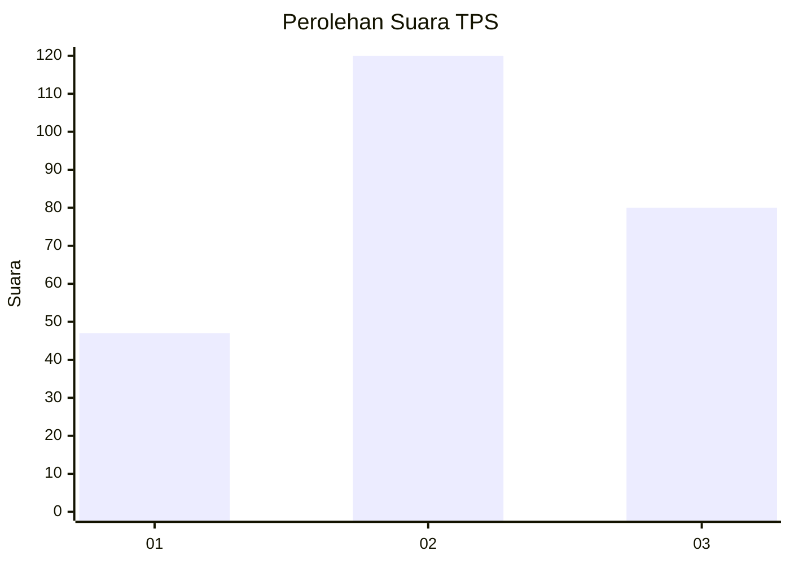
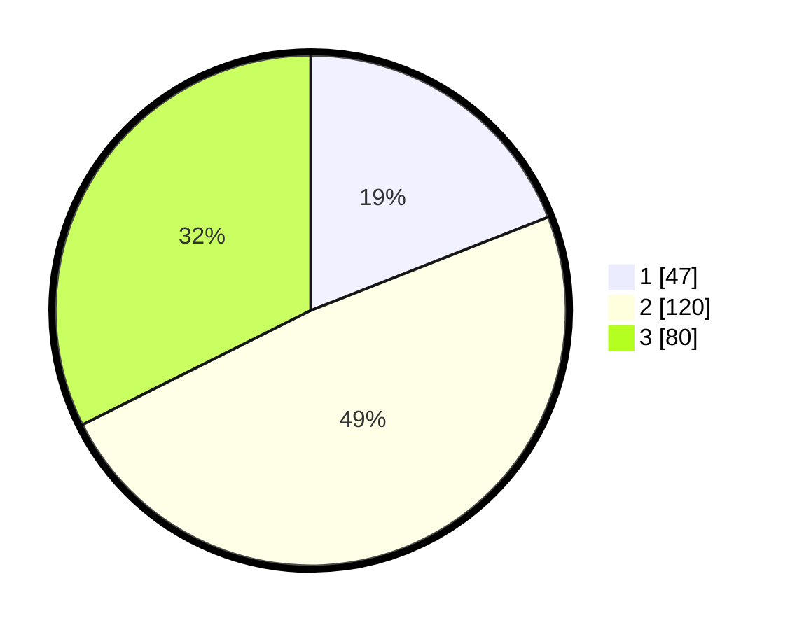

# Hasil

## Grafik

## Tabel

| No. | Nama Paslon    | Suara | Suara (raw) | Persentase |
|:--- |:-------------- | -----:| -----------:| ----------:|
| 1   | ANIES MUHAIMIN | 47    | [47][p-1]   | 19,03      |
| 2   | PRABOWO GIBRAN | 120   | [120][p-2]  | 48,58      |
| 3   | GANJAR MAHFUD  | 80    | [80][p-3]   | 32,39      |

[p-1]: https://github.com/gigit-pemilu/pemilu-2024-34-di-yogyakarta/blob/main/pilpres/hitung-suara/sub/34-di-yogyakarta/sub/04-sleman/sub/02-godean/sub/2005-sidokarto/sub/001-tps/sub/paslon-1.txt
[p-2]: https://github.com/gigit-pemilu/pemilu-2024-34-di-yogyakarta/blob/main/pilpres/hitung-suara/sub/34-di-yogyakarta/sub/04-sleman/sub/02-godean/sub/2005-sidokarto/sub/001-tps/sub/paslon-2.txt
[p-3]: https://github.com/gigit-pemilu/pemilu-2024-34-di-yogyakarta/blob/main/pilpres/hitung-suara/sub/34-di-yogyakarta/sub/04-sleman/sub/02-godean/sub/2005-sidokarto/sub/001-tps/sub/paslon-3.txt

## Foto C Plano

https://sirekap-obj-formc.kpu.go.id/a55f/pemilu/ppwp/34/04/02/20/05/3404022005001-20240215-030337--9a8ceca0-e370-4899-9a19-c2ed0df3075d.jpg

https://sirekap-obj-formc.kpu.go.id/a55f/pemilu/ppwp/34/04/02/20/05/3404022005001-20240215-030920--920a368c-ce14-4fb0-b596-c14a14119a22.jpg

https://sirekap-obj-formc.kpu.go.id/a55f/pemilu/ppwp/34/04/02/20/05/3404022005001-20240215-030824--93ab0e57-eaf4-4f05-a4c3-74701d6577f0.jpg

## Metadata

| Key        | Value               |
| ---------- | ------------------- |
| Time Stamp | 2024-02-15 15:00:29 |

