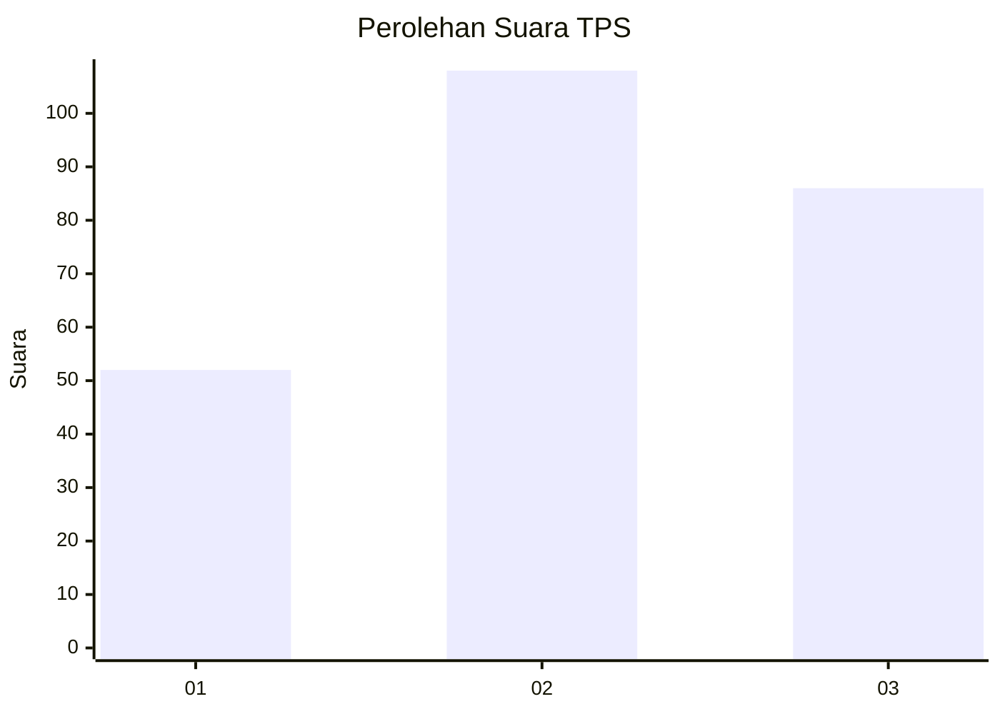
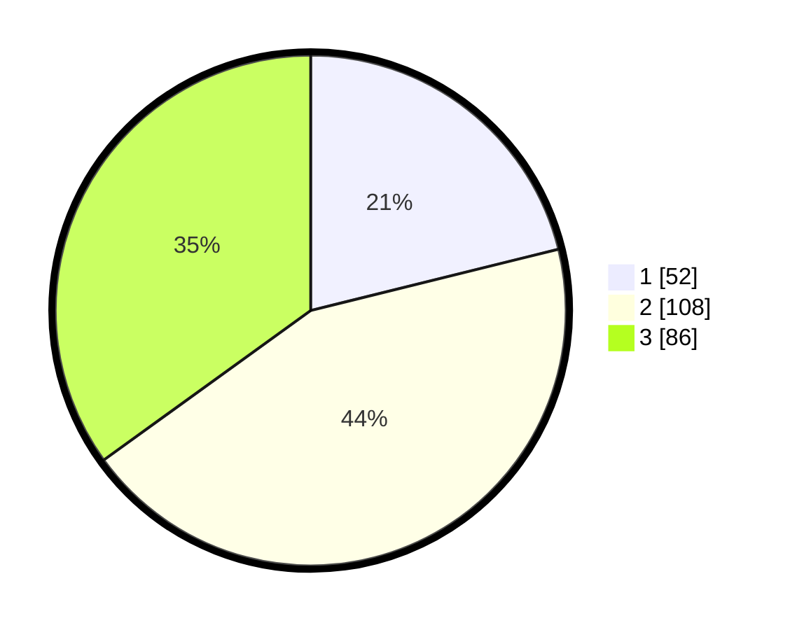

# Hasil

## Grafik

## Tabel

| No. | Nama Paslon    | Suara | Suara (raw) | Persentase |
|:--- |:-------------- | -----:| -----------:| ----------:|
| 1   | ANIES MUHAIMIN | 52    | [52][p-1]   | 21,14      |
| 2   | PRABOWO GIBRAN | 108   | [108][p-2]  | 43,90      |
| 3   | GANJAR MAHFUD  | 86    | [86][p-3]   | 34,96      |

[p-1]: https://github.com/gigit-pemilu/pemilu-2024-34-di-yogyakarta/blob/main/pilpres/hitung-suara/sub/34-di-yogyakarta/sub/04-sleman/sub/02-godean/sub/2005-sidokarto/sub/002-tps/sub/paslon-1.txt
[p-2]: https://github.com/gigit-pemilu/pemilu-2024-34-di-yogyakarta/blob/main/pilpres/hitung-suara/sub/34-di-yogyakarta/sub/04-sleman/sub/02-godean/sub/2005-sidokarto/sub/002-tps/sub/paslon-2.txt
[p-3]: https://github.com/gigit-pemilu/pemilu-2024-34-di-yogyakarta/blob/main/pilpres/hitung-suara/sub/34-di-yogyakarta/sub/04-sleman/sub/02-godean/sub/2005-sidokarto/sub/002-tps/sub/paslon-3.txt

## Foto C Plano

https://sirekap-obj-formc.kpu.go.id/816c/pemilu/ppwp/34/04/02/20/05/3404022005002-20240214-223039--815030cb-9cc8-4acf-81e5-1322480957f1.jpg

https://sirekap-obj-formc.kpu.go.id/816c/pemilu/ppwp/34/04/02/20/05/3404022005002-20240214-223204--6bf0fe69-4f55-4fd6-bea0-28f0f7e2aa27.jpg

https://sirekap-obj-formc.kpu.go.id/816c/pemilu/ppwp/34/04/02/20/05/3404022005002-20240214-223341--84f868f2-ec19-4b5f-b42b-c3cd9ca6e15c.jpg

## Metadata

| Key        | Value               |
| ---------- | ------------------- |
| Time Stamp | 2024-02-15 15:00:29 |

