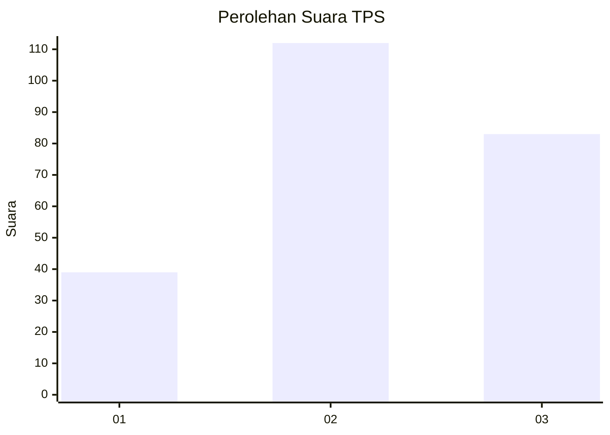
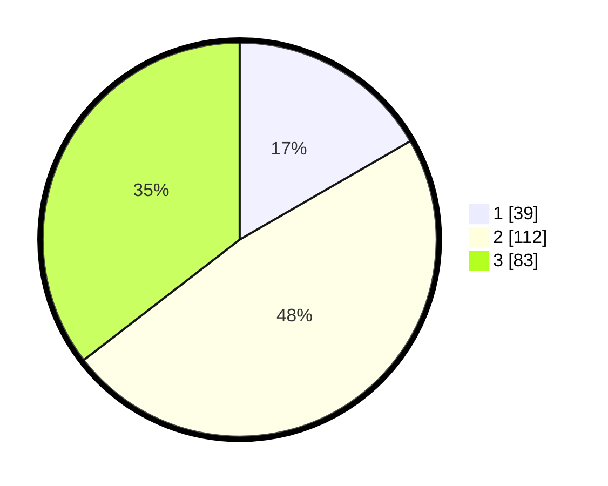

# Hasil

## Grafik

## Tabel

| No. | Nama Paslon    | Suara | Suara (raw) | Persentase |
|:--- |:-------------- | -----:| -----------:| ----------:|
| 1   | ANIES MUHAIMIN | 39    | [39][p-1]   | 16,67      |
| 2   | PRABOWO GIBRAN | 112   | [112][p-2]  | 47,86      |
| 3   | GANJAR MAHFUD  | 83    | [83][p-3]   | 35,47      |

[p-1]: https://github.com/gigit-pemilu/pemilu-2024-34-di-yogyakarta/blob/main/pilpres/hitung-suara/sub/34-di-yogyakarta/sub/04-sleman/sub/02-godean/sub/2005-sidokarto/sub/003-tps/sub/paslon-1.txt
[p-2]: https://github.com/gigit-pemilu/pemilu-2024-34-di-yogyakarta/blob/main/pilpres/hitung-suara/sub/34-di-yogyakarta/sub/04-sleman/sub/02-godean/sub/2005-sidokarto/sub/003-tps/sub/paslon-2.txt
[p-3]: https://github.com/gigit-pemilu/pemilu-2024-34-di-yogyakarta/blob/main/pilpres/hitung-suara/sub/34-di-yogyakarta/sub/04-sleman/sub/02-godean/sub/2005-sidokarto/sub/003-tps/sub/paslon-3.txt

## Foto C Plano

https://sirekap-obj-formc.kpu.go.id/04ac/pemilu/ppwp/34/04/02/20/05/3404022005003-20240215-000257--3177870b-44a5-459b-94f2-d7760c876105.jpg

https://sirekap-obj-formc.kpu.go.id/04ac/pemilu/ppwp/34/04/02/20/05/3404022005003-20240215-000430--06e937c2-d21f-4cca-a7d6-4d1c407fee1b.jpg

https://sirekap-obj-formc.kpu.go.id/04ac/pemilu/ppwp/34/04/02/20/05/3404022005003-20240215-000551--b049a418-7ea1-458d-bfd1-f2d58d793f8b.jpg

## Metadata

| Key        | Value               |
| ---------- | ------------------- |
| Time Stamp | 2024-02-15 15:00:29 |

